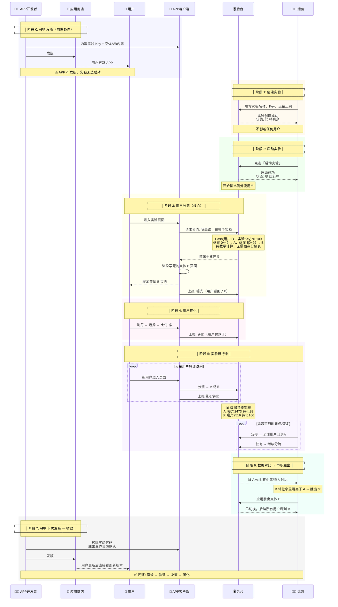

# A/B Test 实验流程与 APP-后台协作规范

## 1. 架构角色

| 角色 | 职责 | 关键约束 |
|------|------|----------|
| **APP (carecam_pro)** | 写死实验 Key + 变体A/B内容，根据后台分流结果渲染对应版本 | 不参与流量分配决策，只管"当前用户看A还是B" |
| **后台 (iot-platform)** | 创建实验、配置流量比例、启动/暂停/结束、数据统计、声明胜出 | 只管"A/B 分流的开关和比例"，不管 A/B 具体内容 |
| **用户** | 无感知参与实验，被 Hash 分到 A 或 B | 同一用户始终看到同一变体 |

## 2. 实验全生命周期

```
 APP 侧：  [发版内置Key+内容] ───────────────────────────────▶ [下次发版清理]
             │                                                  │
 后台侧：    │   [创建] → [启动] → [数据观察] → [声明胜出] → [结束]  │
             │      │        │           │          │          │
 用户侧：    └──────┴────────┴───────────┴──────────┴──────────┘
                       │           │
                    分流生效    看到A/B版本
```

## 3. 详细流程（Mermaid 图）




## 4. 各阶段细节

### 4.1 APP 发版（前置条件）

```
APP 开发者做的事：
1. 定义实验 Key（如 ai_landing_test_01），与运营约定好
2. 写死变体 A 的页面/内容
3. 写死变体 B 的页面/内容
4. 在页面入口埋好分流和上报点
5. 发版
```

**关键原则**：APP 不发版，后台无法启动新实验。因为 APP 需要先内置实验的 Key 和变体内容。

### 4.2 后台创建实验

| 字段 | 说明 | 示例 |
|------|------|------|
| 实验名称 | 运营可读的名称 | "首页改版测试 v1 vs v2" |
| 实验 Key | **必须与 APP 内置 Key 一致** | `homepage_redesign_v2` |
| 流量A占比 | A 变体的流量百分比 | 50（即 A:B = 50:50） |

创建后状态为 **pending**（待启动），此时不会影响任何用户。

### 4.3 用户分流机制（Hash 实时分流详解）

#### 核心概念：不是"提前拆流"，而是"实时计算"

```
┌─────────────────────────────────────────────────────┐
│  误区：提前把 10000 个用户分成 A组5000 + B组5000    │
│  实际：用户请求时才计算，无预分配，纯数学保证比例     │
└─────────────────────────────────────────────────────┘
```

#### 为什么不用预分配？

| 方式 | 做法 | 问题 |
|------|------|------|
| 预分配（静态分桶） | 实验启动时把已有用户随机分成 A/B 两组，写库 | ① 新用户怎么办？② 存量大用户量表开销大 ③ 暂停/恢复/改比例都要重分 |
| **实时哈希（动态分流）** | 每次请求时 `hash(user_id + key) % 100` 即时计算 | 无状态、零存储、新用户自动适配 |

#### Hash 算法详解

```
用户请求：user_id = "user_abc123", experiment_key = "ai_landing_test_01"

Step 1: 拼接
  input = "user_abc123" + "ai_landing_test_01"
        = "user_abc123ai_landing_test_01"

Step 2: 哈希（SHA256 或 MD5，取前 8 位 hex）
  hash_hex = sha256(input).slice(0, 8)
  例：hash_hex = "a3f7b2c1"

Step 3: 转整数取模
  hash_int = parseInt("a3f7b2c1", 16)  // = 2749457089
  bucket = hash_int % 100               // = 89

Step 4: 判断分桶
  trafficA = 50  →  A 占桶 0~49, B 占桶 50~99
  bucket = 89 ≥ 50  →  variant = "B"
```

#### 可视化：100 个桶

```
桶编号:  0 ───────────── 49 │ 50 ───────────── 99
变体:    ←←←  A (50%)  →→→ │ ←←←  B (50%)  →→→
               ↑                        ↑
        hash_int % 100 落在哪边，就是哪个变体
```

**调整流量只需要改分界线**：

```
trafficA = 30 → A 占 0~29, B 占 30~99
trafficA = 70 → A 占 0~69, B 占 70~99
```

#### 为什么同一用户始终看到同一变体？

```
hash("user_abc123" + "ai_landing_test_01") % 100 ≡ 89

只要三个输入不变：
  ① user_id  不变（同一用户）
  ② experiment_key 不变（同一实验）
  ③ trafficA 不变（运营不改比例）

→ hash 结果永远是 89 → 永远是 B 变体
```

**注意**：如果运营中途改了 `trafficA`（比如从 50 改成 70），边界变了，部分用户可能换变体。这是预期行为，但一般不建议实验进行中改比例。

#### 新用户自动适配

```
实验 running 期间新注册的用户 user_new_001：
  hash("user_new_001" + "ai_landing_test_01") % 100 = 37

37 < trafficA(50) → variant = "A"  ✓
无需任何预分配操作，数学保证新用户自然落入某个桶。
```

#### 对比总结

| | 预分配分桶 | 实时 Hash 分流 |
|------|-----------|--------------|
| 存储 | 需要存用户-变体映射表 | 零存储 |
| 新用户 | 需要额外逻辑处理 | 自动适配 |
| 改比例 | 需要重新分桶 | 改一个数字即可 |
| 一致性 | 需要查表保证 | 数学保证 |
| 计算开销 | 查表 I/O | 纯 CPU（纳秒级） |
| 适用场景 | 需要固定分组不变的严格实验 | 绝大多数 A/B 测试场景 |

#### 未请求的用户怎么办？

```
核心原则：不访问实验页面的用户 = 不参与实验 = 不算分母
```

**未请求 = 未被分配变体**：
- 只有用户进入实验页面时，后台才计算他属于 A 还是 B
- 从未访问目标页面的用户，后台根本不知道他属于哪个变体
- 这**不是 bug，是设计意图**：实验只关心「看到了页面」的用户

```
用户总量 100,000 人
         │
         ├── 30,000 人进入实验页面 → 触发 assign → 被分配 A/B
         │      │
         │      ├── ~15,000 人 → A（曝光 15000）
         │      └── ~15,000 人 → B（曝光 15000）
         │
         └── 70,000 人从未进入 → 无分配，无曝光，不参与任何计算
```

**为什么不需要担心偏差？**

```
假设：100,000 用户中，只有「高意向用户」才会点到实验页面
→ 30,000 个高意向用户被分配 A/B

Hash 对这 30,000 人是均匀随机的：
  - A 组 15,000 高意向
  - B 组 15,000 高意向
→ 两组「高意向比例」相同 → 无偏差

如果 A/B 组转化率有差异：
  - A 转化率 4% = 600/15000
  - B 转化率 6% = 900/15000
→ 差异只能来自页面本身（两组前提一致），结论有效 ✓
```

**三种情况对照**：

| 用户类型 | 是否触发 assign | 算入转化率分母？ | 影响 |
|----------|:---:|:---:|------|
| 访问了实验页面的用户 | ✓ | ✓ 曝光为分母 | 正常参与实验 |
| 安装了 APP 但没进目标页 | ✗ | ✗ 不参与 | 不影响结论 |
| 卸载了 APP / 流失用户 | ✗ | ✗ 不参与 | 不影响结论 |

**关键结论**：

> A/B 实验是 **「访问者之间的较量」**，不是「全体用户之间的较量」。
> 只要 A/B 分桶是随机的，两组访问者画像一致，未请求用户不会带来偏差。

### 4.4 实验状态流转

```
                    ┌──────────┐
                    │ pending  │  创建后未启动
                    └────┬─────┘
                         │ 启动
                    ┌────▼─────┐
              ┌─────│ running  │──────┐
              │     └────┬─────┘      │
             暂停        │            停止
              │     ┌────▼─────┐      │
              └────▶│ paused   │      │
                    └────┬─────┘      │
                         │ 停止        │
                         │            │
                    ┌────▼────────────▼──┐
                    │      ended         │
                    │  (winner: A/B/null)│
                    └────────────────────┘
```

| 状态 | 分流行为 | 用户看到 |
|------|----------|----------|
| `pending` | 不参与分流 | 默认版本（A） |
| `running` | 按比例分流 A/B | A 或 B |
| `paused` | 全部返回 A | 默认版本（A） |
| `ended` | winner 不为 null → 全部返回 winner；否则全部返回 A | winner 的变体 |

### 4.5 数据指标

后台需要采集的指标（以变体维度对比）：

| 指标 | 说明 | 计算方式 |
|------|------|----------|
| 页面曝光(UV) | 进入实验页面的独立用户数 | 埋点上报 |
| 套餐选择率 | 看到页面后选择套餐的比例 | 选择数 / 曝光数 |
| 支付转化率 | 最终完成支付的比例 | 支付数 / 曝光数 |
| 总收入 | 变体带来的总收入 | 支付金额汇总 |

### 4.6 结束 & 清理

**运营操作**：
1. 数据达到显著性 → 声明胜出变体
2. 点击「应用胜出变体」→ 100% 流量切到胜出变体
3. 修改实验状态为 `ended`

**APP 下次发版**：
1. 移除实验 Key 的分流请求代码
2. 将胜出变体内容设为默认
3. 删除失败变体的代码/资源

## 5. 全流程速查表

| 阶段 | 谁 | 做什么 | 实验状态 |
|------|-----|------|----------|
| 0. 发版 | APP开发 | 内置 Key+变体内容，发版 | — |
| 1. 创建 | 运营 | 填写名称、Key、流量比例 | `pending` |
| 2. 启动 | 运营 | 点击启动，分流开始生效 | `running` |
| 3. 分流 | 系统 | 用户进入页面 → Hash分流 → APP渲染A/B → 上报曝光 | `running` |
| 4. 转化 | 系统 | 用户付款 → 上报转化 | `running` |
| 5. 观察 | 运营 | 查看数据，可随时暂停/恢复 | `running`/`paused` |
| 6. 结束 | 运营 | 对比数据，声明胜出，全量切换 | `ended` |
| 7. 收敛 | APP开发 | 下次发版移除实验代码，胜出变体默认 | `ended` |
| 8. 归档 | 运营 | 归档历史实验 | — |
