# 物模型全链路流程 — 以「工作模式」为例

## 数据回顾

平台管理员定义的工作模式：

```json
{
  "capType": "prop",
  "name": "工作模式",
  "identifier": "WorkMode",
  "dataDef": {
    "dataType": "enum",
    "accessMode": "rw",
    "enumValues": [
      { "name": "低功耗模式", "val": 0 },
      { "name": "AOV模式", "val": 1 },
      { "name": "长电模式", "val": 2 },
      { "name": "自定义模式", "val": 3 }
    ],
    "defaultVal": "0"
  }
}
```

---

## 系统架构

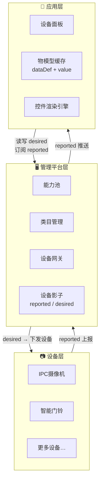

| 层级 | 职责 |
|------|------|
| 应用层 | 用户交互、物模型缓存（dataDef + value）、控件动态渲染、指令下发 |
| 管理平台层 | 物模型定义（能力池+类目关联）、设备影子（reported/desired）、设备网关（鉴权/转发/记录） |
| 设备层 | 属性读写、服务执行、事件上报 |

---

# 一、正常流程

## 1. 设备添加 → 物模型下发

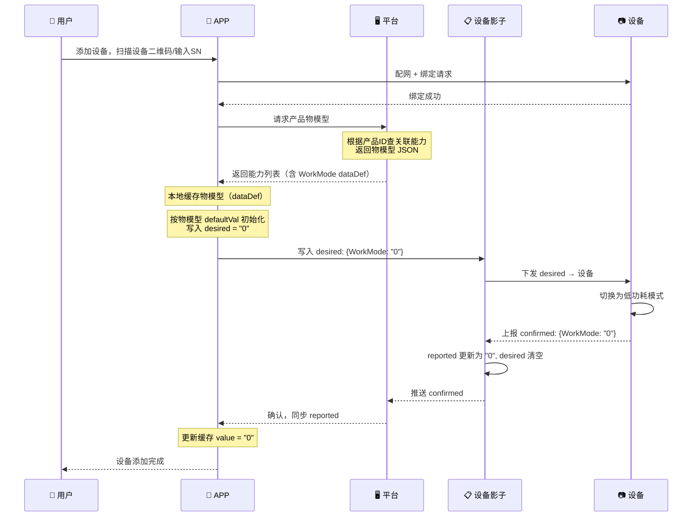

> 设备没有预置状态，初始值由平台 `defaultVal` 决定。APP 通过设备影子的 desired 写入，设备确认后影子 reported 更新，APP 同步 reported 并缓存 value。

---

## 2. APP 进入设备面板 — 缓存秒开 + 后台校验一致

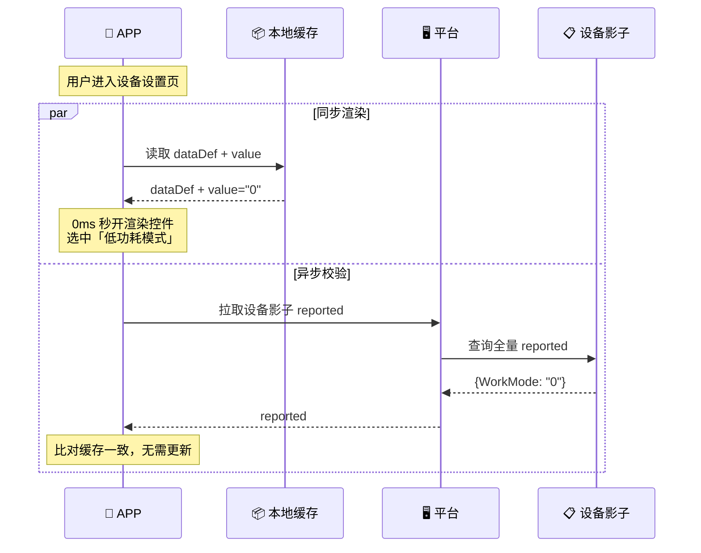

---

### APP 本地缓存结构

```
capabilityCache: {
  "WorkMode": {
    dataDef:   { dataType:"enum", enumValues:[...], accessMode:"rw" },  // 模型定义，决定渲染
    value:     "0"                                                        // 当前值，决定展示
  },
  "RecordMode": {
    dataDef:   { dataType:"enum", ... },
    value:     "1"
  }
}
```

| 缓存层 | 内容 | 作用 |
|--------|------|------|
| dataDef | 能力模型定义（类型、枚举值、读写模式等） | 决定控件类型和可选值 |
| value   | 每个能力的当前值 | 决定控件当前选中态，避免每次打开面板都查设备 |

> value 来源优先级：设备主动上报 > 用户操作确认 > defaultVal。缓存值为空时才走 defaultVal。

---

### 控件渲染决策树

```
dataDef 解析
├── dataType = "enum"
│   ├── enumValues.length ≤ 5 → 分段选择器（Segmented Control）
│   │   选项: enumValues[i].name, 值: enumValues[i].val
│   └── enumValues.length > 5 → 下拉列表（Picker）
│
├── dataType = "int"
│   ├── 可选值 ≤ 6 → 下拉选择
│   ├── 可选值 > 6, max-min ≤ 100 → 滑动条（min/max/step/unit）
│   └── 可选值 > 6, max-min > 100 → 数字输入（Stepper）
│
├── dataType = "boolean" → 开关（Switch）
│   文案: trueLabel / falseLabel
│
└── accessMode = "r" → 上述控件全部置灰只读

注：特殊场景可通过 dataDef 中额外字段覆盖上述默认渲染规则
```

---

## 3. 用户修改参数 — 设备在线

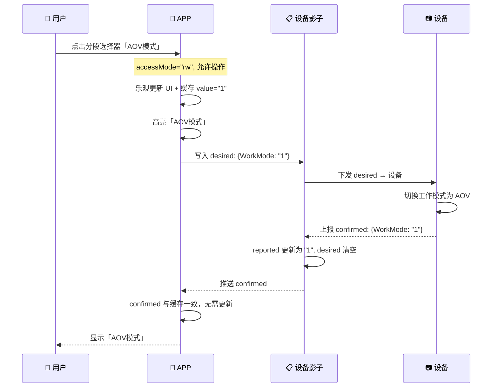

---

## 4. 设备主动上报

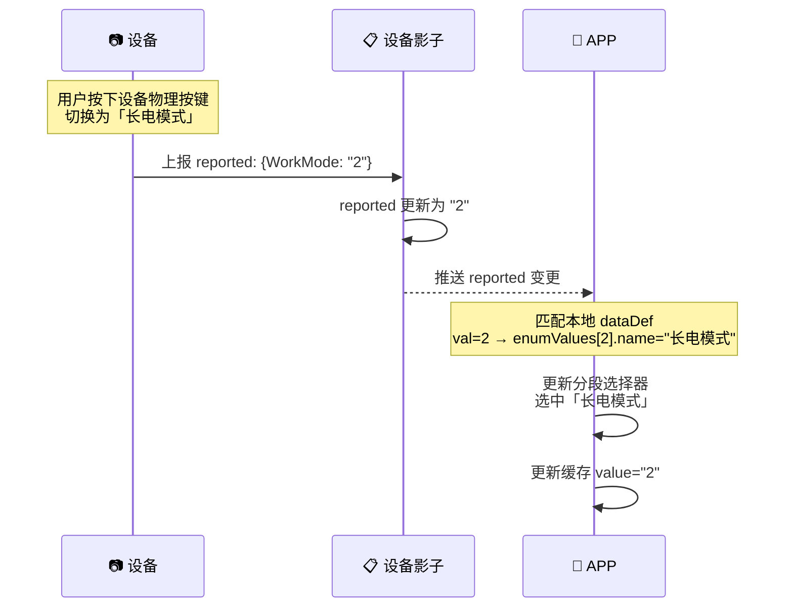

---

## 5. 正常流程完整时序总图

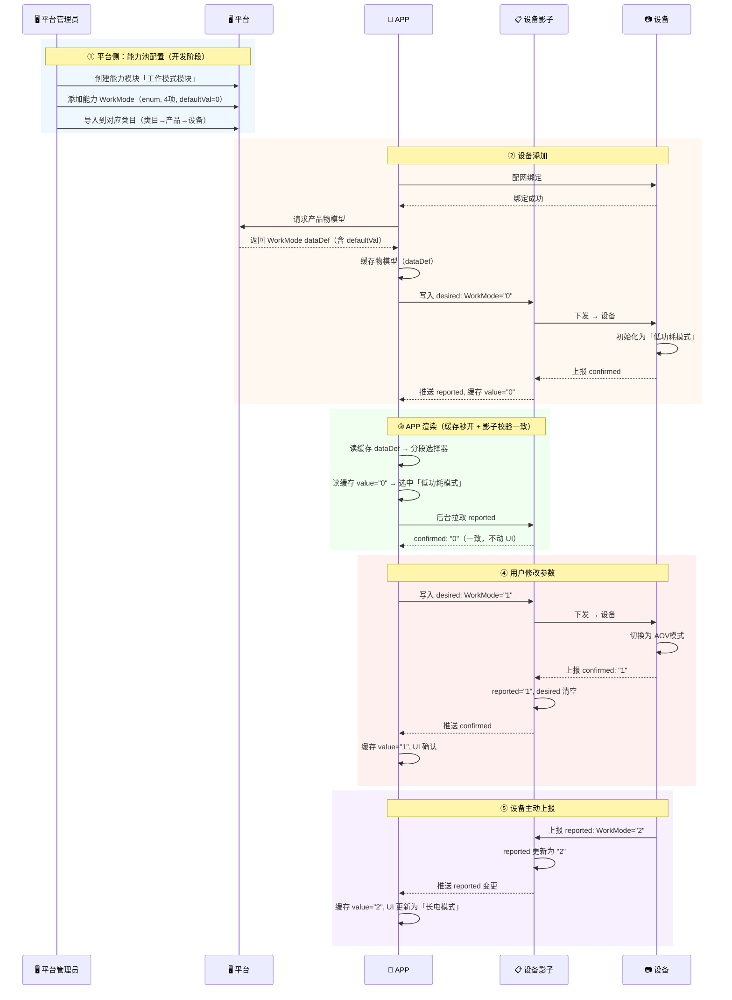

---

# 二、异常流程

## 6. APP 缓存与 Shadow 不一致

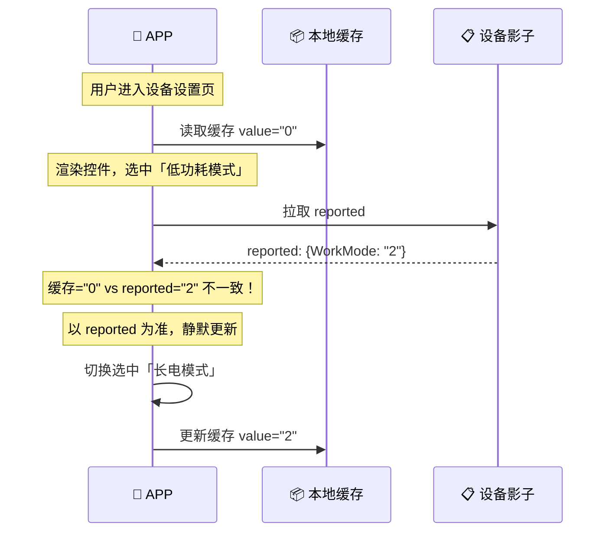

> 不一致可能原因：其他端（另一台手机）修改过参数、设备主动切换后 APP 缓存未更新。

---

## 7. 设备离线 — 属性 desired 暂存 + 上线同步

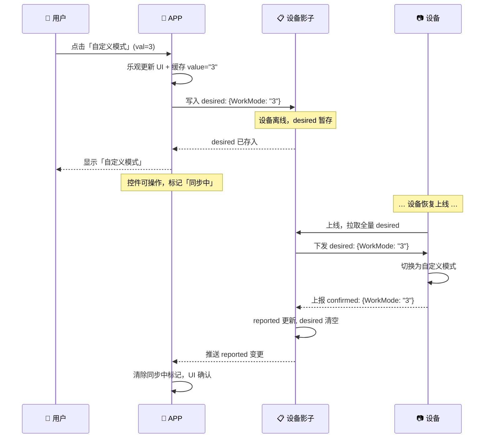

> 属性类（prop）走 desired 暂存模式，设备上线后自动同步，不丢指令。

---

## 8. 设备离线 — 即时指令直接拒绝

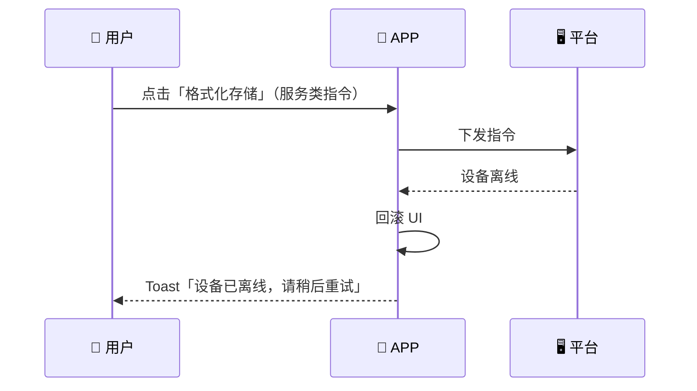

| 能力类型 | 离线策略 | UI 表现 |
|---------|---------|---------|
| 属性（prop）| 写入 desired，上线后自动同步 | 控件可操作，标记「同步中」 |
| 服务（svc）| 直接拒绝 | Toast「设备已离线，请稍后重试」 |
| 事件（evt）| 不涉及下发 | 仅展示历史事件 |

---

## 9. 设备执行成功但 confirmed 丢失

固件收到 desired 并写入本地成功，但回传 confirmed 时网络丢包。此时：

- 设备实际已切换为新值（如 "3"）
- 影子 desired 仍为 pending，reported 仍是旧值（如 "0"）
- APP 一直显示「同步中」或超时后错误回滚

**问题本质：** 设备真实状态已变，但平台不知道。

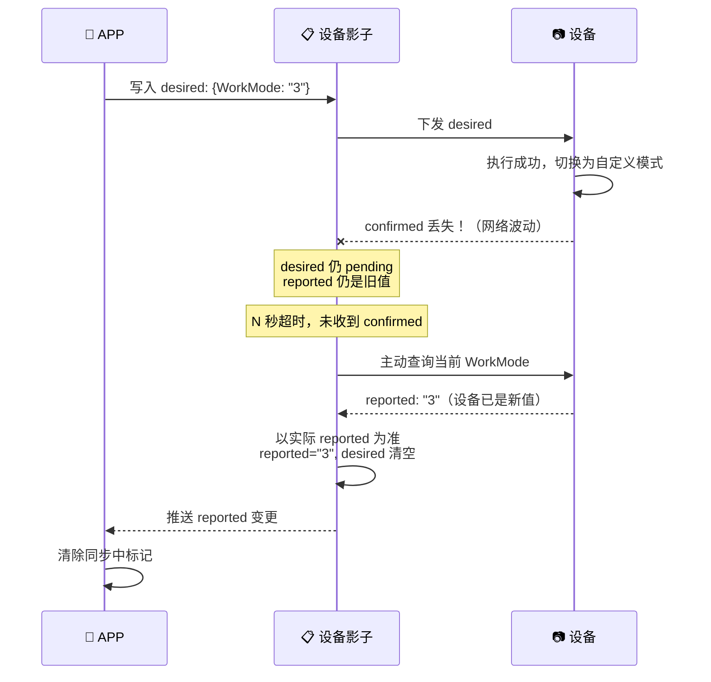

**处理机制：**

| 机制 | 说明 |
|------|------|
| **超时重查** | desired 写入后 T 秒未收到 confirmed → 平台主动查询设备当前值 |
| **以 reported 为准** | 查询返回后，无论是否匹配 desired，都以 reported 覆盖影子，清空 desired |
| **设备端去重** | 设备记录最后执行的 desired 版本号，重复下发不重复执行，直接回 confirmed |
| **心跳携带状态摘要** | 设备心跳包附带 key property 值的 hash，平台比对检测不一致 |

**APP 侧表现：**

| 阶段 | APP 行为 |
|------|---------|
| desired 写入后 T 秒内 | 控件标记「同步中」，可操作但建议等待 |
| 超时 + 平台查询中 | 「同步中」持续，不主动回滚 |
| reported 更新到达 | 清除同步中标记，以 reported 更新 UI |
| 查询也超时（极低概率） | 降级：回滚 UI 到写入前缓存值 + Toast「操作超时，请检查设备状态」 |

---

## 10. 设备修改成功但上报时离线（新增）

设备侧属性值修改成功（如物理按键、自动切换），但向平台上报 reported 时设备离线或网络中断。

- 设备实际值已变（如 "2"）
- 平台影子 reported 仍是旧值（如 "1"）
- 两边状态不一致

**问题本质：** 与场景 9 相反——不是平台→设备的 confirmed 丢包，而是设备→平台的 reported 丢包。

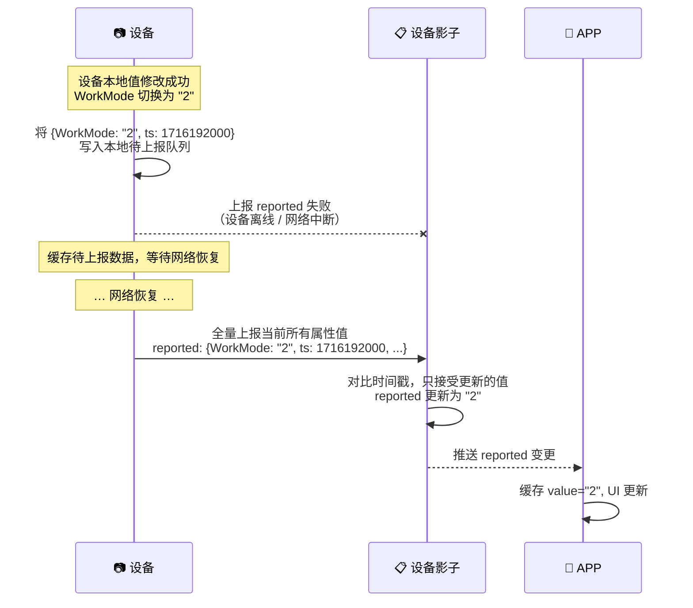

**处理机制：**

| 机制 | 说明 |
|------|------|
| **设备端缓存队列** | 设备修改成功后立即写入本地待上报队列，携带时间戳 |
| **重连全量上报** | 网络恢复后上报所有当前属性值（全量而非增量），避免遗漏 |
| **时间戳防乱序** | 平台比较上报时间戳，只接受比当前值更新的数据，拒绝过期值 |
| **不主动查询** | 平台不知道设备何时修改成功，等设备自己上报 |

**与场景 9 的对比：**

| 对比维度 | 场景 9（confirmed 丢失） | 场景 10（reported 丢失） |
|------|------|------|
| 触发方向 | 平台→设备 | 设备→平台 |
| 丢失内容 | desired 已执行但 confirmed 未达 | 设备值已变但 reported 未达 |
| 检测方式 | 平台侧超时（desired 写入后 T 秒无 confirmed） | 设备侧发送失败（立即感知） |
| 恢复方式 | 平台主动查询设备当前值 | 设备恢复联网后全量上报 |
| 谁发起恢复 | 平台 | 设备 |

---

## 关键原则

| 关键原则 | 说明 |
|------|------|
| 设备影子统一中转 | APP 不直连设备，所有属性读写通过影子 desired/reported 中转，保证多端一致 |
| 缓存做 UI 占位 | dataDef + value 双重缓存，进入面板即渲染；影子 reported 后台校验修正 |
| 离线不丢指令 | 属性类写入 desired 暂存，设备上线后自动同步；服务类直接拒绝 |
| 默认值由平台定义 | `defaultVal` 在平台配置能力时设定，设备绑定后通过影子 desired 写入 |
| 按产品请求物模型 | APP 通过 `productId` 获取物模型，平台解析产品所属类目→关联能力 |
| 控件动态渲染 | APP 不硬编码任何控件，完全由 `dataDef` 决定渲染什么、如何渲染 |
| 设备端缓存上报 | 设备修改成功后缓存待上报值，网络恢复后全量上报，带时间戳防乱序 |
| 以设备实际状态为准 | 平台不猜测设备状态；无论 confirmed 丢失还是 reported 丢失，最终都以设备上报的实际值为准 |

---

*文档版本: v4.0 | 更新日期: 2026-06-02*
