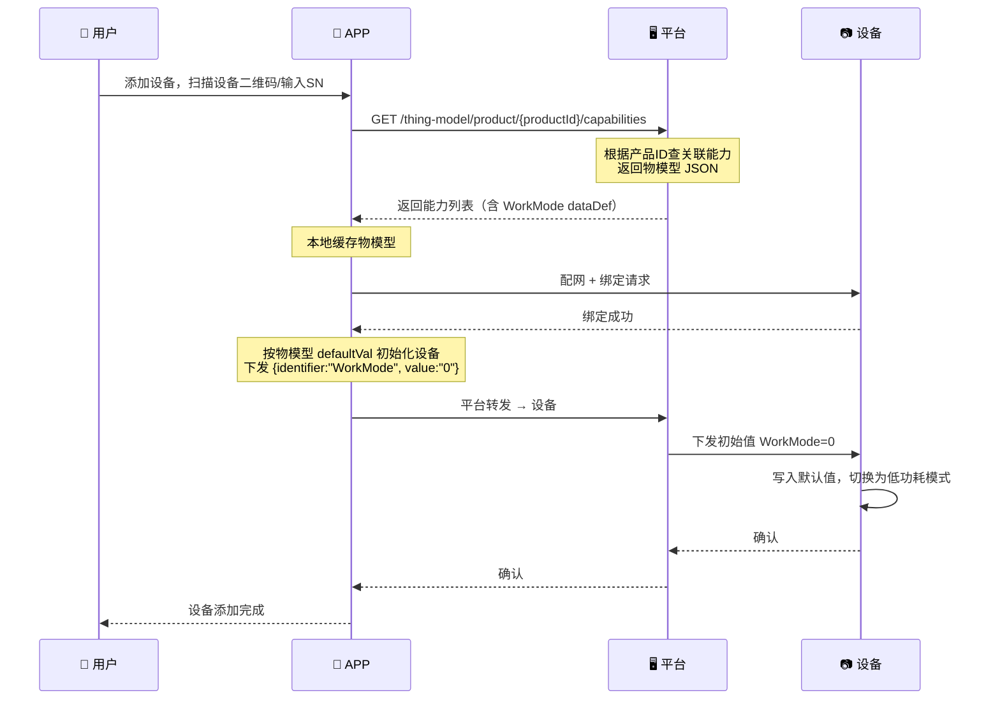
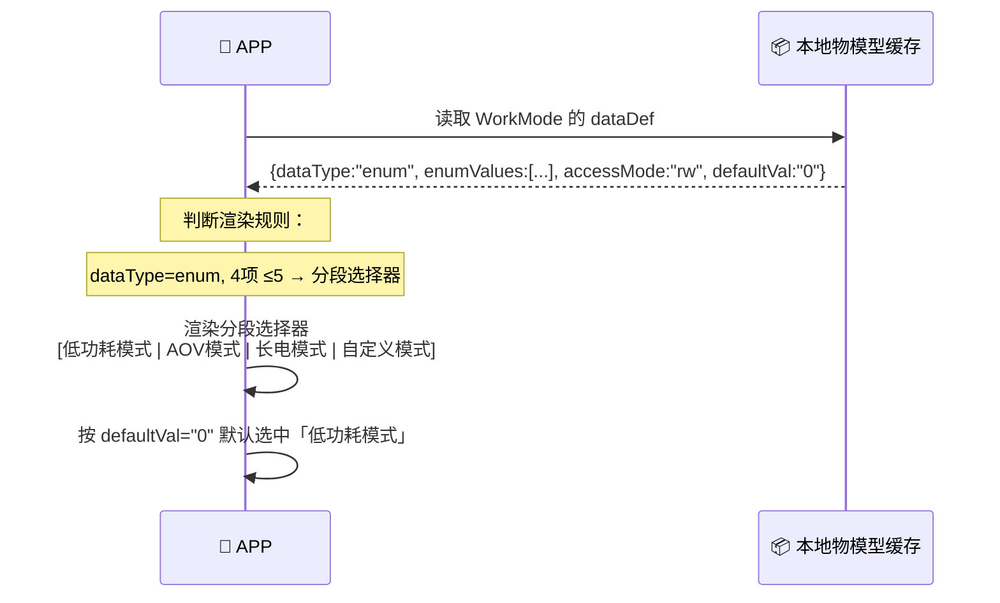
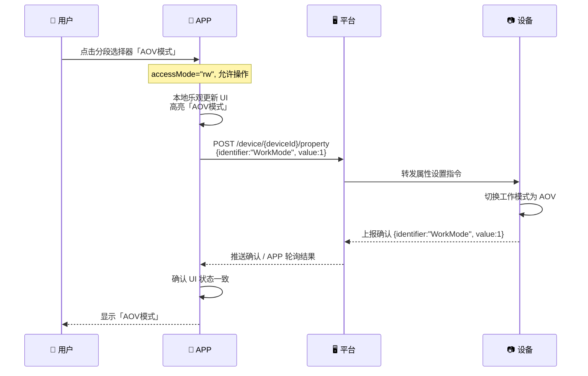
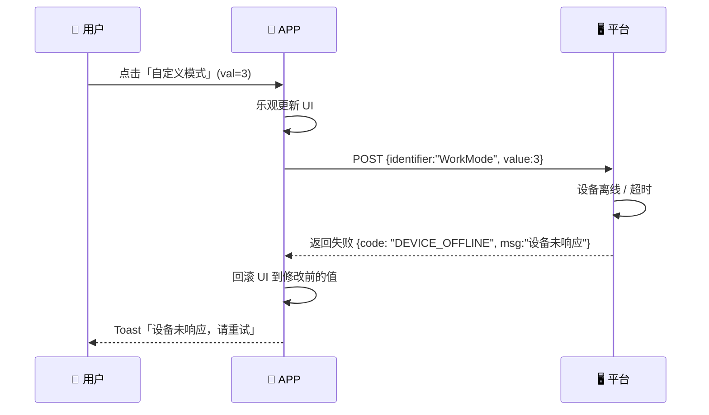
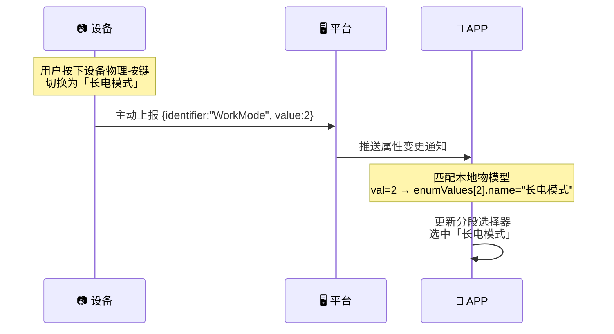
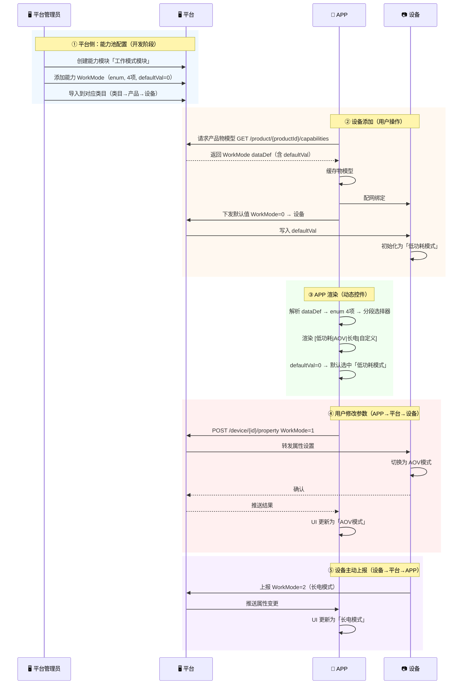

# 物模型全链路流程 — 以「工作模式」为例

## 数据回顾

平台管理员定义的工作模式：

```json
{
  "capType": "prop",
  "name": "工作模式",
  "identifier": "WorkMode",
  "dataDef": {
    "dataType": "enum",
    "accessMode": "rw",
    "enumValues": [
      { "name": "低功耗模式", "val": 0 },
      { "name": "AOV模式", "val": 1 },
      { "name": "长电模式", "val": 2 },
      { "name": "自定义模式", "val": 3 }
    ],
    "defaultVal": "0"
  }
}
```

---

## 1. 设备添加 → 物模型下发



> 设备没有预置状态，初始值由平台 `defaultVal` 决定，APP 在绑定后通过平台下发写入设备。

---

## 2. APP 控件动态加载



控件渲染决策树：

```
dataDef 解析
├── dataType = "enum"
│   ├── enumValues.length ≤ 5 → 分段选择器（Segmented Control）
│   │   选项: enumValues[i].name, 值: enumValues[i].val
│   └── enumValues.length > 5 → 下拉列表（Picker）
│
├── dataType = "int"
│   ├── 可选值 ≤ 6 → 下拉选择
│   ├── 可选值 > 6, max-min ≤ 100 → 滑动条（min/max/step/unit）
│   └── 可选值 > 6, max-min > 100 → 数字输入（Stepper）
│
├── dataType = "boolean" → 开关（Switch）
│   文案: trueLabel / falseLabel
│
└── accessMode = "r" → 上述控件全部置灰只读
```

---

## 3. 用户修改参数 → 设备生效



### 异常处理



---

## 4. 设备主动上报（物理按键 / 自动切换）



---

## 5. 完整链路时序总图



---

| 关键原则 | 说明 |
|------|------|
| 默认值由平台定义 | `defaultVal` 在平台配置能力时设定，设备绑定后由 APP 通过平台下发写入 |
| 按产品请求物模型 | APP 通过 `productId` 获取物模型，平台解析产品所属类目→关联能力 |
| APP 不直连设备 | 所有属性读写均走 **APP→平台→设备** 链路，平台统一鉴权、转发、记录 |
| 控件动态渲染 | APP 不硬编码任何控件，完全由 `dataDef` 决定渲染什么、如何渲染 |

---

*文档版本: v2.0 | 更新日期: 2026-05-28*
