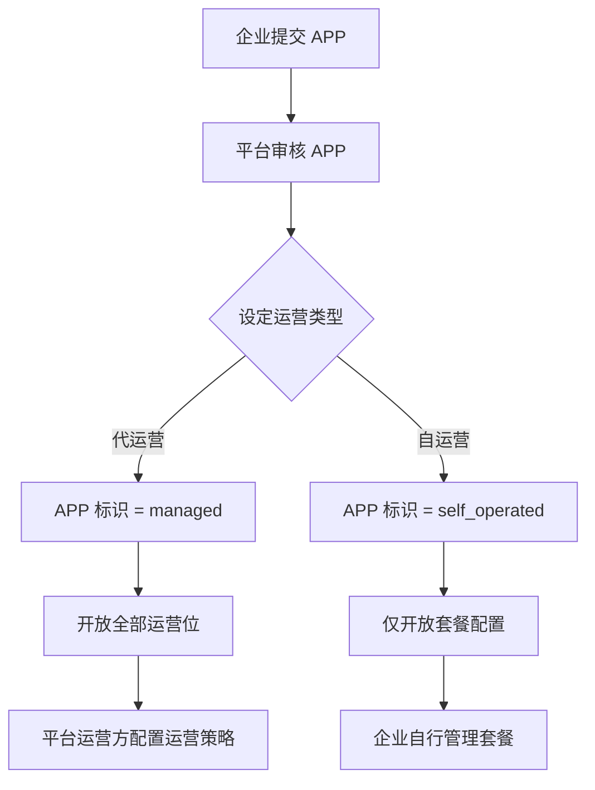
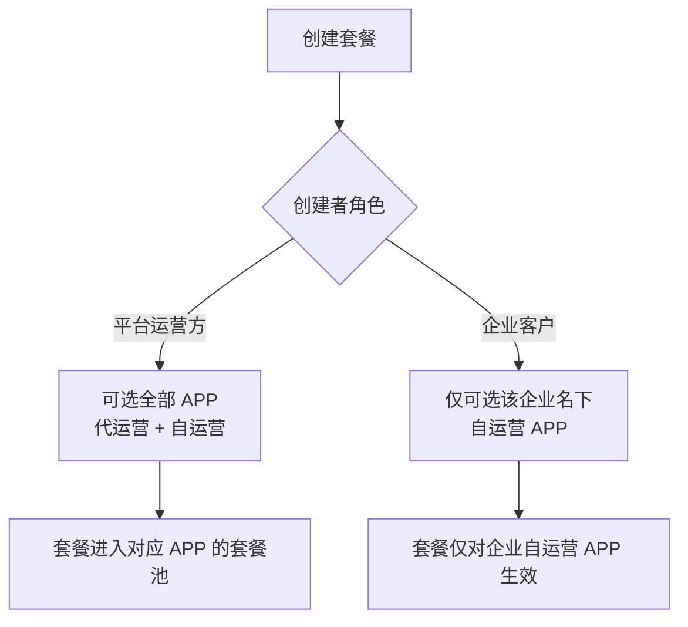
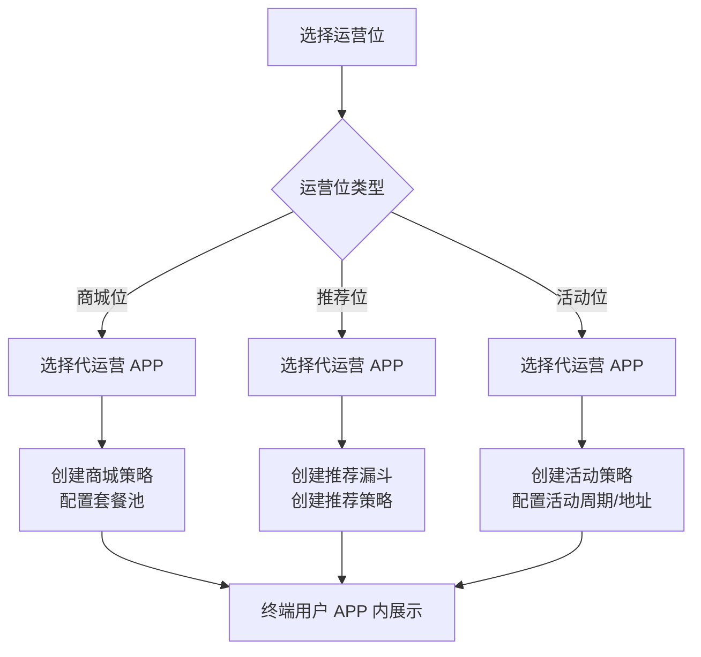
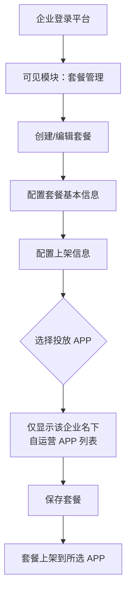

# APP 运营投放规则说明 — PRD

## 修订记录

| 修订时间 | 修订内容 | 修订人 |
|---|---|---|
| 2026-06-11 | 初稿，整理代运营/自运营 APP 投放规则 | — |

---

## 业务背景

生态平台管理多款 APP，采用两种运营模式：

- **代运营 APP**：平台运营方全权负责运营投放，涵盖商城位、推荐位、活动位三大运营模块
- **企业自运营 APP**：企业客户自行管理 APP，平台仅提供套餐配置能力，不介入日常运营

同一企业下可存在多款 APP，部分由平台代运营、部分由企业自运营。本 PRD 规范两类 APP 的运营能力边界、投放规则及数据隔离机制。

---

## 名词解释

| 名词 | 解释 |
|------|------|
| 代运营 APP | 由平台运营方全权负责运营投放的 APP。运营类型标识 `managed` |
| 企业自运营 APP | 由企业客户自行管理套餐配置的 APP。运营类型标识 `self_operated` |
| 运营位（Operation Slot） | APP 内展示运营内容的区域，包含商城位、推荐位、活动位 |
| 商城位（Mall Slot） | APP 商城页的套餐展示区域，通过商城策略控制套餐展示 |
| 推荐位（Recommend Slot） | APP 推荐场景的套餐展示区域，通过漏斗 + 策略控制推荐 |
| 活动位（Activity Slot） | APP 首页活动弹窗，通过活动策略控制活动投放 |
| 商城策略 | 针对商城位的套餐推送规则（区域、用户分群 → 套餐池） |
| 推荐策略 | 针对推荐位的套餐推送规则（条件漏斗 → 套餐推送） |
| 活动策略 | 针对活动位的活动投放规则（周期、频率、地址、人群） |
| 套餐池 | 与运营位绑定的套餐集合，支持分类管理 |
| 投放范围 | 套餐/策略可投放的目标 APP 集合 |
| 混合运营 | 同一企业下同时存在代运营 APP 和自运营 APP 的场景 |

---

## 功能列表概述

| 序号 | 模块 | 功能 | 代运营 | 自运营 | 说明 |
|------|------|------|:------:|:------:|------|
| 1 | 应用管理 | APP 审核 — 设定运营类型 | ✓ | ✗ | 平台审核 APP 时设定 managed / self_operated |
| 2 | 应用管理 | 运营类型变更 | ✓ | ✗ | 平台在审核环节可变更，企业不可操作 |
| 3 | 套餐管理 | 套餐 CRUD | ✓ | ✓ | 双方均可用 |
| 4 | 套餐管理 | 套餐投放 APP 选择 | ✓ | ✓ | 平台可选全部；企业仅可选名下自运营 APP |
| 5 | 商城位运营 | 商城策略管理 | ✓ | ✗ | 仅代运营 APP |
| 6 | 商城位运营 | 套餐池配置 | ✓ | ✗ | 仅代运营 APP |
| 7 | 推荐位运营 | 套餐漏斗管理 | ✓ | ✗ | 仅代运营 APP |
| 8 | 推荐位运营 | 推荐策略管理 | ✓ | ✗ | 仅代运营 APP |
| 9 | 活动位运营 | 活动策略管理 | ✓ | ✗ | 仅代运营 APP |
| 10 | 活动位运营 | 活动地址管理 | ✓ | ✗ | 仅代运营 APP |
| 11 | 用户分群 | 分群查看与绑定 | ✓ | ✗ | 仅平台运营侧使用 |

---

## 业务流程图

### APP 运营类型判定流程



### 套餐创建与投放 APP 选择流程



### 运营位投放流程（代运营 APP）



### 企业自运营套餐管理流程



---

## 详细规则设计

### 1. APP 运营类型

#### 1.1 类型定义

每个 APP 具有「运营类型」属性，由平台运营方在 APP 审核环节设定：

| 属性 | 类型 | 说明 |
|------|------|------|
| operationType | String | `managed` = 代运营，`self_operated` = 企业自运营 |
| enterpriseId | String | 所属企业 ID（自运营 APP 必填） |

> **设定时机**：APP 提交后，平台审核时设定运营类型。APP 创建时不指定类型。

#### 1.2 类型变更规则

- **仅平台运营方**在审核环节可设定和变更 APP 运营类型
- 企业客户不可变更名下 APP 的运营类型
- 变更方向：`managed` ↔ `self_operated` 双向可转
- 变更后已有策略/套餐数据按新类型规则生效：
  - `managed` → `self_operated`：原运营位策略失效，APP 从运营位投放选择列表中移除；该 APP 出现在企业套餐投放选择列表中
  - `self_operated` → `managed`：原企业套餐关联保留但 APP 转为平台统一运营；APP 出现在运营位投放选择列表中
- 变更操作需二次确认

#### 1.3 企业多 APP 场景

```
企业 A
├── APP-1  operationType: managed        → 平台运营
├── APP-2  operationType: self_operated   → 企业自运营
└── APP-3  operationType: self_operated   → 企业自运营
```

- 企业 A 登录后菜单仅显示「套餐管理」
- 企业 A 在套餐管理中仅可见 APP-2、APP-3
- 企业 A 创建套餐时投放 APP 仅可选 APP-2、APP-3
- 平台运营方可见全部 3 个 APP，可为 APP-1 配置运营策略

---

### 2. 运营位投放规则（代运营 APP）

#### 2.1 商城位运营

**适用范围**：仅 `operationType = managed` 的 APP

**功能清单**：

| 功能 | 说明 |
|------|------|
| 商城策略列表 | 左侧 APP 树显示所有代运营 APP |
| 添加商城策略 | Step1 基础信息（策略名称、备注）+ Step2 投放配置（区域、用户分群） |
| 套餐配置 | 进入策略的套餐池页面，支持分类管理、拖拽排序、上下架开关 |
| 删除策略 | 仅可删除无关联套餐的策略 |

**投放规则**：
- 投放 APP 选择范围：仅代运营 APP
- 默认策略：每个代运营 APP 自动生成一条默认策略（投放区域=国内+海外，用户分群=空），未命中分群的用户展示默认策略的套餐
- 用户分群策略：可额外创建针对特定分群的策略
- 套餐仅可从「代运营套餐池」中选择（平台创建的、投放范围为代运营 APP 的套餐）

#### 2.2 推荐位运营

**适用范围**：仅 `operationType = managed` 的 APP

**功能清单**：

| 功能 | 说明 |
|------|------|
| 推荐位套餐漏斗 | 左侧 APP 树显示代运营 APP 及其推荐位 |
| 漏斗配置 | 固定 4 个漏斗位，从套餐池选择套餐填入 |
| 推荐位策略 | 三步向导：基本信息 → 漏斗配置（条件→漏斗映射+弹窗间隔）→ 投放配置（区域、用户分群） |

**投放规则**：
- 投放 APP 选择范围：仅代运营 APP
- 漏斗位套餐仅可从「代运营套餐池」中选择
- 默认策略：每个代运营 APP 自动生成一条默认推荐策略

#### 2.3 活动位运营

**适用范围**：仅 `operationType = managed` 的 APP

**功能清单**：

| 功能 | 说明 |
|------|------|
| 活动策略列表 | 展示所有活动策略，支持按状态/区域/APP 筛选 |
| 添加活动策略 | 三步：基本信息（名称、周期、备注）→ 投放配置（弹窗频率、区域、APP、分群）→ 活动内容（选择H5地址） |
| 活动地址管理 | 独立页面，管理活动 H5 地址列表 |
| 状态流转 | 草稿 → 进行中 → 已暂停/已结束/已过期 |
| 冲突检测 | 发布前检查与进行中策略的区域/APP/分群冲突 |

**投放规则**：
- 投放 APP 选择范围：仅代运营 APP
- 活动周期超期后自动标记为「已过期」
- 同一 APP、同一时段内，同一用户分群仅允许一条活动策略处于「进行中」

---

### 3. 套餐配置规则（企业自运营 APP）

#### 3.1 功能范围

企业自运营 APP 仅开放「套餐管理」模块：
- 套餐列表查看（仅该企业名下的自营 APP 套餐）
- 套餐创建/编辑/删除
- 套餐上架/下架

**不开放**的功能：
- 商城位运营
- 推荐位运营
- 活动位运营
- 用户分群管理

#### 3.2 套餐投放 APP 选择规则

企业创建套餐时，上架配置中的「投放 APP」选择范围：

| 条件 | 可选 APP |
|------|----------|
| 企业名下自运营 APP | ✓ 可选 |
| 企业名下代运营 APP | ✗ 不可选 |
| 其他企业 APP | ✗ 不可选 |

#### 3.3 代运营套餐池与企业套餐的隔离

- **代运营套餐池**：平台运营方创建的、投放范围为代运营 APP 的套餐。这些套餐用于商城位和推荐位策略配置
- **企业套餐**：企业创建的、投放范围为企业自运营 APP 的套餐。这些套餐不出现在代运营套餐池中

两类套餐在数据层面通过 `operationType` + `enterpriseId` 实现隔离：
- 代运营套餐池查询条件：`operationType = managed`
- 企业套餐查询条件：`operationType = self_operated AND enterpriseId = {enterpriseId}`

---

### 4. 平台运营方视角

平台运营方拥有全局视角：

| 模块 | 可见范围 |
|------|----------|
| 套餐管理 | 全部套餐（代运营 + 各企业自运营） |
| 商城位运营 | 全部代运营 APP |
| 推荐位运营 | 全部代运营 APP |
| 活动位运营 | 全部代运营 APP |
| 用户分群 | 全部用户分群 |
| 应用管理 | 全部 APP（含运营类型管理） |

---

## 数据模型

### APP 运营类型扩展

```json
{
  "app": {
    "id": "QX_PRO_001",
    "name": "牵心PRO",
    "operationType": "managed",
    "enterpriseId": null,
    "...": "..."
  }
}
```

```
自运营 APP 示例：
{
  "app": {
    "id": "ENT_A_APP_002",
    "name": "XX企业安防APP",
    "operationType": "self_operated",
    "enterpriseId": "ENT_A",
    "...": "..."
  }
}
```

### 套餐投放范围

```json
{
  "package": {
    "id": "PKG_001",
    "name": "7天云存储套餐",
    "targetApps": [
      { "appId": "ENT_A_APP_002", "operationType": "self_operated" }
    ],
    "createdBy": "platform",
    "enterpriseId": null,
    "...": "..."
  }
}
```

---

## UI 交互规则

### 菜单可见性

| 菜单项 | 平台运营方 | 企业客户 |
|--------|:----------:|:--------:|
| 运营管理 → 商城位运营 | ✓ | ✗ |
| 运营管理 → 推荐位运营 | ✓ | ✗ |
| 运营管理 → 活动位运营 | ✓ | ✗ |
| 运营管理 → 用户分群 | ✓ | ✗ |
| 套餐管理 → 套餐配置 | ✓ | ✓（仅自运营 APP 套餐） |
| 应用管理 | ✓ | ✗ |

### 套餐创建 — 投放 APP 选择器

- **平台运营方**：下拉列表显示全部 APP，以「代运营」/「自运营 - 企业名」分组
- **企业客户**：下拉列表仅显示该企业名下自运营 APP，无分组

### 运营位策略 — 投放 APP 选择器

- 下拉列表仅显示代运营 APP
- 企业自运营 APP 不出现在运营位投放选择中

---

## 异常场景处理

| 场景 | 处理方式 |
|------|----------|
| 企业名下所有 APP 转为代运营 | 该企业套餐管理页面显示空状态：「暂无自运营 APP」 |
| APP 从代运营转为自运营 | 该 APP 的运营策略保留但不再生效；APP 从运营位选择列表中移除 |
| APP 从自运营转为代运营 | 企业套餐中该 APP 的关联保留；APP 出现在运营位选择列表中 |
| 删除企业 | 先处理该企业名下所有 APP（转代运营或删除），再删除企业 |
| 删除自运营 APP | 该 APP 关联的套餐投放记录同步清理 |

---

*创建日期: 2026-06-11 | 基于已有实现 + 需求分析整理*
