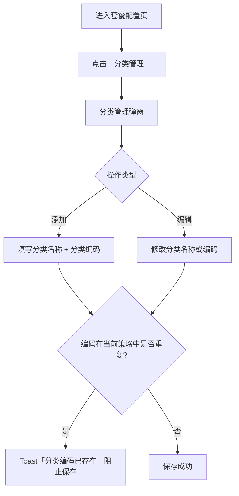

# 商城位运营 — 分类编码 PRD

## 修订记录

| 修订时间 | 修订内容 | 修订人 |
|------|------|------|
| 2026-06-24 | 初稿 | Kiro |

---

## 一、业务背景

商城位运营的套餐配置中，套餐按分类组织（如「云存储套餐」「AI智能服务」「综合套餐」），当前分类仅有名称，缺少机器可读的编码标识。在跨系统对接（如 APP 端按分类展示套餐、数据统计按分类聚合）时，仅靠中文名称无法做稳定的标识匹配。

**产品目标**：
- 分类增加「分类编码」字段，作为分类的稳定标识
- 同一策略内分类编码唯一，不同策略间允许重复
- 编码供后端 API、APP 端、数据统计使用，前端不直接展示给终端用户

---

## 二、名词解释

| 术语 | 说明 |
|------|------|
| 商城位策略 | 定义一组套餐投放规则的实体，包含投放区域/APP/用户分群，关联分类和套餐 |
| 分类（Category） | 套餐的逻辑分组，如云存储套餐、AI智能服务。一个策略下有多个分类 |
| 分类编码（Code） | 分类的英文标识，如 `cloud_storage`、`ai_service`，用于系统间稳定引用 |

---

## 三、核心业务流程



---

## 四、业务规则

| 编号 | 规则 | 说明 |
|------|------|------|
| R01 | 编码必填 | 分类编码和分类名称均为必填项 |
| R02 | 策略内唯一 | 同一策略内，分类编码不可重复；编辑时排除自身 |
| R03 | 策略间可重复 | 不同策略可使用相同的分类编码 |
| R04 | 编码格式 | 英文小写 + 下划线，建议格式 `xxx_xxx`，如 `cloud_storage` |

---

## 五、功能描述

### 5.1 分类管理弹窗 — 新增分类编码列

在分类管理弹窗的表格中，于「分类名称」列后新增「分类编码」列：

- 位置：分类名称 → **分类编码（新增）** → 套餐数量 → 操作
- 样式：等宽字体（`font-family: monospace`），灰色文字
- 未填写时显示「—」

### 5.2 添加/编辑分类弹窗 — 新增分类编码输入

在添加/编辑分类弹窗中，于「分类名称」下方新增「分类编码」输入框：

- 标签：分类编码（必填）
- placeholder：`请输入分类编码（如 cloud_storage）`
- 校验：编码为空时阻止保存

### 5.3 唯一性校验

保存分类时校验编码在当前策略的分类列表中是否重复：

- **新增**：遍历当前策略所有分类，检查 code 是否重复
- **编辑**：排除自身后遍历，检查 code 是否重复
- 重复时：`ElMessage.warning('分类编码「xxx」已存在，请使用其他编码')` 阻止保存
- 不同策略间的分类编码互不干扰（校验范围为当前策略的分类列表）

---

## 六、数据模型

```javascript
// 分类（新增 code 字段）
{
  key: String,       // 内部唯一键（不变）
  name: String,      // 分类名称
  code: String,      // 【新增】分类编码，如 "cloud_storage"，策略内唯一
  packages: [...]    // 关联套餐列表
}
```

### Mock 数据示例

```javascript
const categories = [
  { key: 'cloud', name: '云存储套餐', code: 'cloud_storage', packages: [...] },
  { key: 'ai',    name: 'AI智能服务', code: 'ai_service',   packages: [...] },
  { key: 'bundle', name: '综合套餐',   code: 'bundle_pkg',   packages: [...] }
]
```

---

## 七、UI 规格

### 7.1 分类管理弹窗

```
┌─────────────────────────────────────────────┐
│  分类管理                                    │
│  拖拽可调整排序                 [+ 添加分类]  │
├─────────────────────────────────────────────┤
│  ⠿ │ 分类名称    │ 分类编码      │ 数量 │ 操作│
├─────────────────────────────────────────────┤
│  ⠿ │ 云存储套餐   │ cloud_storage │  3   │ 编辑│ 删除│
│  ⠿ │ AI智能服务  │ ai_service    │  1   │ 编辑│ 删除│
│  ⠿ │ 综合套餐    │ bundle_pkg    │  1   │ 编辑│ 删除│
└─────────────────────────────────────────────┘
```

### 7.2 添加/编辑分类弹窗

```
┌─────────────────────────┐
│  添加分类                │
├─────────────────────────┤
│  分类名称 *              │
│  ┌───────────────────┐  │
│  │ 请输入分类名称     │  │
│  └───────────────────┘  │
│                          │
│  分类编码 *              │
│  ┌───────────────────┐  │
│  │ 如 cloud_storage  │  │
│  └───────────────────┘  │
├─────────────────────────┤
│          [取消]  [确定]  │
└─────────────────────────┘
```

---

## 八、改动文件

| 文件 | 改动 |
|------|------|
| `src/views/ops/mall.vue` | 分类 mock 数据新增 `code`；分类管理表格新增分类编码列；添加/编辑分类弹窗新增编码输入；`saveCategory` 增加策略内编码唯一性校验 |

---

## 九、异常说明

| 异常类型 | 触发条件 | 表现 |
|------|------|------|
| 编码重复 | 同一策略内输入已存在的编码 | `ElMessage.warning` 提示，阻止保存 |
| 编码为空 | 未填写分类编码直接保存 | 同名称必填校验，不通过不保存 |
| 不同策略编码相同 | 策略 A 和策略 B 使用相同编码 | 正常通过，互不干扰 |

---

*文档版本: v1.0 | 创建日期: 2026-06-24*
