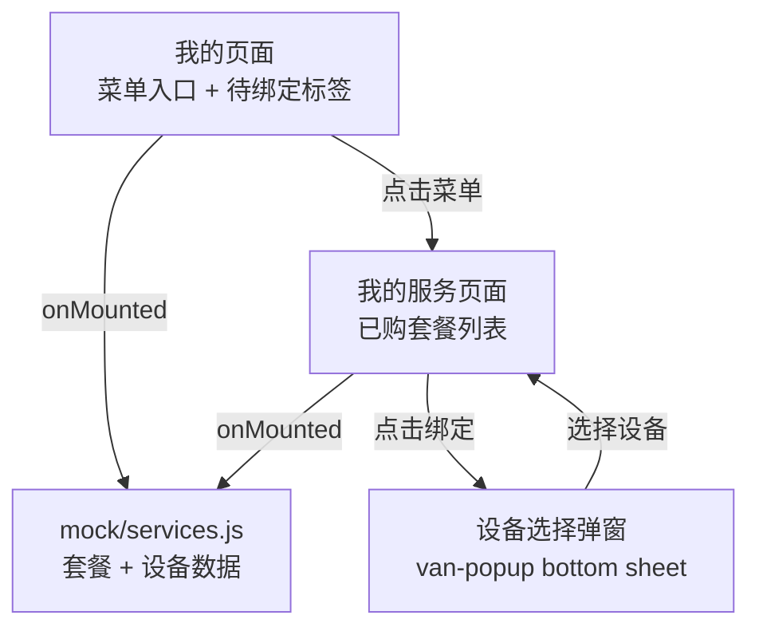
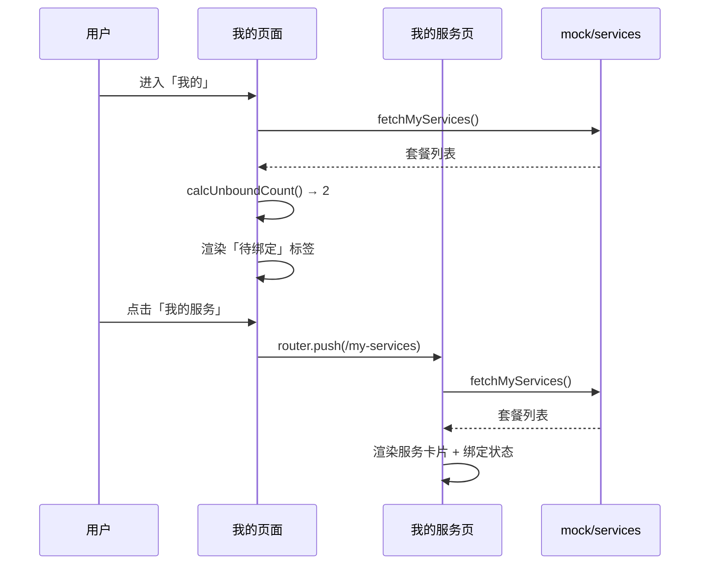
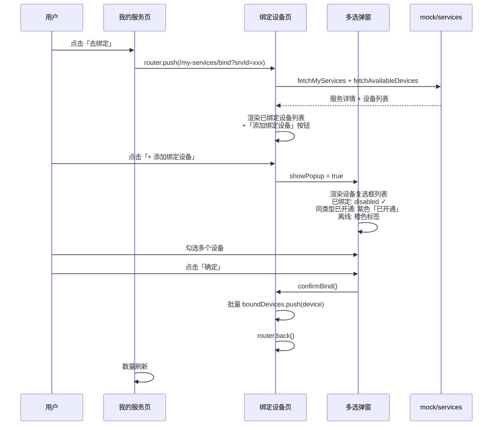
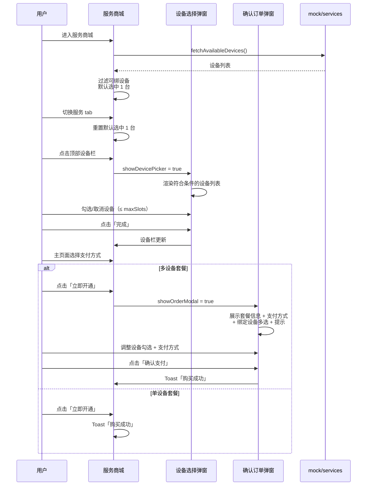
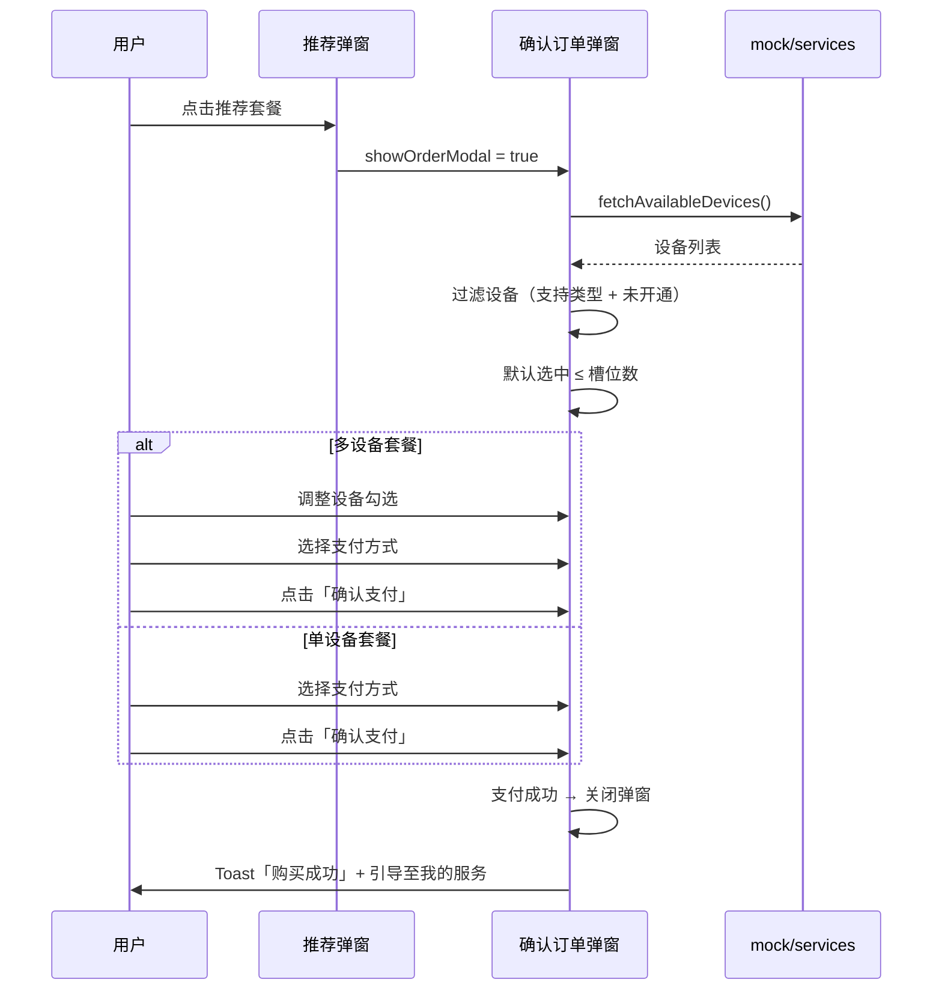

# 多设备套餐引导优化 — 完整业务 PRD

## 修订记录

| 修订时间 | 修订内容 | 修订人 |
|------|------|------|
| 2026-06-05 | 初稿 | Kiro |

---

## 一、业务背景

CareCam Pro 用户购买云存储、AI 侦测等服务套餐后，需要查看已购服务状态，并对多设备套餐完成设备绑定才能生效。当前存在以下痛点：

1. 用户付款后找不到已购套餐，不知道在哪管理
2. 购买多设备套餐后忘记绑定设备，导致套餐买了却未生效
3. 缺少清晰的「待绑定」引导，用户要用时才发现没绑设备

**产品目标**：在「我的」页面新增「我的服务」入口，集中管理已购套餐与设备绑定，并通过标签引导用户完成待绑定操作。

---

## 二、名词解释

| 术语 | 说明 |
|------|------|
| 服务套餐 | 用户购买的服务能力，如云存储 7/30 天循环、AI 全能侦测 Pro |
| 单设备套餐 | 仅可绑定一台设备的套餐，绑定后可更换 |
| 多设备套餐 | 可绑定多台设备（如最多 4 台），用户自行添加/移除 |
| 待绑定 | 套餐尚未绑定设备或未绑满，需引导用户操作 |
| 绑定 | 将套餐权限关联到指定设备，使套餐功能对该设备生效 |

---

## 三、功能架构



---

## 四、核心流程

### 4.1 查看已购服务 + 待绑定引导



### 4.2 绑定设备流程



### 4.3 服务商城选购流程（购买前选设备）



---

## 五、页面信息架构

### 5.1 页面层级

```
CareCam Pro PWA
├── APP 推荐弹窗（首页活动/推送落地页）
│   └── 确认订单弹窗 → 支付（复用 6.5 流程）
├── 服务商城（/store）
│   ├── 设备选择栏（顶部，点击切换设备）
│   ├── 支付方式（主页面直接选）
│   ├── 设备选择弹窗（底部 55%，切换设备）
│   └── 确认订单弹窗（底部 65%，多设备套餐：支付方式 + 绑定设备 + 确认支付）
├── 我的（/me）
│   └── 我的服务（/my-services）
│       └── 绑定设备（/my-services/bind?srvId=xxx）
```

### 5.2 页面跳转关系

| 起点 | 触发 | 终点 |
|------|------|------|
| 我的页「我的服务」菜单 | 点击 | /my-services |
| 我的服务页「← 返回」 | 点击 | router.back() |
| 服务卡片「去绑定」 | 点击 | /my-services/bind?srvId=xxx |
| 绑定页「← 返回」 | 点击 | router.back() |
| 绑定页「确认绑定」 | 点击 | router.back() 回到服务列表 |
| 服务商城「立即开通」 | 点击 | 单设备：Toast 直接购买 / 多设备：确认订单弹窗（支付方式 + 绑定设备 + 支付） |
| 服务商城设备栏 | 点击 | 设备选择弹窗（底部 55%） |
| 确认订单弹窗「确认支付」 | 点击 | Toast「购买成功」关闭弹窗 |
| APP 推荐弹窗套餐 | 点击 | 单设备：直接支付 / 多设备：确认订单弹窗 → 支付（同商城流程） |

---

## 六、详细功能描述

### 6.1 我的页面 — 菜单入口

**功能应用场景**：用户进入「我的」页面，查看个人信息和功能菜单。当有待绑定套餐时，「我的服务」菜单右侧显示橙色标签引导用户操作。

**菜单位置**：第一组菜单「服务商城」下方

**菜单项规格**：

| 属性 | 值 |
|------|------|
| 图标 | `gem-o`（💎），颜色 `#7C3AED`，背景 `#F5F3FF` |
| 文案 | 我的服务 |
| 标签 | 橙色 pill，文案「N个待绑定」，仅 `unboundCount > 0` 时显示 |
| 标签字号 | 11px，`font-weight: 600` |
| 标签颜色 | `#EA580C`（橙色文字），`#FFF7ED`（浅橙背景） |

### 6.2 我的服务页面 — 已购套餐列表

**功能应用场景**：用户查看所有已购服务套餐，了解每项套餐的服务内容、有效期和绑定状态，并对未绑定/未绑满的套餐进行设备绑定。

**页面状态**：

| 状态 | 触发条件 | 展示内容 |
|------|------|------|
| 加载中 | 数据请求中 | `van-skeleton` 骨架屏 × 3 |
| 正常 | 数据加载完成 | 服务卡片列表 |
| 空态 | 无已购套餐 | （一期不做，假设用户至少有一个套餐） |

**服务卡片内容**：

| 区域 | 说明 |
|------|------|
| 标题行 | 套餐名称（15px bold）+ 类型标签（单设备绿 / 多设备紫，10px pill） |
| 有效期 | 🕐 图标 + 「有效期至 YYYY-MM-DD」，12px |
| 服务内容 | ✓ 图标 + 功能清单，flex wrap 布局，12px |
| 分隔线 | 1px `$border-color` |
| 绑定设备区 | 显示绑定数量（如「2/4 台」「已绑定」「未绑定」）+ 「去绑定」按钮（未绑定/未绑满时） |

### 6.3 设备绑定（二级页面）

**功能应用场景**：用户从服务列表点击「去绑定」，进入独立页面查看已绑定设备，并通过弹窗多选添加绑定。

**入口**：服务卡片底部「去绑定」按钮，仅未绑定/未绑满时显示。

**页面结构**：

| 区域 | 说明 |
|------|------|
| 服务摘要卡片 | 套餐名称 + 类型标签 + 已绑定数量 |
| 已绑定设备列表 | 直接展示已绑定设备：图标 + 名称 + deviceId + 绿色「✓ 已绑定」 |
| 添加按钮 | 虚线边框「+ 添加绑定设备」，仅未绑满时显示 |

**多选弹窗**（`van-popup`，底部弹出，60% 高）：

| 属性 | 说明 |
|------|------|
| Header | 标题「选择设备」+ 「确定」按钮 |
| 设备列表 | `van-checkbox` 多选，显示设备图标 + 名称 + deviceId |

**弹窗过滤规则**：仅展示同时满足以下条件的设备：
1. `supportedCategories` 包含当前套餐 category
2. 当前没有同 category 的生效中套餐（不在 `buildDeviceServiceMap` 中）

**已绑定设备**直接在页面展示，不在弹窗中出现。

**默认选中**：打开弹窗时自动勾选所有符合条件的设备，数量 ≤ 剩余可绑槽位（`maxSlots`）。

**绑定逻辑**：
- 多设备套餐：勾选多个设备 → 确定 → 批量 `boundDevices.push({ id, deviceId, name })`
- 单设备套餐：只能选一个 → 确定 → `boundDevice = { id, deviceId, name }`
- 绑定完成后自动 `router.back()` 返回服务列表
- 弹窗底部提示：「后续查看/管理绑定设备请前往【我的】→【我的服务】」

### 6.4 服务商城选购流程（购买前选设备 + 支付）

**功能应用场景**：用户在服务商城选择套餐后，可在顶部设备栏切换目标设备，在主页面选择支付方式。多设备套餐点击「立即开通」后弹出「确认订单」弹窗确认设备绑定再支付；单设备套餐直接完成购买。

**入口**：服务商城「立即开通」按钮。

**页面结构**（从上到下）：

| 区域 | 说明 |
|------|------|
| 服务 tabs | 横向滚动：云存储 / AI智能服务 / 离线监测 / 去广告 / 流量充值 |
| 设备选择栏 | 顶部，显示已选设备名（多设备用「、」连接），点击打开设备选择弹窗 |
| Banner | 渐变背景 + 图标 + 标题/副标题，按 tab 切换 |
| 套餐卡片 | 横向滚动，选中蓝色边框，角标「最划算」/「热门」 |
| 支付方式 | 微信支付 / 支付宝 radio，主页面直接选择 |
| 套餐详情 | 白卡，图标 + 说明文字 |
| 底部栏 | 协议勾选 + 「立即开通」按钮，sticky 固定底部 |

**设备选择栏**：
- 默认选中 1 台符合条件的设备
- 切换 tab 或套餐时自动重置为 1 台
- 点击打开设备选择弹窗（底部 55%），支持切换

**设备选择弹窗规则**：

| 属性 | 说明 |
|------|------|
| 设备列表 | 展示全部设备，每台设备标注状态 |
| 可开通 | 支持该 category 且未开通同类型 → 可勾选 |
| 已开通 | 支持该 category 但已有同类型生效中套餐 → 紫色「已开通」标签，不可勾选 |
| 不支持 | 不支持该 category → 灰色「不支持」标签，不可勾选 |
| 排序 | 可开通 > 已开通 > 不支持 |
| 单设备套餐 | 仅可勾选 1 台（radio 行为） |
| 多设备套餐 | 可多选 ≤ maxSlots，弹窗顶部提示「该套餐最多支持绑定 N 台设备」 |
| 槽位限制 | 达到上限后未选中项半透明 disabled |

**购买分支**：

| 套餐类型 | 点击「立即开通」后 |
|------|------|
| 单设备 | 直接 Toast「购买成功」，不弹窗 |
| 多设备 | 弹出「确认订单」弹窗（底部 65%） |

**确认订单弹窗**（仅多设备套餐）：

| 区域 | 说明 |
|------|------|
| Header | 「确认订单」+ 关闭按钮（固定） |
| 套餐信息 | 名称 + 价格（固定） |
| 支付方式 | 微信/支付宝 radio（可滚动区） |
| 绑定设备 | 多选列表，过滤规则同设备选择弹窗（可滚动区） |
| 提示 | 「后续查看/管理绑定设备请前往【我的】→【我的服务】」（可滚动区） |
| 确认按钮 | 「确认支付 ¥XX/月」，固定底部不跟随滚动 |

**弹窗 CSS 结构**：`.order-modal` flex column → header + plan（固定）+ `.order-body`（flex:1 滚动区包支付方式+设备+提示）+ 确认按钮（固定）

### 6.5 APP 内推荐弹窗（推送/活动入口）

**功能应用场景**：用户通过 APP 内推荐弹窗（如首页活动弹窗、推送消息落地页）触达套餐购买。若为多设备套餐，弹窗内需嵌入设备绑定步骤再进入支付。

**入口**：首页推荐弹窗、推送消息落地页、活动 banner 等。

**流程**：
1. 用户点击推荐弹窗中的套餐 → 弹出「确认订单」弹窗（底部 65%）
2. 弹窗展示：套餐信息 + 支付方式 + 绑定设备（多选） + 提示文案 + 确认支付按钮
3. 单设备套餐：仅展示套餐信息 + 支付方式，确认后直接支付
4. 多设备套餐：默认选中符合条件的设备（≤ 槽位数），用户确认设备后支付
5. 支付完成后引导至「我的」→「我的服务」管理绑定

**弹窗规则**：与服务商城「确认订单」弹窗完全一致，复用相同的设备过滤逻辑和最大槽位限制。



**与 6.4 服务商城的复用关系**：推荐弹窗的「确认订单」弹窗与服务商城共用同一组件/逻辑，区别仅在于触发入口不同（店铺页面 vs APP 推荐位）。

---

## 七、业务规则

| 编号 | 规则 | 说明 |
|------|------|------|
| R01 | 待绑定计数 | 单设备未绑定 + 多设备有剩余槽位 = 待绑定数 |
| R02 | 多设备槽位上限 | 绑定数 < maxDevices 时才显示绑定按钮 |
| R03 | 单设备唯一绑定 | 单设备套餐仅能绑定一台，绑定后替换而非追加 |
| R04 | 离线可绑 | 离线设备显示橙色「离线」标签，仍可选中绑定，后续设备上线即生效 |
| R05 | 不支持设备标记 | `supportedCategories` 不含该类型的设备显示灰色「不支持」标签，不可勾选 |
| R06 | 已开通标记 | 已有同 category 生效中套餐的设备显示紫色「已开通」标签，不可勾选 |
| R09 | 设备列表排序 | 可开通 > 已开通 > 不支持 |
| R07 | 默认全选 | 打开弹窗时自动勾选所有符合条件的设备（≤ 剩余槽位） |
| R08 | 一期不支持解绑 | 解绑需联系客服处理 |

---

## 八、异常说明

| 分类 | 场景 | 处理方式 |
|------|------|------|
| 设备 | 设备离线 | 橙色「离线」标签提示，可正常选择绑定 |
| 设备 | 设备已绑定 | 显示 ✓，不可重复绑定 |
| 数据 | 无符合条件的设备 | 弹窗空态「暂无可绑定的设备」（不支持或已开通同类型） |
| 网络 | fetchMyServices 失败 | catch 静默处理，列表为空，不显示标签 |
| 网络 | fetchAvailableDevices 失败 | catch 设置空数组，弹窗显示空态 |
| 极限 | 多设备槽位已满 | 不显示「+ 绑定设备」按钮 |

---

## 九、文件清单

| 文件 | 类型 | 说明 |
|------|------|------|
| `src/mock/services.js` | Mock | fetchMyServices()、calcUnboundCount()、fetchAvailableDevices() |
| `src/composables/useServicesStore.js` | Composable | 共享服务数据状态，跨页面同步绑定结果 |
| `src/views/me/index.vue` | 页面（改） | 新增「我的服务」菜单项 + 待绑定标签 |
| `src/views/my-services/index.vue` | 页面（新） | 已购套餐列表，仅显示绑定数量 + 去绑定按钮 |
| `src/views/my-services/bind.vue` | 页面（新） | 二级绑定页，显示设备名称 + deviceId |
| `src/views/store/index.vue` | 页面（改） | 新增购买前设备选择步骤（选购→选设备→支付） |
| `src/router/index.js` | 路由（改） | 新增 /my-services、/my-services/bind 路由 |

---

## 十、关键决策

| # | 决策 | 原因 |
|------|------|------|
| D1 | 一期仅支持绑定，不支持解绑 | 解绑涉及设备侧状态同步，先覆盖核心绑定场景 |
| D2 | 数据来源为 mock | 后端接口未就绪，mock 先行验证交互流程 |
| D3 | 一期仅中文 | 多语言在二期评估 |
| D4 | 待绑定用文案标签而非纯红点 | 用户偏好：文案标签信息更明确，降低认知负担 |
| D5 | 绑定操作使用独立二级页面 | 信息量较大（设备ID+名称+状态），弹窗空间不足，独立页面体验更好 |
| D6 | 套餐购买在「服务商城」完成 | 职责分离，本模块仅做已购管理 |
| D7 | 绑定使用弹窗多选 | 一次可绑定多台设备，减少重复操作 |

---

> **本文档为纯业务PRD，面向产品和开发团队。不包含API路由路径、数据库建表语句等技术实现细节。**

---

*文档版本: v1.0 | 创建日期: 2026-06-05*
