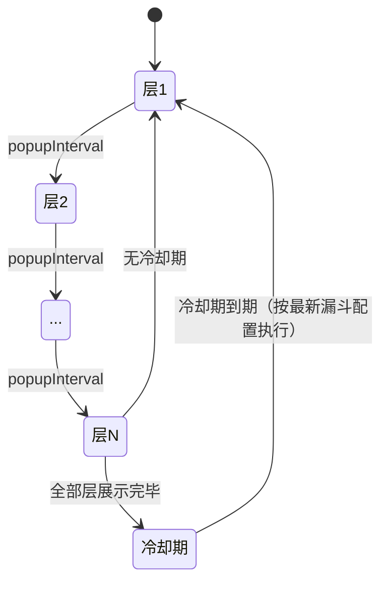

# 推荐位运营策略优化 — 需求分析文档

## 修订记录

| 修订时间 | 修订内容 | 修订人 |
|------|------|------|
| 2026-06-29 | 初稿 | Kiro |
| 2026-06-29 | 新增漏斗层级模板 + 样式预览 | Kiro |
| 2026-06-29 | 模板管理改为策略抽屉内「管理模板」弹窗 | Kiro |
| 2026-06-29 | 模板改为每层独立配置（非每条件），卡片改为9:16手机比例横向滚动 | Kiro |
| 2026-07-01 | 移除预设样式模板（简约/氛围/动态/奢华），模板统一由运营自行上传 | Kiro |
| 2026-07-01 | 冷却规则改为按实际配置层数触发；模板新增ID字段、去掉图片文件 | Kiro |

---

## 一、业务背景

推荐位运营中，每个策略关联漏斗（包含若干层套餐），按序循环弹出。弹窗间隔由 `popupInterval` 控制。

**痛点**：

1. 漏斗无休止循环，缺少冷却机制
2. 弹窗样式单一，无法匹配套餐类型
3. 选漏斗后看不到套餐详情，需切换 Tab

**目标**：

- 冷却期控制：全部层展示完毕后静默 N 天
- 层级模板：每个漏斗层可独立选择模板，9:16 手机比例卡片预览，支持横向滚动
- 模板管理集成在策略抽屉内，通过「管理模板」按钮触达

---

## 二、名词解释

| 术语 | 说明 |
|------|------|
| 推荐位 | App 首页等位置展示套餐推荐的运营位 |
| 推荐位策略 | 投放规则：目标用户、漏斗、弹窗间隔、冷却期、层级模板 |
| 漏斗 | 多层套餐，按序弹出（层1→2→…→N） |
| 漏斗轮次 | 全部层展示完毕称为「一轮」 |
| 弹窗间隔 | 两次弹窗最小间隔，小时 |
| 冷却期 | 一轮后暂停弹窗的静默时段，天 |
| 层级模板 | APP 弹窗视觉样式，由名称 + 图片组成，**每层独立配置** |
| 管理模板弹窗 | 策略抽屉内「管理模板」按钮触发的模板管理弹窗 |

---

## 三、功能范围

### 3.1 功能列表

| 序号 | 功能 | 优先级 | 说明 |
|------|------|:--:|------|
| F1 | 漏斗套餐详情 | P0 | 选漏斗后展示全部层套餐 |
| F2 | 层级模板选择 | P0 | 每层独立的模板选择器，9:16 手机比例卡片横向滚动 |
| F3 | 管理模板弹窗 | P0 | 抽屉内模板增删改查（模板ID/预览/名称/描述/操作），支持删除 |
| F4 | 模板添加 | P0 | 填写模板ID + 上传模板图片 + 命名 + 描述，模板ID用户自定义，全局唯一 |
| F5 | 冷却期天数 | P0 | 策略级别，天为单位 |
| F6 | 列表冷却期列 | P0 | 90px |
| F7 | 模板卡片滚轮横向滚动 | P0 | 鼠标滚轮在模板区域转为横向，不影响外层 |

### 3.2 不做

| 功能 | 原因 |
|------|------|
| 活动位冷却期 | 本期仅推荐位 |
| 模板 A/B 测试 | 二期 |
| 独立模板管理 Tab | 集成在抽屉内 |

---

## 四、场景穷举分析

### 4.1 正常场景

| 编号 | 场景 | 步骤 | 预期 |
|------|------|------|------|
| N-001 | 选漏斗看详情 | 条件一下拉选漏斗 | 展示全部层套餐列表，每层显示模板选择行 |
| N-002 | 为某层选模板 | 点击层级模板行展开→点击模板卡片 | 卡片即选中，同层其他卡片取消选中 |
| N-003 | 管理模板-新增 | 点管理模板→添加→填写ID→上传图片→命名→确认 | 新模板出现在列表中 |
| N-003b | 管理模板-删除 | 点删除→确认 | 未被引用则直接删除；被引用则弹窗列引用策略确认后删除 |
| N-004 | 配置冷却期 | 冷却期输入 3 | 策略保存后生效 |
| N-005 | 不填冷却期 | 留空 | 无冷却，持续循环 |
| N-006 | 模板卡片横向滚动 | 模板卡片区域滚轮滚动 | 仅横向滚动，不影响外层抽屉竖向 |
| N-007 | 模板图片放大预览 | 管理模板→点击预览缩略图 | 弹出大图预览弹窗 |

### 4.2 异常场景

| 编号 | 异常 | 触发 | 行为 |
|------|------|------|------|
| E-001 | 图片过大 | > 2MB | 前端拦截提示 |
| E-002 | 格式错误 | 非 PNG/JPG/WEBP | accept 限制 |
| E-003 | 删除引用模板 | 模板被策略引用 | 二次确认，列出引用策略 |
| E-004 | 模板预览失败 | 图片 404 | 占位图 |

### 4.3 状态流转



---

## 五、跨模块联动

| 模块 | 关系 | 影响 |
|------|------|------|
| 推荐位套餐漏斗 | 详情联动 | 无 |
| APP 端 | 读取 cooldownDays + templateIds | 适配 |

---

## 六、数据模型

### 模板

```javascript
{ id: 'tpl_chunjie', name, image, createdAt }
```
> `id` 由用户手动填写，全局唯一。

### 策略扩展

| 字段 | 类型 | 默认值 |
|------|------|------|
| `cooldownDays` | number\|undefined | `undefined` |
| `funnels[].templateIds` | string[] | `[]` |

> `templateIds` 长度等于漏斗实际层数，索引 0 对应层 1。漏斗增删层时随之增减。

---

## 七、文件清单

| 文件 | 说明 |
|------|------|
| `src/views/ops/recommend.vue` | 策略抽屉：漏斗详情+层级模板选择+管理模板弹窗+冷却期 |

---

*文档版本: v5.0 | 创建日期: 2026-06-29*
