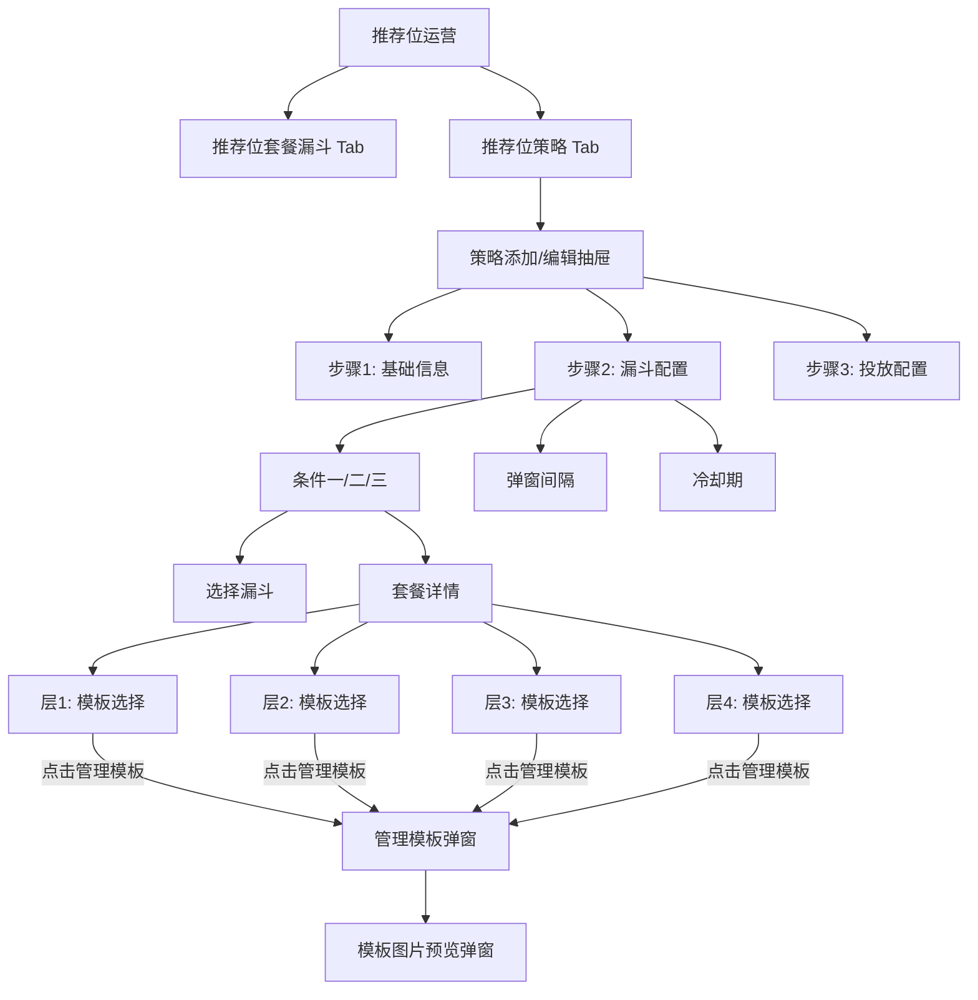
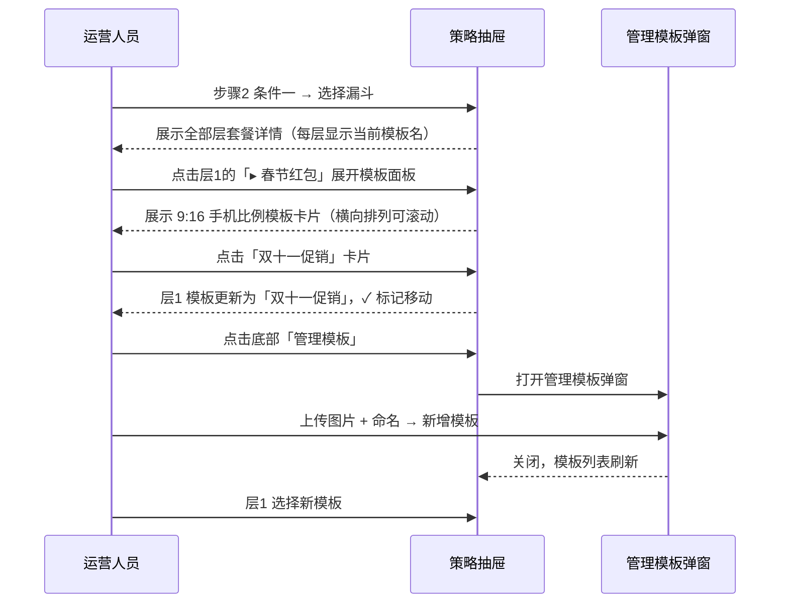
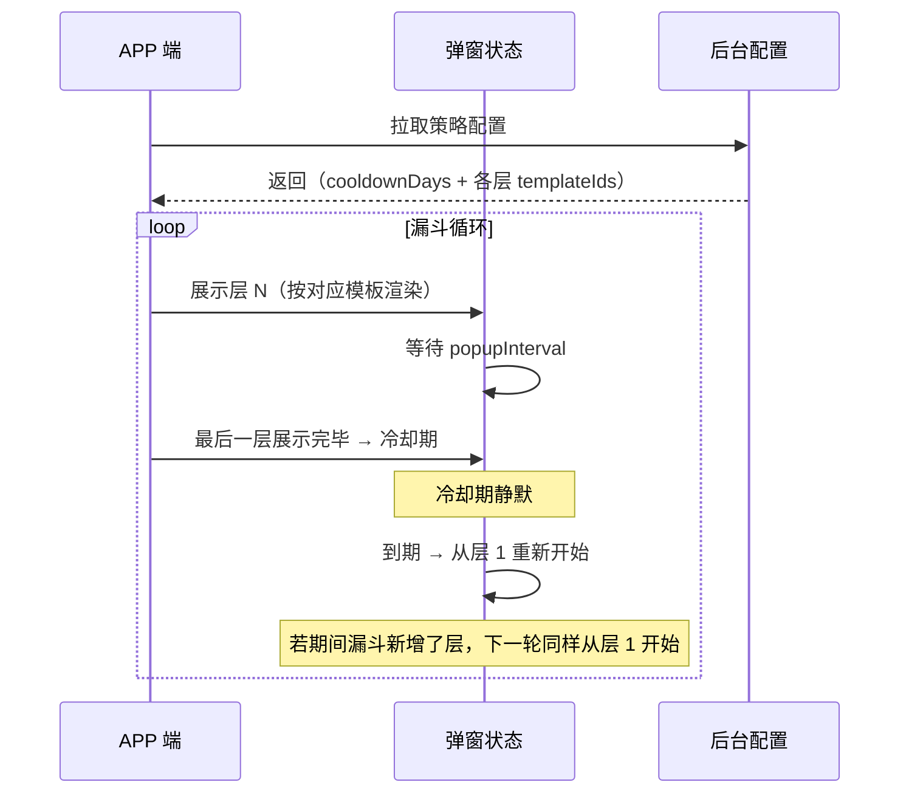

# 推荐位运营策略优化 — 完整业务 PRD

## 修订记录

| 修订时间 | 修订内容 | 修订人 |
|------|------|------|
| 2026-06-29 | 初稿 | Kiro |
| 2026-06-29 | 新增漏斗层级模板配置 + 样式预览 | Kiro |
| 2026-06-29 | 模板管理改为策略抽屉内「管理模板」弹窗 | Kiro |
| 2026-06-29 | 模板改为每层独立配置；卡片改为9:16手机比例横向滚动；移除独立预览区 | Kiro |
| 2026-07-01 | 移除预设样式模板（简约/氛围/动态/奢华），模板统一由运营自行上传 | Kiro |
| 2026-07-01 | 冷却规则改为按实际配置层数触发；模板新增ID字段、去掉图片文件列 | Kiro |

---

## 一、业务背景

推荐位运营模块中，每个推荐位策略关联一个漏斗，漏斗包含若干层套餐，按序循环展示（层1 → 层2 → … → 层N → 层1…）。弹窗间隔由 `popupInterval`（小时）控制。

当前痛点：

1. **无冷却机制**：漏斗循环无休止弹窗，运营无法在一轮完整曝光后主动降温
2. **弹窗样式单一**：APP 端仅一种固定样式，运营无法按套餐类型匹配弹窗模板
3. **配置不直观**：选择漏斗后看不到内部套餐详情，需切换 Tab 确认

**产品目标**：

- 新增「冷却期」控制：一轮漏斗全部层（按实际配置层数）展示完毕后自动静默 N 天
- 新增「层级模板」配置：**每层独立**选择模板，9:16 手机比例卡片预览，横向滚动
- 模板管理集成在策略配置流程内，通过展开面板底部「管理模板」按钮触发弹窗

---

## 二、名词解释

| 术语 | 说明 |
|------|------|
| 推荐位 | App 首页等位置展示套餐推荐的运营位 |
| 推荐位策略 | 完整的推荐投放规则：目标用户、匹配漏斗、弹窗间隔、冷却期、层级模板 |
| 漏斗 | 多层套餐的展示容器，按序弹出（层1→2→…→N） |
| 漏斗轮次 | 漏斗全部层展示完毕称为「一轮」 |
| 弹窗间隔 | 两次弹窗间的最小间隔，以小时为单位 |
| 冷却期 | 一轮漏斗展示完毕后暂停弹窗的静默时段，以天为单位 |
| 层级模板 | APP 端弹窗的视觉样式模板，由名称 + 图片组成，**每层独立配置** |
| 管理模板 | 展开面板底部「管理模板」按钮触发的弹窗，用于模板增删改查 |

---

## 三、功能架构



---

## 四、核心流程

### 4.1 配置策略



### 4.2 APP 端弹窗冷却循环



---

## 五、业务规则

| 编号 | 规则 | 说明 |
|------|------|------|
| R01 | 冷却期始终生效 | 配置了冷却期天数后即生效 |
| R02 | 最小冷却天数 | 最小 1 天 |
| R03 | 按配置层数触发冷却 | 漏斗配置了几层就展示几层，全部展示完毕后触发冷却 |
| R04 | 冷却后复位 | 到期后从层 1 重新开始（若期间漏斗新增/减少了层，下一轮按最新配置执行） |
| R05 | 策略间独立 | 各策略冷却期独立计算 |
| R06 | 漏斗详情联动 | 选漏斗后展示全部层套餐 |
| R07 | 模板图片 ≤ 2MB | PNG/JPG/WEBP |
| R08 | 管理模板入口 | 模板面板展开后底部「管理模板」按钮 |
| R09 | 手风琴交互 | 同一时刻最多展开一个层的模板面板，点击其他层自动收起 |
| R10 | 点击选中 | 点击模板卡片即选中该层模板，✓ 标记移动 |
| R11 | 滚轮横向滚动 | 模板卡片区域鼠标滚轮仅横向滚动，不透传外层 |

---

## 六、详细功能描述

### 6.1 层级模板选择

**位置**：漏斗套餐详情内，每层套餐行下方缩进显示。

**交互**：

| 属性 | 值 |
|------|------|
| 触发方式 | 点击某层模板选择行切换展开/收起 |
| 收起态 | 显示 `▸ 当前模板名` |
| 展开态 | 显示 `▾ 当前模板名`，下方弹出模板卡片面板 |
| 手风琴 | 展开某层时，其他已展开的层自动收起 |
| 选中模板 | 点击面板内模板卡片即选中，✓ 标记移动 |
| 管理模板 | 按钮在展开面板底部 |

**模板卡片**：

| 属性 | 值 |
|------|------|
| 排列 | flex，横向排列，`overflow-x: auto`，gap 10px |
| 滚动 | 横向滚动条 4px + 鼠标滚轮横向滚动（`@wheel.prevent`，不透传外层） |
| 卡片宽 | 160px（`min-width`，`flex-shrink: 0`） |
| 缩略图 | `aspect-ratio: 9/16`，圆角 8px，手机比例 |
| 选中态 | 2px 蓝色边框 + 右上角蓝色圆形 ✓ badge |
| 未选中 | 1px 灰色边框 |
| 无独立预览 | 卡片 9:16 比例足够大，不需要额外预览区 |

### 6.2 管理模板弹窗

**触发**：模板面板展开后，点击底部「管理模板」按钮。

**组件**：`el-dialog`，600px，标题「管理模板」。

```
┌──────────────────────────────────────────────────────┐
│  管理模板                                       [✕]  │
├──────────────────────────────────────────────────────┤
│  [+ 添加模板]                                         │
├──────┬──────────┬────────┬─────────────┤
│ 模板ID │ 预览     │ 名称    │ 操作         │
├──────┼──────────┼────────┼─────────────┤
│ tpl_01│ [图]     │春节红包 │编辑/删除      │
│ tpl_02│ [图]     │双十一   │编辑/删除      │
│ tpl_03│ [图]     │周末特惠 │编辑/删除      │
│ tpl_04│ [图]     │新手引导 │编辑/删除      │
└──────┴──────────┴────────┴─────────────┘
│  每个漏斗层级可选用不同模板                       │
├──────────────────────────────────────────────────────┤
│                                            [关闭]      │
└──────────────────────────────────────────────────────┘
```

| 属性 | 说明 |
|------|------|
| 模板ID | 用户自定义，全局唯一，字符/数字/下划线 |
| 预览列 | 88×66 缩略图，圆角 4px，**点击弹出大图预览**（700px 弹窗） |
| 名称 | 模板名称，编辑时修改 |
| 操作 | 「编辑」+「删除」；删除前检查引用，被引用时弹窗列出引用策略并确认 |

### 6.3 模板图片预览弹窗

| 属性 | 值 |
|------|------|
| 组件 | `el-dialog`，700px，标题「模板预览」 |
| 内容 | `` 全宽展示，圆角 8px |
| 触发 | 管理模板弹窗内点击预览缩略图 |

### 6.4 添加/编辑模板（管理弹窗内子弹窗）

| 属性 | 值 |
|------|------|
| 组件 | `el-dialog`，500px，嵌套于管理弹窗之上 |
| 字段 | 模板ID（`el-input`，必填，全局唯一）+ 模板名称（`el-input`）+ 模板图片（`el-upload` 单图） |
| 图片限制 | PNG/JPG/WEBP，≤ 2MB |

### 6.5 漏斗套餐详情

| 属性 | 值 |
|------|------|
| 内容 | 按漏斗实际层数展示：每层行显示编码 + 名称 + 售价，下方缩进显示模板选择行 |
| 背景 | `var(--gray-50)`，圆角 6px |
| 字号 | `var(--font-xs)` |
| 层间分隔 | `border-bottom: 1px solid var(--gray-100)`，末层无分隔 |
| 显示条件 | 已选择漏斗 |

### 6.6 弹窗间隔 + 冷却期

| 属性 | 值 |
|------|------|
| 包裹 | `<el-form label-position="top">` |
| 组件 | `el-input-number`，width 200px |
| 弹窗间隔 | `:min="0"`，后跟提示「每 N 小时弹出 1 次」 |
| 冷却期 | `:min="1"`，后跟提示「每轮漏斗展示完毕后静默 N 天」 |

### 6.7 策略列表

「漏斗配置」列后新增「冷却期」列（90px）。

---

## 七、页面信息架构

```
推荐位运营
├── 推荐位套餐漏斗 Tab
└── 推荐位策略 Tab
    ├── 策略列表（冷却期列）
    └── 策略抽屉（720px）
        ├── 步骤 1：基础信息
        ├── 步骤 2：漏斗配置
        │   ├── 条件一/二/三：
        │   │   ├── 选择漏斗
        │   │   └── 套餐详情（按漏斗实际层数）
        │   │       ├── #1 套餐行
        │   │       │   └── ▸/▾ 模板名 → 模板卡片面板
        │   │       │       └── [管理模板] 按钮（面板底部）
        │   │       ├── #2 套餐行
        │   │       │   └── ▸/▾ 模板名 → ...
        │   │       ├── #3 ...
        │   │       └── #4 ...
        │   ├── 弹窗间隔（H）
        │   └── 冷却期（天）
        │   └── [管理模板] → 管理模板弹窗
        │       ├── 添加/编辑模板子弹窗
        │       └── 模板图片预览弹窗（700px）
        └── 步骤 3：投放配置
```

---

## 八、数据模型

### 模板

```javascript
{
  id: 'tpl_chunjie',    // 用户自定义，全局唯一
  name: '春节红包',
  image: '...',         // base64 / URL
  createdAt: '2026-06-29'
}
```

### 策略扩展

| 字段 | 类型 | 默认值 |
|------|------|------|
| `cooldownDays` | number / undefined | `undefined` |
| `funnels[].templateIds` | string[] | `[]` |

> `templateIds` 长度等于漏斗实际层数，索引 0 对应层 1，依次类推。每层独立配置，互不影响。漏斗增删层时，`templateIds` 随之增减。

---

## 九、异常说明

| 场景 | 处理方式 |
|------|------|
| 图片 > 2MB | 前端拦截提示 |
| 非图片格式 | accept 限制 |
| 删除被引用模板 | 二次确认，列引用策略，清空对应层的模板选择 |
| 模板图片加载失败 | 占位图「暂无预览」 |
| 已有策略缺少新字段 | 编辑时 templateIds 默认填充空数组 |

---

## 十、文件清单

| 文件 | 类型 | 说明 |
|------|------|------|
| `src/views/ops/recommend.vue` | 页面（改） | 策略抽屉优化：漏斗详情 + 每层模板选择 + 管理模板弹窗 + 图片预览 + 冷却期 |

---

> **本文档为纯业务 PRD。APP 端弹窗冷却期 + 模板渲染逻辑由 APP 端自行实现，后台仅提供配置数据。**

---

*文档版本: v5.0 | 创建日期: 2026-06-29*
