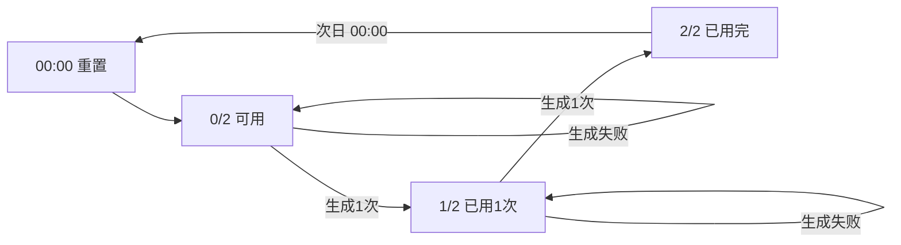
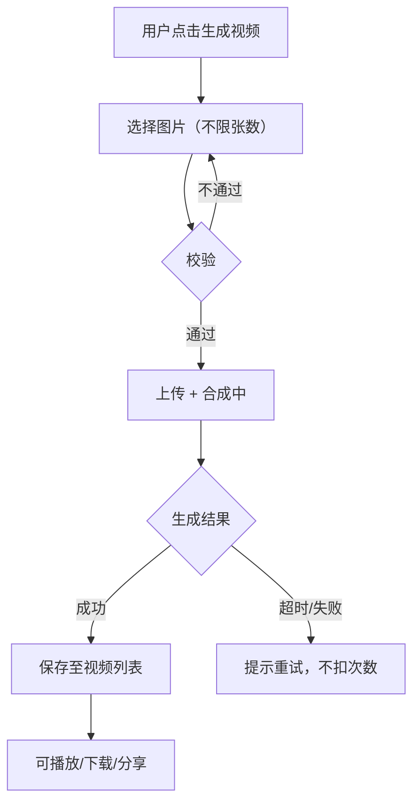
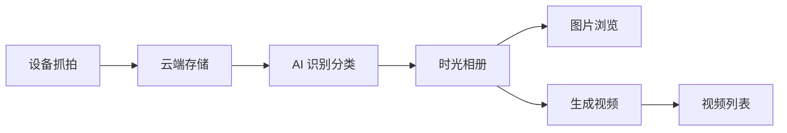

# 时光相册 — 需求分析文档

## 修订记录

| 修订时间 | 修订内容 | 修订人 |
|------|------|------|
| 2026-06-22 | 初稿 | Kiro |
| 2026-06-26 | 更新视频生成规则：不限制图片张数、历史日期限1次、每日仅保留最新视频 | Kiro |

---

## 一、业务背景

### 业务场景

CareCam Pro 作为安防与看护类摄像机的配套 APP，设备每天产生大量抓拍图片（告警事件抓图、云端抓图等）。当前这些图片仅作为事件记录辅助信息展示，分散在消息列表和 AI 事件详情中，用户缺乏统一浏览和管理设备图片的入口。

借鉴手机系统相册（如 Google Photos、Apple Photos）的体验，为 CareCam 用户提供一个设备专属的「时光相册」功能：
- 自动汇聚设备所有抓拍图片
- AI 智能分类（常规、宠物、老人、儿童），方便按关注对象查看
- 支持一键生成短视频，将静态图片转化为可分享的回忆片段

### 用户痛点

- 设备抓图分散在各处（事件详情、消息列表、AI 日报），无法统一浏览
- 想回顾家人/宠物的日常瞬间时，需要在大量事件记录中翻找
- 静态图片缺乏情感表达力，用户希望将图片组合成短视频分享

### 产品目标

- 一站式图片浏览：按分类（常规/宠物/老人/儿童）切换查看设备抓拍图片
- AI 自动分类：后台 AI 自动识别图片内容并归入对应分类
- 一键生成视频：用户可主动生成图片短视频，每日限 2 次
- 视频可保存/分享

---

## 二、名词解释

| 术语 | 说明 |
|------|------|
| 时光相册 | 汇聚设备云端抓拍图片并按 AI 分类展示的功能模块，入口在设备设置页 |
| 图片分类 | AI 自动识别图片内容后归入的类别：常规（默认）、宠物、老人、儿童 |
| 常规分类 | 未识别到特定对象的图片，或场景/风景类图片，作为默认分类 |
| 宠物分类 | AI 识别到猫、狗等宠物主体的图片 |
| 老人分类 | AI 识别到老年人主体的图片 |
| 儿童分类 | AI 识别到儿童/婴儿主体的图片 |
| 生成视频 | 用户选择一个分类下的多张图片（不限张数），系统自动合成短视频（配乐+转场），每日限制 2 次，历史未生成日期限 1 次，每日仅保留最新视频 |
| 图片库 | 某个分类下的图片网格列表，展示图片缩略图和拍摄时间 |
| 设备抓拍图片 | 设备定时或事件触发时抓拍并上传至云端存储的图片（依赖云存储服务） |

---

## 三、功能范围

### 3.1 功能列表总览

| 序号 | 模块 | 功能 | 优先级 | 说明 | 备注 |
|------|------|------|:--:|------|------|
| F1 | 设置页 | 时光相册入口 | P0 | 设备设置页新增「时光相册」设置项，点击进入时光相册主页 | — |
| F2 | 时光相册 | 分类 Tab 切换 | P0 | 顶部 4 个分类 Tab：常规/宠物/老人/儿童，默认显示常规 | 各分类独立加载 |
| F3 | 时光相册 | 图片库网格 + 日期筛选 | P0 | 按选中分类展示图片缩略图网格，按日期分组（今天/昨天/本周/更早），每张图片显示拍摄时间 | — |
| F4 | 时光相册 | 图片详情查看 | P1 | 点击图片全屏查看，支持左右滑动切换 | — |
| F5 | 时光相册 | 生成视频 | P0 | 底部「生成视频」按钮，点击后选择图片 → 确认生成，每日 2 次限制，历史日期限 1 次，不限制图片张数 | **核心功能** |
| F6 | 时光相册 | 视频列表 | P1 | 已生成视频列表，支持播放/下载/分享；视频有效期 30 天，过期自动清理 | — |
| F7 | 时光相册 | 空态/异常态 | P0 | 各分类无图片时的空态展示；网络异常/权限不足提示 | — |

### 3.2 不做/暂不做的功能

| 功能 | 原因 | 后续计划 |
|------|------|------|
| 用户手动上传图片 | 时光相册定位为设备抓图自动汇聚，非用户相册 | 不做 |
| 手动调整分类 | 一期由 AI 自动分类，暂不提供人工修正 | 后续按反馈评估 |
| 视频模板选择 | 一期使用默认模板（转场+配乐），不提供多模板 | 后续版本丰富 |
| 图片删除 | 时光相册为只读浏览，暂不支持删除 | 按需评估 |
| 多设备跨设备时光相册 | 一期每个设备独立 | 后续按需评估 |

---

## 四、场景穷举分析

### 4.1 时光相册入口

#### 4.1.1 功能概述

- **功能目的**：用户从设备设置页进入时光相册
- **前置条件**：用户已登录，设备已绑定
- **操作路径**：App 首页 → 设备卡片「设置」→ 设置页「时光相册」→ 时光相册主页

#### 4.1.2 正常场景

| 场景编号 | 场景名称 | 前置条件 | 操作步骤 | 预期结果 | 状态变化 |
|------|------|------|------|------|------|
| N-001 | 从设置页进入时光相册 | 设备已绑定 | 1. 首页点击设备设置 2. 在设置列表找到「时光相册」 3. 点击进入 | 跳转至时光相册主页，默认显示「常规」分类 | — |
| N-002 | 返回设置页 | 在时光相册主页 | 点击顶部返回按钮 | 回到设备设置页 | — |

#### 4.1.3 异常场景

| 场景编号 | 异常类型 | 触发条件 | 系统行为 | 用户感知 |
|------|------|------|------|------|
| E-001 | 设备未开通云存储 | 无云存储服务 | 无法获取云端图片 | 空态 + 提示「暂无设备抓拍图片」（不引导开通） |

### 4.2 分类 Tab 与图片库浏览

#### 4.2.1 功能概述

- **功能目的**：按分类查看设备抓拍图片
- **前置条件**：已进入时光相册，设备有云存储图片
- **操作路径**：时光相册主页 → 切换顶部 Tab → 浏览图片网格

#### 4.2.2 正常场景

| 场景编号 | 场景名称 | 前置条件 | 操作步骤 | 预期结果 | 状态变化 |
|------|------|------|------|------|------|
| N-101 | 浏览常规分类 | 已有常规分类图片 | 1. 进入时光相册 2. 默认在「常规」Tab 3. 上下滚动浏览 | 展示常规分类图片网格，每张图显示日期标签 | — |
| N-102 | 切换到宠物分类 | 已有宠物分类图片 | 1. 点击「宠物」Tab 2. 查看图片 | 切换至宠物分类图片网格 | Tab 高亮切换 |
| N-103 | 切换到空分类 | 「老人」分类暂无图片 | 点击「老人」Tab | 显示空态提示「暂无该类图片」 | Tab 高亮切换 |
| N-104 | 点击图片查看 | 图片网格已加载 | 点击某张图片 | 全屏大图查看，可左右滑动浏览同分类其他图片 | 进入大图模式 |
| N-105 | 下拉刷新 | 图片网格已加载 | 在网格顶部下拉 | 触发刷新动画，重新加载当前分类图片 | — |
| N-106 | 按日期筛选 | 图片库有跨多日的图片 | 1. 点击日期筛选按钮 2. 选择日期范围 | 网格仅显示所选范围内的图片 | 筛选条件生效 |

#### 4.2.3 异常场景

| 场景编号 | 异常类型 | 触发条件 | 系统行为 | 用户感知 |
|------|------|------|------|------|
| E-101 | 网络异常 | 无网络或请求超时 | 保留上次缓存数据（如有），底部 Toast | Toast「网络异常，请检查网络」 |
| E-102 | 加载失败 | 服务端错误 | 停止加载动画 | Toast「加载失败，请重试」+ 重试按钮 |
| E-103 | 图片加载失败 | 单张图片 URL 失效 | 显示默认占位图 | 模糊缩略图占位 |
| E-104 | 数据为空 | 所有分类均无图片 | 默认分类 Tab 显示空态 | 空态插图 + 「暂无设备抓拍图片」 |
| E-105 | 设备离线 | 设备不在线 | 可浏览已有图片，无法获取新图片 | 顶部横幅提示「设备离线，图片暂不更新」 |

#### 4.2.4 边界条件

| 条件项 | 说明 | 默认值 |
|------|------|------|
| 图片数量 | 单分类图片数无硬限制，分页加载（每页 20 张） | 滚动加载更多 |
| 分类数量 | 固定 4 个：常规/宠物/老人/儿童 | — |
| 图片格式 | 支持 JPEG/PNG/WebP | — |

### 4.3 生成视频

#### 4.3.1 功能概述

- **功能目的**：用户选择图片后生成短视频
- **前置条件**：当天生成次数 < 2，该日期未生成过视频
- **操作路径**：时光相册主页 → 点击「生成视频」→ 选择图片 → 确认生成 → 等待合成 → 查看视频

#### 4.3.2 正常场景

| 场景编号 | 场景名称 | 前置条件 | 操作步骤 | 预期结果 | 状态变化 |
|------|------|------|------|------|------|
| N-201 | 首次生成视频 | 今日生成 0 次，所选日期未生成过视频 | 1. 点击底部「生成视频」2. 进入图片选择模式 3. 勾选图片 4. 点击「开始生成」5. 确认 | 上传图片列表 → 服务端合成 → 返回视频 → 自动保存至视频列表 | 今日剩余次数: 2→1 |
| N-202 | 第二次生成 | 今日已生成 1 次，所选日期未生成过视频 | 同上流程 | 成功生成；若同日有旧视频则替换 | 今日剩余次数: 1→0 |
| N-203 | 查看已生成视频 | 已有生成记录 | 1. 点击「视频列表」入口 2. 查看视频列表 | 展示历史视频，每项显示封面/生成时间/时长 | — |
| N-204 | 播放视频 | 视频列表中有视频 | 点击某个视频 | 全屏播放视频 | — |
| N-205 | 下载/分享视频 | 视频播放中或列表项 | 点击下载/分享按钮 | 保存到本地/调起系统分享面板 | — |

#### 4.3.3 异常场景

| 场景编号 | 异常类型 | 触发条件 | 系统行为 | 用户感知 |
|------|------|------|------|------|
| E-201 | 次数用尽 | 当日已生成 2 次 | 点击「生成视频」 | 按钮置灰或弹窗提示「今日生成次数已用完，请明天再来」，显示剩余时间 |
| E-202 | 历史日期已生成 | 所选日期已有生成记录 | 点击「生成视频」或日期筛选时选中该日期 | Toast「该日期已生成过视频」 |
| E-203 | 生成超时 | 服务端合成超过 60s | 停止等待动画 | Toast「视频生成超时，请重试」 |
| E-204 | 生成失败 | 服务端合成出错 | 停止等待动画 | Toast「视频生成失败，请重试」+ 不消耗次数 |
| E-205 | 网络中断 | 生成过程中断网 | 中断上传/下载 | Toast「网络连接已断开」+ 不消耗次数 |

#### 4.3.4 边界条件

| 条件项 | 最小值 | 最大值 | 默认值 | 超限行为 |
|------|------|------|------|------|
| 每日生成次数 | 0 | 2 次 | — | 达到上限后按钮不可用，次日 00:00 重置 |
| 历史日期生成次数 | — | 1 次/日期 | — | 已生成过的日期不可再生成 |
| 每日视频保留 | — | 1 个 | — | 同日新视频替换旧视频 |
| 选择图片数量 | 1 张 | 不限 | — | — |
| 生成等待时间 | — | 60 秒 | — | 超时提示重试 |
| 视频格式 | — | — | MP4 | — |

### 4.4 状态流转

#### 4.4.1 每日生成次数状态

#### 4.4.2 视频生成状态

---

## 五、跨模块联动分析

### 5.1 与现有模块的关联

| 关联模块 | 关联方式 | 影响 |
|------|------|------|
| 设备设置页 | 新增时光相册入口项 | 在 settingsItems 中追加一项，跳转至时光相册页 |
| 云存储服务 | 时光相册图片来自云端抓图存储 | 未开通云存储时需引导开通 |
| 路由系统 | 新增时光相册相关路由 | 新增 `/time-album`、`/time-album/video-list` 等路由 |
| 消息页 / AI 事件 | 图片来源 | 仅数据来源关联，不改变现有页面行为 |
| 设备预览页 | 可能提供快捷入口（后续版本） | 一期不做 |

### 5.2 数据流

---

## 六、待确认问题

| 序号 | 问题 | 建议方案 | 决策 |
|------|------|------|------|
| Q01 | 视频格式/配乐模板是否可选择性？ | 一期仅默认模板（基础转场+背景音乐） | **已确认：仅默认模板** |
| Q02 | 视频服务端合成还是客户端合成？ | 建议服务端（保证质量一致性），需后端配合 | **已确认：服务端合成** |
| Q03 | 图片库是否需要按日期分组（如「今天」「昨天」「本周」「更早」）？ | 建议按日期分组，增强时间线感知 | **已确认：需要日期筛选和分类筛选** |
| Q04 | 视频列表是否需要有效期（如生成后 30 天自动清理）？ | 建议 30 天有效期，过期前 3 天提醒 | **已确认：30 天自动清理** |
| Q05 | 是否需要在首页或底部导航增加快捷入口？ | 一期仅设置页入口，后续根据使用数据评估 | **已确认：不需要** |
| Q06 | 未开通云存储时，是否允许用户在 APP 内直接开通？ | 建议显示引导文案 + 跳转至服务商城/我的服务 | **已确认：不需要** |

---

*文档版本: v1.0 | 创建日期: 2026-06-22*
