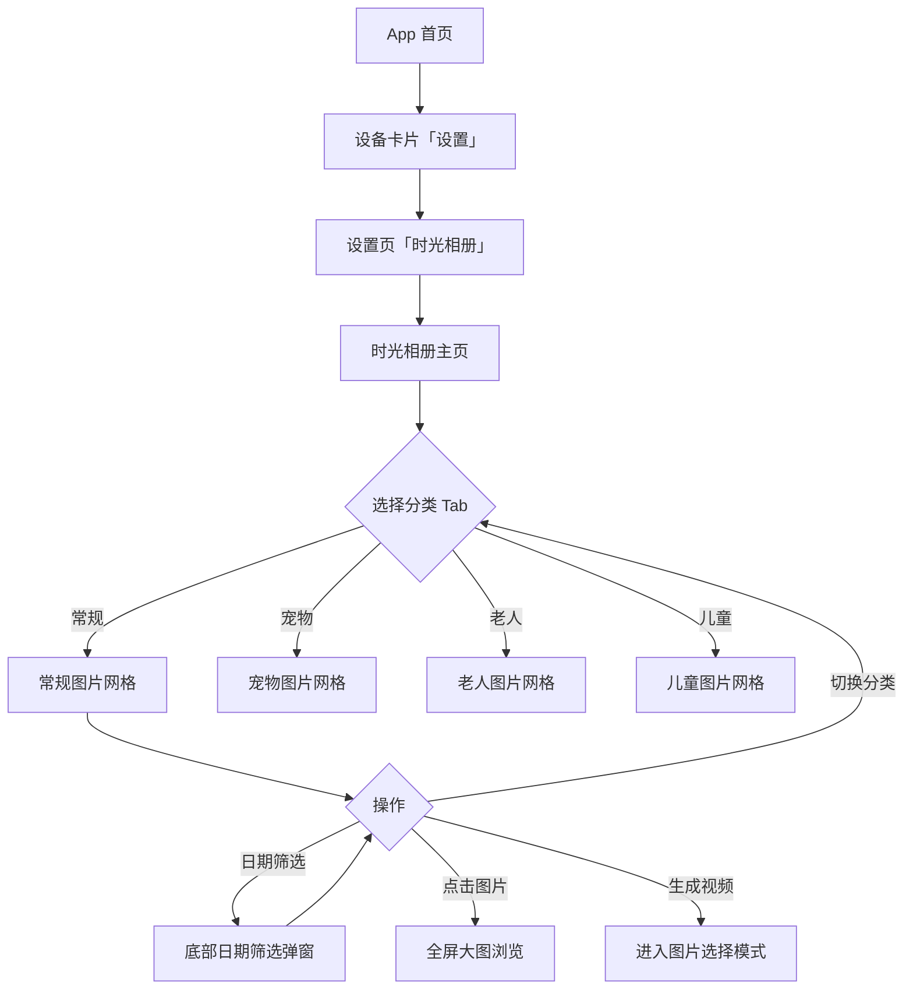
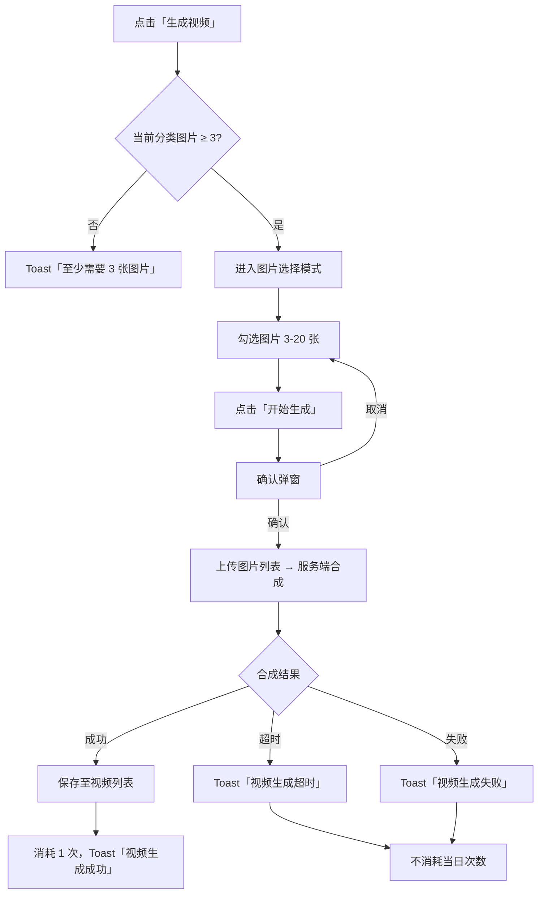
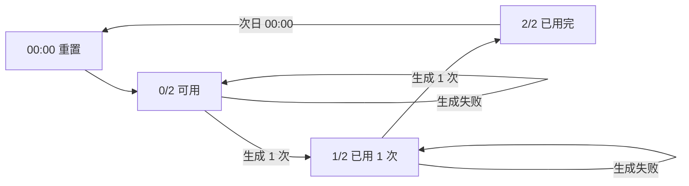
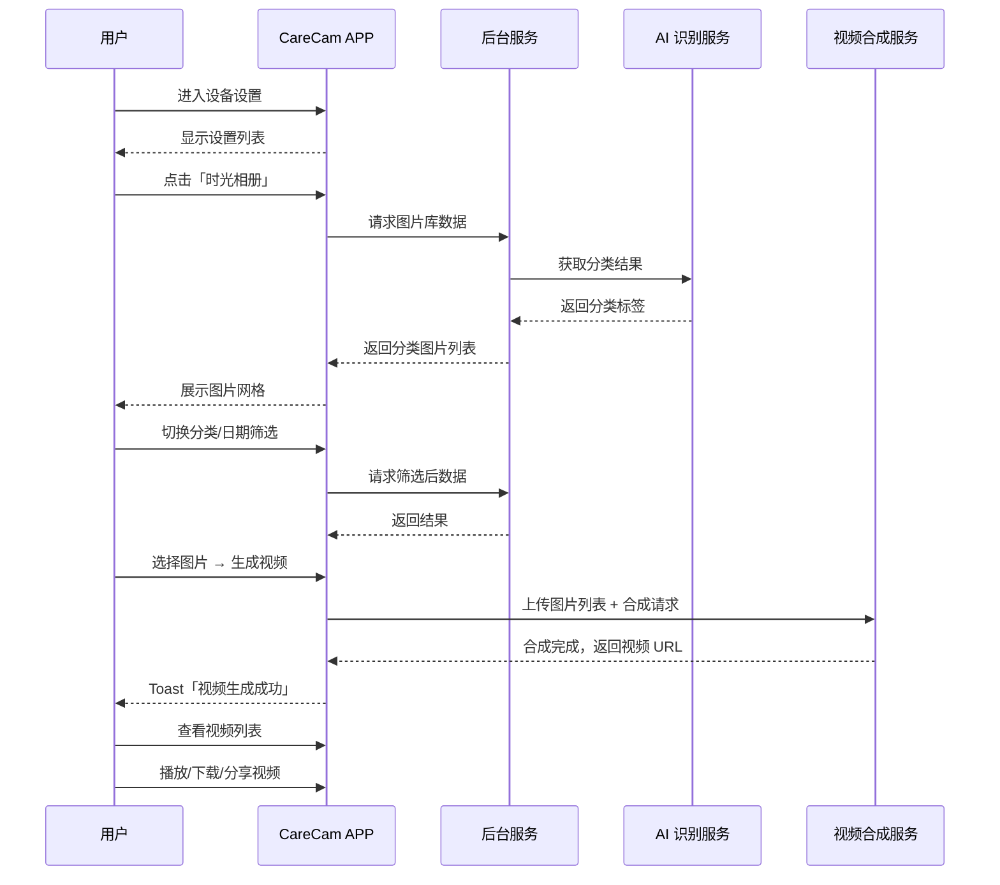
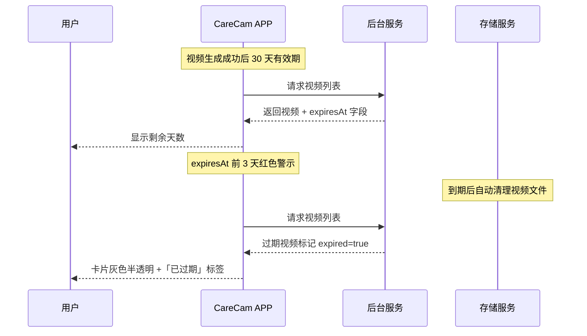

# 时光相册 — 完整业务 PRD

## 修订记录

| 修订时间 | 修订内容 | 修订人 |
|------|------|------|
| 2026-06-22 | v1.0 初稿 | Kiro |

---

## 一、业务背景

CareCam Pro 设备每天产生大量抓拍图片，当前分散在事件详情、消息列表和 AI 日报中，用户缺乏统一浏览和回顾设备图片的入口。

借鉴手机系统相册体验，为 CareCam 用户提供设备专属「时光相册」：
- 自动汇聚设备云端抓拍图片
- AI 智能分类（常规、宠物、老人、儿童）
- 支持一键生成短视频（每日限 2 次）

**产品目标**：一站式的设备图片浏览和视频生成体验，增强用户粘性和情感连接。

---

## 二、名词解释

| 术语 | 说明 |
|------|------|
| 时光相册 | 汇聚设备云端抓拍图片并按 AI 分类展示的功能模块，入口在设备设置页 |
| 图片分类 | AI 自动识别图片内容后归入的类别：常规（默认）、宠物、老人、儿童。各分类独立加载 |
| 常规分类 | 未识别到特定对象的图片，或场景/风景类图片，作为默认分类 |
| 宠物分类 | AI 识别到猫、狗等宠物主体的图片 |
| 老人分类 | AI 识别到老年人主体的图片 |
| 儿童分类 | AI 识别到儿童/婴儿主体的图片 |
| 生成视频 | 用户选择 3-20 张图片，服务端合成短视频（默认模板：转场+配乐），每日限制 2 次 |
| 视频有效期 | 生成后的视频保留 30 天，过期自动清理，过期前 3 天红色警示 |
| 图片库 | 按日期分组的图片网格列表，每张图片显示缩略图和拍摄时间 |

---

## 三、核心业务流程

### 3.1 浏览时光相册流程



### 3.2 生成视频流程



### 3.3 每日生成次数状态流转



### 3.4 全局时序图



### 3.5 视频过期时序



---

## 四、业务规则

| 编号 | 规则 | 说明 |
|------|------|------|
| R01 | 入口规则 | 仅从设备设置页「时光相册」进入，无底部导航入口 |
| R02 | AI 分类 | 图片由后台 AI 自动分类为常规/宠物/老人/儿童，各分类独立 Tab |
| R03 | 日期筛选 | 支持按日期范围筛选图片，默认显示全部时间 |
| R04 | 每日生成限制 | 每天最多 2 次，00:00 重置，失败不扣次数 |
| R05 | 图片选择范围 | 每 3-20 张，超过 20 张 Toast「最多选择 20 张」，不足 3 张不可生成 |
| R06 | 视频模板 | 仅默认模板（基础转场+背景音乐），不可选择 |
| R07 | 视频合成 | 服务端合成，60s 超时，超时不消耗生成次数 |
| R08 | 视频有效期 | 生成后保留 30 天，过期自动清理，剩余 ≤ 3 天时红色警示 |
| R09 | 图片来源 | 从云端抓图存储获取，无云存储服务的设备显示空态 |
| R10 | 空态展示 | 全部无图片：「暂无设备抓拍图片」；单分类无图片：「暂无该类图片」 |

---

## 五、功能架构

```
时光相册模块
├── 设备设置页（改造）
│   └── 新增「时光相册」设置项 → 跳转 /time-album
│
├── 时光相册主页 /time-album
│   ├── 顶部返回栏：返回 + 标题 + 功能说明
│   ├── 分类 Tab 栏：常规 / 宠物 / 老人 / 儿童
│   ├── 日期筛选栏：范围显示 + 筛选图标 → 日期选择弹窗
│   ├── 图片网格区
│   │   ├── 按日期分组（今天/昨天/本周/具体日期）
│   │   ├── 三列等宽网格 + van-image 懒加载
│   │   ├── 选择模式（勾选框 + 已选预览条）
│   │   └── 空态 / 加载态
│   └── 底部操作栏
│       ├── 正常模式：视频列表入口 + 生成视频按钮
│       └── 选择模式：已选预览 + 计数 + 开始生成 + 取消
│
├── 视频列表页 /time-album/video-list
│   ├── 顶部返回栏：返回 + 标题
│   ├── 视频卡片列表：封面 + 时长 + 生成时间 + 有效期倒计时 + 操作
│   └── 空态：暂无生成的视频
│
└── 视频播放（overlay）
    └── 全屏播放器 + 下载/分享按钮
```

---

## 六、详细功能描述

### 6.1 设置页入口

在设备设置列表新增「时光相册」项，图标 photo-o（粉色 #E91E63），描述「智能分类、生成视频」。点击跳转至时光相册主页，携带 `deviceId` 和 `deviceName` 参数。

### 6.2 时光相册主页

**分类 Tab**：4 个 chip 标签水平排列（常规/宠物/老人/儿童），默认选中「常规」。选中标签蓝底白字，未选中透明底灰字。各分类显示图片计数 badge。

**日期筛选**：显示当前筛选范围文字（如「2026/06/15 - 2026/06/22」或「全部时间」）。点击弹出日期选择弹窗，支持起止日期选择，确认后更新筛选结果。

**图片网格**：三列等宽网格，4px 间距。图片按日期分组（今天/昨天/本周/具体日期），每组顶部显示日期标签。每张图片右下角叠加拍摄时间。网格支持垂直滚动，触底可加载更多（每页 20 张）。

**图片选择模式**：点击「生成视频」进入。每张图片出现勾选框，选中后边框高亮。底部显示已选数量 + 缩略图预览条 + 「开始生成」按钮 + 「取消」按钮。最多选 20 张，最少 3 张方可生成。

**生成视频**：确认后弹窗验证，提交图片列表至服务端合成。等待期间全屏遮罩 + spinner + 「视频生成中...」。成功后 Toast 提示并跳转视频列表，失败提示重试且不扣次数。

**底部按钮状态**：
- 剩余 2/2 次：蓝色实心「生成视频」
- 剩余 1/2 次：蓝色实心「生成视频（剩余 1 次）」
- 剩余 0/2 次：灰色置灰「今日已用完」

### 6.3 视频列表

展示已生成的所有视频卡片。每张卡片包含：16:9 封面缩略图、视频时长标签、生成日期、「时光视频」标题、有效期倒计时（≤ 3 天红色）、操作栏（播放/下载/分享）。

已过期视频：卡片半透明灰色，不可播放，显示「已过期」标签。

**空态**：未生成过视频时，居中显示「暂无生成的视频」。

### 6.4 视频播放

点击视频卡片进入全屏播放器。顶部半透明返回按钮，底部下载和分享按钮。下载保存至系统相册，分享调起系统分享面板。

---

## 七、状态说明

| 状态 | 触发条件 | 展示内容 |
|------|------|------|
| 正常态 | 数据就绪 | 分类 Tab + 日期筛选 + 图片网格 + 底部操作栏 |
| 空态 — 全部无图片 | 所有分类均无图片 | `van-empty`「暂无设备抓拍图片」 |
| 空态 — 单分类无图 | 某分类无图片 | 切换 Tab 后网格区显示「暂无该类图片」 |
| 空态 — 无视频 | 从未生成视频 | 视频列表页「暂无生成的视频」 |
| 加载态 — 首次 | 首次进入页面 | 居中 `van-loading` |
| 加载态 — 更多 | 滚动到列表底部 | 底部 `van-loading size="small"` |
| 加载态 — 生成中 | 正在合成视频 | 全屏遮罩 + spinner + 「视频生成中...」 |
| 边界态 — 次数用完 | 当日已生成 2 次 | 底部按钮置灰「今日已用完」 |
| 边界态 — 次数剩余 1 | 当日已生成 1 次 | 按钮显示「生成视频（剩余 1 次）」 |
| 边界态 — 图片不足 | 分类图片 < 3 张 | 点击生成按钮 Toast「至少需要 3 张图片才能生成视频」 |
| 边界态 — 选满 20 张 | 已选 20 张 | 继续点击 Toast「最多选择 20 张」 |
| 边界态 — 视频临近过期 | expiresAt ≤ 3 天 | 有效期倒计时红色 |
| 边界态 — 视频已过期 | expiresAt < 当前 | 卡片灰色半透明 + 「已过期」标签 |
| 错误态 — 网络 | 加载/生成时断网 | Toast「网络异常，请检查网络」 |
| 错误态 — 加载失败 | 服务端返回错误 | 「加载失败，请重试」+ 可点击重试 |
| 错误态 — 生成超时 | 合成 > 60s | Toast「视频生成超时」，不扣次数 |
| 错误态 — 生成失败 | 服务端合成出错 | Toast「视频生成失败，请重试」，不扣次数 |

---

## 八、页面信息架构

```
CareCam Pro
├── 首页 /home
│   └── 设备卡片 →「设置 」
│
├── 设备设置页 /settings  ← 改造
│   ├── [已有] 侦测/通知/画面/音频/存储/云台/工作模式/录制模式/电池/灯光
│   ├── [新增] 时光相册 → /time-album
│   └── [已有] 一键分享
│
├── 时光相册主页 /time-album  ← 新建
│   ├── 返回 → /settings
│   └── 底部「视频列表」→ /time-album/video-list
│
├── 视频列表 /time-album/video-list  ← 新建
│   └── 返回 → /time-album
│
└── 视频播放 ← overlay（视频列表页内）
```

---

## 九、异常说明

| 异常类型 | 页面表现 | 处理方式 |
|------|------|------|
| 网络异常 | 保留上次缓存数据（如有），底部 Toast | 「网络异常，请检查网络」 |
| 加载失败 | 显示重试按钮 | 「加载失败，请重试」 |
| 单张图片加载失败 | 缩略图显示灰色占位图 | `van-image` error slot 兜底 |
| 无云存储服务 | 无云端图片 | 显示空态「暂无设备抓拍图片」 |
| 设备离线 | 可浏览缓存图片 | 顶部横幅提示「设备离线，图片暂不更新」 |
| 生成超时 | 停止等待动画 | 60s 后自动提示超时，不扣次数 |
| 生成失败 | 停止等待动画 | 提示重试，不扣次数 |
| 生成时断网 | 中断上传/下载 | 提示网络断开，不扣次数 |
| 次数校验失败 | 后端返回次数用尽 | 按钮置灰，提示次数已用完 |

---

## 十、APP 埋点与运营数据看板

### 10.1 核心指标

| 指标 | 维度 | 定义 |
|------|------|------|
| 时光相册入口点击率 | 行为 | 点击「时光相册」用户数 / 进入设置页用户数 |
| 分类 Tab 切换率 | 行为 | 各分类 Tab 点击占比 |
| 视频生成次数 | 行为 | 每日视频生成总量、人均生成次数 |
| 视频生成成功率 | 质量 | 成功 / 总提交次数 |
| 生成次数用尽率 | 行为 | 用尽 2 次的用户占比 |
| 视频播放率 | 行为 | 播放 / 生成数 |
| 视频分享率 | 行为 | 分享 / 播放数 |

### 10.2 关键埋点事件

| 事件名 | 触发时机 | 参数 |
|------|------|------|
| `time_album_enter` | 进入时光相册主页 | deviceId, category |
| `time_album_tab_switch` | 切换分类 Tab | fromCategory, toCategory |
| `time_album_date_filter` | 确认日期筛选 | startDate, endDate, category |
| `time_album_select_start` | 点击生成视频 | category, imageCount |
| `time_album_select_image` | 勾选/取消图片 | imageId, action(select/unselect) |
| `time_album_gen_confirm` | 确认开始生成 | imageCount, imageIds, remaining |
| `time_album_gen_result` | 视频生成结果 | result(success/timeout/fail), duration(ms) |
| `time_album_video_play` | 播放视频 | videoId, source(list/popup) |
| `time_album_video_download` | 下载视频 | videoId |
| `time_album_video_share` | 分享视频 | videoId, platform |

---

*文档版本: v1.0 | 创建日期: 2026-06-22*
