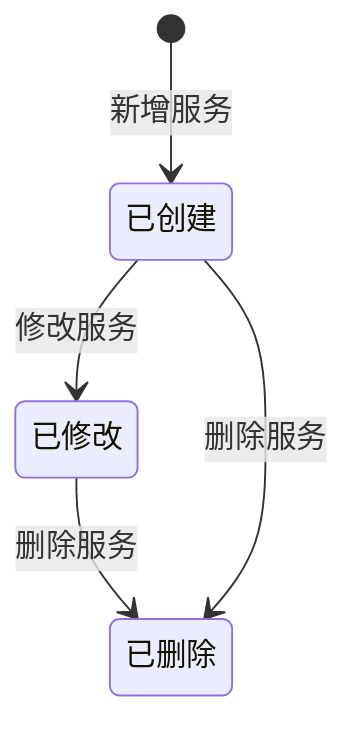

# 服务类型模块复刻 — 需求分析文档

## 修订记录

| 修订时间 | 修订内容 | 修订人 |
|------|------|------|
| 2026-06-30 | 初稿 | Kiro |

---

## 一、业务背景

在鹤梦云生态平台中，「套餐管理 → 服务类型」模块是套餐服务的底层配置入口。平台上的所有套餐功能（云存储、AI 检测、智能报警、语音助手等）都依赖服务类型模块定义的基础服务数据。

当前 iot-platform 项目缺少此模块，需要在项目中完整复刻该功能，使其具备与参考站点一致的服务类型管理能力。

**产品目标**：

- 新增「服务分类」管理：支持新建/编辑分类，分类列表展示包含的服务数量
- 新增「服务管理」：支持服务列表、新增/修改/删除服务
- 新增「物模型配置」：创建服务时关联物模型，修改服务时配置算法参数

---

## 二、名词解释

| 术语 | 说明 |
|------|------|
| 服务类型 | 平台上可售卖或可开通的基础服务单元，如"智能告警""云存储""GPS 定位" |
| 服务分类 | 对服务类型的归类分组，如"云存储""AI 服务""未分类" |
| 服务 ID | 服务类型的唯一数字标识，如 `110600` |
| 物模型 | 设备能力抽象，描述设备可上报的属性、可执行的服务、可触发的事件 |
| 物模型 ID | 物模型的唯一数字标识，如 `1000`（人形/运动检测） |
| 可选物模型 | 平台已定义的所有物模型，供服务创建时勾选关联 |
| 已选物模型 | 当前服务已关联的物模型列表 |
| 算法参数详情配置 | 修改服务时，对已关联的物模型进一步配置事件类型和开关状态 |

---

## 三、功能范围

### 3.1 功能列表总览

| 序号 | 模块 | 功能 | 优先级 | 说明 |
|------|------|------|:--:|------|
| F1 | 服务分类 | 分类列表 | P0 | 左侧面板，展示分类名称 + 服务数量 badge |
| F2 | 服务分类 | 新建分类 | P0 | 弹窗：分类名称（必填）+ 排序号（默认0） |
| F3 | 服务分类 | 编辑分类 | P0 | 弹窗：与新建相同，数据回填 |
| F4 | 服务管理 | 服务列表 | P0 | 表格：选择框、服务名称、服务ID、所属分类、最后更新、操作 |
| F5 | 服务管理 | 新增服务 | P0 | 弹窗：服务名称 + 服务ID + 所属分类 + 物模型配置 |
| F6 | 服务管理 | 修改服务 | P0 | 弹窗：与新增相同 + 算法参数详情配置 |
| F7 | 服务管理 | 删除服务 | P0 | 二次确认后删除 |
| F8 | 服务管理 | 批量移动 | P1 | 选中多个服务后移动到指定分类 |

### 3.2 不做/暂不做的功能

| 功能 | 原因 | 后续计划 |
|------|------|------|
| 物模型本身的增删改查 | 已有独立的物模型管理模块 | — |
| 分类删除 | 参考站点未提供 | 按需追加 |
| 服务详情页 | 参考站点仅弹窗模式 | — |

---

## 四、场景穷举分析

### 4.1 服务分类 — 列表展示

#### 4.1.1 功能概述

左侧面板展示服务分类列表，每个分类项显示图标、名称、服务数量 badge。点击分类可筛选右侧服务列表。

#### 4.1.2 正常场景

| 场景编号 | 场景名称 | 前置条件 | 操作步骤 | 预期结果 |
|------|------|------|------|------|
| N-001 | 查看分类列表 | 进入服务类型页面 | 页面加载 | 左侧展示全部分类，含数量 badge |
| N-002 | 点击分类筛选 | 分类列表已加载 | 点击某分类 | 右侧服务列表筛选为该分类下的服务 |

#### 4.1.3 异常场景

| 场景编号 | 异常类型 | 触发条件 | 系统行为 | 用户感知 |
|------|------|------|------|------|
| E-001 | 数据为空 | 无分类数据 | 显示默认"未分类"，数量 0 | 空列表 |
| E-002 | 网络异常 | 请求超时 | 保留上次数据，Toast 提示 | 可手动刷新 |

#### 4.1.4 边界条件

| 条件项 | 最小值 | 最大值 | 默认值 | 超限行为 |
|------|------|------|------|------|
| 分类名称 | 1 字符 | 50 字符 | — | Toast 提示 |
| 排序号 | 0 | 9999 | 0 | — |

---

### 4.2 服务分类 — 新建/编辑

#### 4.2.1 功能概述

点击「新建分类」触发对话框，填写分类名称和排序号后保存。点击分类旁的编辑图标触发同一对话框，数据回填。

#### 4.2.2 正常场景

| 场景编号 | 场景名称 | 前置条件 | 操作步骤 | 预期结果 |
|------|------|------|------|------|
| N-003 | 新建分类 | 页面已加载 | 点击「新建分类」→ 填名称和序号 → 确定 | 分类列表新增一项 |
| N-004 | 编辑分类 | 分类已存在 | 点击编辑 → 修改名称 → 确定 | 分类名称更新 |

#### 4.2.3 异常场景

| 场景编号 | 异常类型 | 触发条件 | 系统行为 | 用户感知 |
|------|------|------|------|------|
| E-003 | 名称为空 | 提交时未填分类名称 | 前端校验拦截 | 提示"请输入分类名称" |
| E-004 | 重复名称 | 与已有分类同名 | 后端返回错误 | Toast 提示 |
| E-005 | 网络异常 | 请求超时 | Toast 提示失败 | 对话框保持打开，可重试 |

---

### 4.3 服务管理 — 列表展示

#### 4.3.1 功能概述

右侧表格展示服务列表，支持分类筛选、多选、操作（修改/删除）。

#### 4.3.2 正常场景

| 场景编号 | 场景名称 | 前置条件 | 操作步骤 | 预期结果 |
|------|------|------|------|------|
| N-005 | 查看服务列表 | 进入页面 | 页面加载 | 展示所有服务，分页 |
| N-006 | 按分类筛选 | 已有分类 | 点击左侧「云存储」分类 | 右侧仅展示该分类下服务 |
| N-007 | 选中服务 | 列表已加载 | 勾选某服务 checkbox | 行高亮，「批量移动」按钮激活 |

#### 4.3.3 异常场景

| 场景编号 | 异常类型 | 触发条件 | 系统行为 | 用户感知 |
|------|------|------|------|------|
| E-006 | 列表为空 | 无服务数据 | 显示空态 | "暂无数据" |
| E-007 | 网络异常 | 请求超时 | Toast 提示 | 保留旧列表，可刷新 |

#### 4.3.4 边界条件

| 条件项 | 最小值 | 最大值 | 默认值 | 超限行为 |
|------|------|------|------|------|
| 服务名称 | 1 字符 | 50 字符 | — | Toast 提示 |
| 服务 ID | 1 | 999999 | — | 后端校验唯一性 |

---

### 4.4 服务管理 — 新增服务

#### 4.4.1 功能概述

点击「新增服务」触发大弹窗，填写服务名称、服务 ID、所属分类，并在物模型配置区域从可选物模型中勾选关联。

#### 4.4.2 正常场景

| 场景编号 | 场景名称 | 前置条件 | 操作步骤 | 预期结果 |
|------|------|------|------|------|
| N-008 | 新增服务-基础信息 | 弹窗打开 | 填写名称 + ID + 选分类 | 保存按钮可用 |
| N-009 | 新增服务-选物模型 | 弹窗打开 | 从「可选」勾选 → 点「添加」 | 物模型移入「已选」 |
| N-010 | 新增服务-移除物模型 | 已选有物模型 | 从「已选」勾选 → 点「移除」 | 物模型移回「可选」 |
| N-011 | 新增服务-搜索物模型 | 可选物模型列表长 | 在搜索框输入关键词 | 列表筛选匹配项 |
| N-012 | 新增服务-保存 | 所有必填项已填 | 点击「保存」 | 服务创建成功，列表刷新 |

#### 4.4.3 异常场景

| 场景编号 | 异常类型 | 触发条件 | 系统行为 | 用户感知 |
|------|------|------|------|------|
| E-008 | 名称为空 | 提交时未填服务名称 | 前端校验 | 提示"请输入服务名称" |
| E-009 | ID 为空 | 提交时未填服务 ID | 前端校验 | 提示"请输入服务 ID" |
| E-010 | ID 重复 | 与已有服务 ID 冲突 | 后端返回错误 | Toast 提示"服务 ID 已存在" |
| E-011 | ID 非数字 | 输入非数字字符 | 前端限制输入 | 无法输入非数字 |
| E-012 | 网络异常 | 保存请求超时 | Toast 提示失败 | 弹窗保持，可重试 |

#### 4.4.4 边界条件

| 条件项 | 说明 |
|------|------|
| 物模型最少 | 0 个（可选） |
| 物模型最多 | 41 个（平台物模型总数） |
| 所属分类默认值 | "未分类" |

---

### 4.5 服务管理 — 修改服务

#### 4.5.1 功能概述

点击某服务行的「修改」触发弹窗，数据回填。与新增弹窗的区别：额外展示「算法参数详情配置」区域，对每个已选物模型可配置事件类型。

#### 4.5.2 正常场景

| 场景编号 | 场景名称 | 前置条件 | 操作步骤 | 预期结果 |
|------|------|------|------|------|
| N-013 | 修改基础信息 | 弹窗打开 | 修改名称/分类 → 保存 | 信息更新 |
| N-014 | 修改物模型关联 | 弹窗打开 | 添加/移除物模型 | 关联变更，下方算法配置区同步更新 |
| N-015 | 配置事件类型 | 已选物模型存在 | 在算法配置区点「添加事件」→ 选事件 → 保存 | 事件列表新增一行 |
| N-016 | 切换事件开关 | 已有事件 | 切换某事件的「是否开启」 | 开关状态变更 |

#### 4.5.3 异常场景

| 场景编号 | 异常类型 | 触发条件 | 系统行为 | 用户感知 |
|------|------|------|------|------|
| E-013 | 服务 ID 不可改 | — | ID 字段展示但置灰不可编辑 | 灰显提示 |
| E-014 | 无物模型 | 已选为空 | 不展示算法配置区 | — |

#### 4.5.4 状态流转

**服务生命周期**：

---

### 4.6 服务管理 — 删除服务

#### 4.6.1 正常场景

| 场景编号 | 场景名称 | 前置条件 | 操作步骤 | 预期结果 |
|------|------|------|------|------|
| N-017 | 删除服务 | 服务存在 | 点击「删除」→ 二次确认弹窗 → 确定 | 服务从列表移除 |

#### 4.6.2 异常场景

| 场景编号 | 异常类型 | 触发条件 | 系统行为 | 用户感知 |
|------|------|------|------|------|
| E-015 | 服务被引用 | 服务已被套餐引用 | 后端返回错误 | Toast 提示"服务已被套餐引用，无法删除" |

---

## 五、跨模块联动分析

### 5.1 与物模型管理模块的关系

- 物模型配置中的「可选物模型」数据来源于物模型管理模块
- 本模块仅读取物模型列表，不修改物模型定义
- 修改服务时的「算法参数详情配置」读取物模型的事件定义

### 5.2 与套餐配置模块的关系

- 套餐配置（pkg/config.vue）中选择套餐服务时，依赖本模块的服务数据
- 服务被套餐引用后不可删除

### 5.3 路由关系

- 本模块路径：`/package/service`
- 与已有 pkg 模块同级，共用左侧导航「套餐管理」菜单组

---

## 六、待确认问题

| 序号 | 问题 | 建议方案 | 优先级 |
|------|------|------|:--:|
| Q1 | 服务 ID 是由系统自动生成还是手动输入？ | 参考站点为手动输入，建议保持一致 | P0 |
| Q2 | 分类是否需要支持删除？ | 参考站点未提供，建议本期不支持 | P2 |
| Q3 | 算法配置的事件类型数据来源？ | 从物模型的事件定义中读取 | P0 |

---

*文档版本: v1.0 | 创建日期: 2026-06-30*
