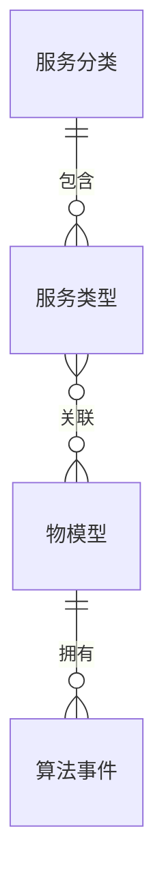
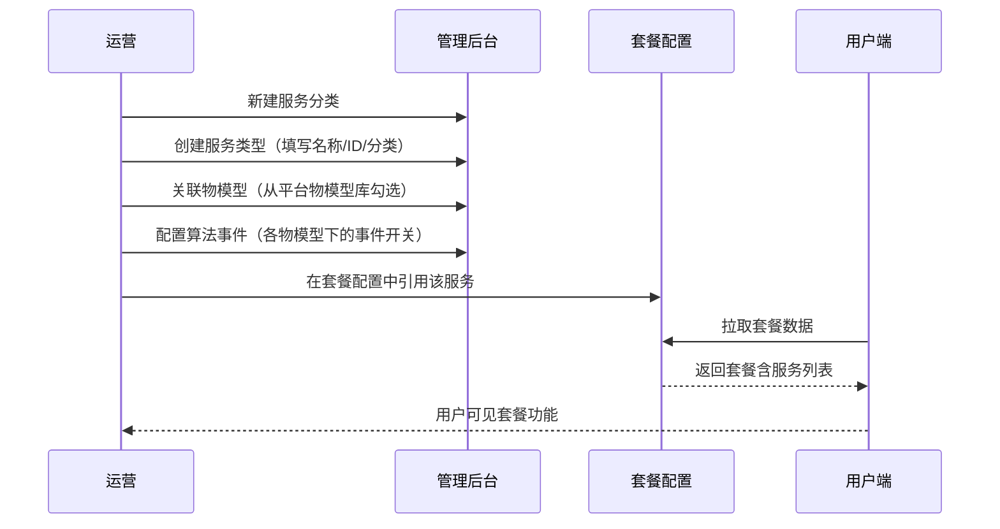
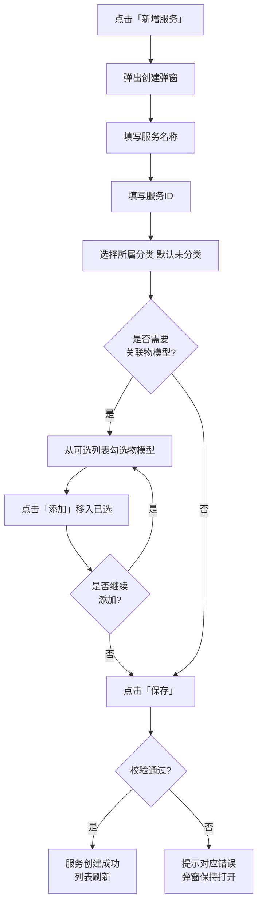
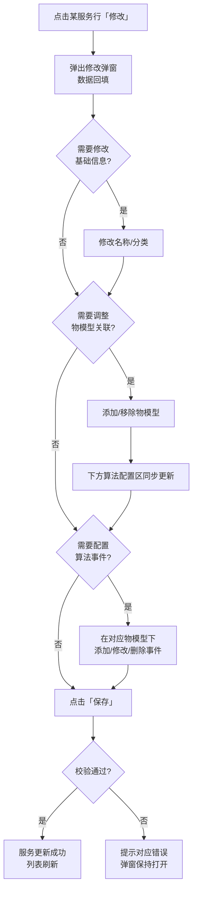
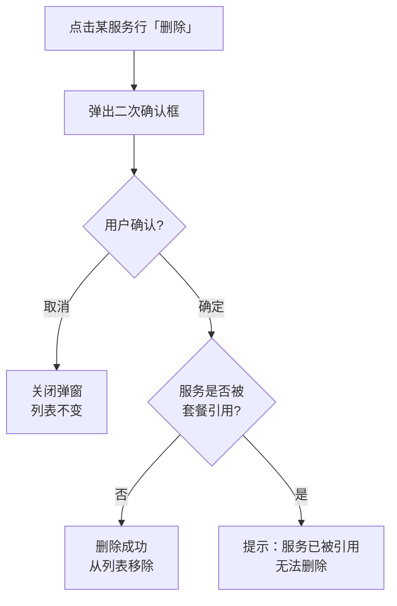
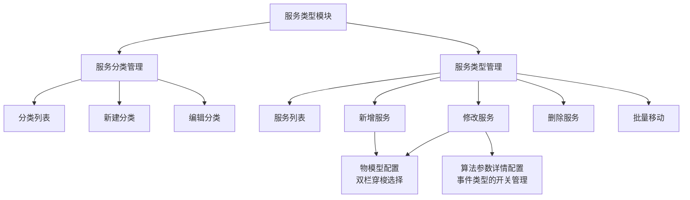

# 服务类型模块复刻 — 完整业务 PRD

## 修订记录

| 修订时间 | 修订内容 | 修订人 |
|------|------|------|
| 2026-06-30 | 初稿 | Kiro |

---

## 一、业务背景

在鹤梦云生态平台中，「套餐管理 → 服务类型」模块是套餐服务的底层配置入口。平台上所有可售卖的套餐功能（云存储、AI 检测、智能报警、语音助手等）均依赖服务类型模块定义的基础服务数据。

一套完整的套餐由以下层级构成：

```
服务分类 → 服务类型 → 物模型 → 算法事件配置
```

运营人员通过本模块完成服务的分类管理与物模型关联配置后，后续套餐配置模块即可引用这些服务作为套餐的基础能力单元。

**产品目标**：

- 建立服务分类体系，便于运营对服务按业务线归类管理
- 提供服务类型的完整生命周期管理（创建、查看、修改、删除）
- 支持服务关联多个物模型，定义套餐底层设备能力
- 支持修改模式下配置每个物模型的算法事件参数

---

## 二、名词解释

| 术语 | 说明 |
|------|------|
| 服务类型 | 平台上可售卖或可开通的基础服务单元，如"智能告警""云存储""GPS 定位"。每个服务有唯一服务 ID |
| 服务分类 | 对服务类型的归类分组，如"云存储""AI 服务""未分类"。分类展示服务数量 badge |
| 服务 ID | 服务类型的唯一数字标识，由运营人员手动输入，如 `110600`。创建后不可修改 |
| 物模型 | 设备能力抽象，描述设备可上报的属性、可执行的服务、可触发的事件 |
| 物模型 ID | 物模型的唯一数字标识，如 `1000`（人形/运动检测） |
| 可选物模型 | 平台已定义的所有物模型列表，供服务创建时勾选关联 |
| 已选物模型 | 当前服务已关联的物模型列表 |
| 算法参数详情配置 | 修改服务时，对每个已关联的物模型配置事件类型和开关状态 |
| 批量移动 | 同时选中多个服务后批量变更所属分类 |
| 排序号 | 分类的展示排序依据，数字越小越靠前 |

---

## 三、业务实体说明

### 3.1 核心实体

| 实体 | 核心属性 | 业务含义 |
|------|------|------|
| 服务分类 | 分类名称、排序号、服务数量 | 服务的分组容器，一个分类包含多个服务 |
| 服务类型 | 服务名称、服务 ID、所属分类、关联物模型列表 | 套餐的基础能力单元 |
| 物模型 | 物模型 ID、物模型名称 | 设备能力的模板定义 |
| 算法事件 | 事件类型、是否开启 | 物模型的具体事件参数配置 |

### 3.2 实体关系



- 一个服务分类可包含 0 到多个服务类型
- 一个服务类型必须属于一个分类（默认"未分类"）
- 一个服务类型可关联 0 到 41 个物模型（平台物模型总数上限）
- 一个物模型可被多个服务类型关联
- 每个已关联的物模型可配置多个算法事件

---

## 四、核心业务流程

### 4.1 全链路角色协作



### 4.2 创建服务类型流程



### 4.3 修改服务类型流程



### 4.4 删除服务流程



---

## 五、业务规则

| 编号 | 规则描述 | 触发条件 | 结果 |
|------|------|------|------|
| R01 | 服务名称必填，长度 1-50 字符 | 保存时校验 | 不满足则提示"请输入服务名称" |
| R02 | 服务 ID 必填，纯数字 1-6 位 | 保存时校验 | 不满足则提示"请输入服务 ID" |
| R03 | 服务 ID 全局唯一 | 提交到后台时校验 | 重复则提示"服务 ID 已存在" |
| R04 | 服务 ID 创建后不可修改 | 修改弹窗中 | ID 输入框置灰不可编辑 |
| R05 | 分类名称必填，长度 1-50 字符 | 保存时校验 | 不满足则提示"请输入分类名称" |
| R06 | 服务被套餐引用后不可删除 | 删除操作提交时校验 | 提示"服务已被套餐引用，无法删除" |
| R07 | 物模型关联非必填，最少 0 个，最多 41 个 | 保存时 | 可创建不带物模型的服务 |
| R08 | 新增服务时不展示算法配置区 | 弹窗打开时 | 仅基础信息 + 物模型选择 |
| R09 | 修改服务时，已选物模型区域展示算法配置 | 弹窗打开时 | 每个已选物模型独立展示事件配置 |
| R10 | 已选物模型为空时，不展示算法配置区 | 最后一个物模型被移除时 | 算法配置区隐藏 |
| R11 | 所属分类默认值为"未分类" | 弹窗打开时 | 下拉框默认选中未分类 |

---

## 六、功能架构



---

## 七、详细功能描述

### 7.1 服务分类 — 分类列表

**功能应用场景**：运营人员进入服务类型页面，左侧面板展示所有服务分类，点击分类筛选右侧服务列表。

**区域划分**：页面左侧固定宽度面板（240px），包含标题栏和分类列表。

**分类列表项规格**：

| 属性 | 说明 |
|------|------|
| 图标 | 文件夹图标，灰色 |
| 分类名称 | 13px 正文 |
| 数量 badge | 小尺寸标签，显示该分类下服务数量 |
| 编辑按钮 | 悬停时显示在行尾，铅笔图标 |
| 默认分类 | 系统预设"未分类"，不可删除 |
| 选中态 | 浅灰背景高亮 |

**交互说明**：
- 点击分类行：切换右侧服务列表为该分类下的服务
- 悬停显示编辑按钮，点击编辑弹出分类编辑弹窗

### 7.2 服务分类 — 新建/编辑

**功能应用场景**：运营人员需要新增服务分类（如"视频服务""通讯服务"），或修改已有分类名称。

**弹窗规格**：

| 属性 | 值 |
|------|------|
| 弹窗宽度 | 400px |
| 新建标题 | "新建分类" |
| 编辑标题 | "编辑分类" |
| 表单标签位置 | 顶部对齐 |

**表单字段**：

| 字段 | 类型 | 必填 | 校验规则 | 默认值 | 说明 |
|------|------|:--:|------|------|------|
| 分类名称 | 文本输入 | 是 | 1-50 字符 | — | — |
| 排序号 | 数字输入 | 否 | 0-9999 | 0 | 数字越小越靠前 |

**状态说明**：

| 状态 | 触发条件 | 展示内容 |
|------|------|------|
| 正常态 | 弹窗打开 | 空表单（新建）/ 数据回填（编辑） |
| 校验失败态 | 名称为空提交 | 提示"请输入分类名称" |
| 保存成功态 | 保存完成 | 弹窗关闭，分类列表刷新 |

### 7.3 服务列表

**功能应用场景**：运营人员查看和管理平台上所有服务类型。

**区域划分**：页面右侧主体区域，包含工具栏和表格。

**工具栏**：

| 元素 | 状态 | 行为 |
|------|------|------|
| 「批量移动」按钮 | 默认 disabled | 选中服务后激活，点击批量变更分类 |
| 「新增服务」按钮 | 始终可用 | 点击打开创建服务弹窗 |

**表格列定义**：

| 列名 | 宽度 | 对齐 | 说明 |
|------|:--:|:--:|------|
| 选择框 | 50px | 居中 | 多选 checkbox |
| 服务名称 | 自适应 | 左对齐 | 加粗 500 |
| 服务 ID | 120px | 居中 | 纯数字 |
| 所属分类 | 120px | 左对齐 | 小标签展示 |
| 最后更新 | 160px | 左对齐 | 格式：YYYY/M/D HH:mm:ss |
| 操作 | 140px | 固定右侧 | 「修改」+「删除」按钮 |

**分页**：表格底部分页器，每页 10 条，显示"共 N 条"。

**状态说明**：

| 状态 | 触发条件 | 展示 |
|------|------|------|
| 正常态 | 有数据 | 表格正常展示 |
| 空态 | 无服务数据 | 显示"暂无数据" |
| 选中态 | 勾选复选框 | 行高亮，批量移动按钮激活 |
| 筛选态 | 点击左侧分类 | 仅展示该分类下服务，分页重算 |

### 7.4 新增服务

**功能应用场景**：运营人员需要创建一个新的服务类型，为其关联物模型。

**弹窗规格**：

| 属性 | 值 |
|------|------|
| 宽度 | 800px |
| 标题 | "创建服务类型" |

**区域一：基础信息**

| 字段 | 类型 | 必填 | 校验 | 默认值 |
|------|------|:--:|------|------|
| 服务名称 | 文本输入 | 是 | 1-50 字符 | — |
| 服务 ID | 文本输入 | 是 | 纯数字 1-6 位 | — |
| 所属分类 | 下拉选择 | 否 | — | 当前选中分类 |

**区域二：物模型配置**

| 属性 | 说明 |
|------|------|
| 布局 | 左右双面板 + 中间操作按钮 |
| 左面板 | "可选物模型"，平台全部可选的物模型列表，支持搜索 |
| 右面板 | "已选物模型"，当前已关联的物模型列表，支持搜索 |
| 面板标题 | 带全选 checkbox，格式：可选物模型 N/M |
| 操作按钮 | 「添加」（向右箭头）和「移除」（向左箭头） |
| 按钮状态 | 未勾选时 disabled，勾选后激活 |
| 搜索框 | 支持按 ID 或名称搜索过滤 |
| 空态 | 右面板为空时显示"无数据" |

**交互说明**：
- 在左面板勾选物模型 → 点击「添加」→ 物模型移入右面板
- 在右面板勾选物模型 → 点击「移除」→ 物模型移回左面板
- 全选 checkbox：勾选全部 / 取消全选
- 搜索：输入关键词即时过滤

**状态说明**：

| 状态 | 触发条件 | 展示 |
|------|------|------|
| 正常态 | 弹窗打开 | 空表单 + 可选物模型 41 条 |
| 已添加态 | 添加物模型后 | 左面板减少，右面板增加 |
| 校验失败态 | 必填项为空 | 提示具体错误信息 |
| 保存成功态 | 保存成功 | 弹窗关闭，列表刷新，新服务出现在列表顶部 |

### 7.5 修改服务

**功能应用场景**：运营人员需要修改已有服务的信息、物模型关联或算法事件配置。

**弹窗规格**：

| 属性 | 值 |
|------|------|
| 宽度 | 800px |
| 标题 | "修改服务类型" |

**与新增弹窗的区别**：

- 服务 ID 字段置灰不可编辑
- 额外展示「算法参数详情配置」区域（当已选物模型不为空时）

**区域三：算法参数详情配置**

仅当已选物模型不为空时展示。按已选物模型逐一展示：

| 组件 | 说明 |
|------|------|
| 物模型头部 | 物模型 ID（蓝色加粗）+ 物模型名称 |
| 事件表格 | 列：序号 / 事件类型（输入框） / 是否开启（开关） / 操作（删除按钮） |
| 添加事件按钮 | 表格下方，"添加事件"文字按钮 |
| 删除事件 | 点击行尾"删除"按钮，该行移除 |

**交互说明**：
- 添加/移除物模型时，下方算法配置区同步增减对应物模型 block
- 每个物模型的算法事件独立管理，互不干扰
- 开关默认开启
- 事件类型输入框 placeholder："请输入事件类型"

**状态说明**：

| 状态 | 触发条件 | 展示 |
|------|------|------|
| 有物模型 | 已选物模型 >= 1 | 展示算法配置区 |
| 无物模型 | 已选为空 | 隐藏算法配置区 |
| 物模型变更 | 添加/移除物模型 | 算法区实时同步增减 |

### 7.6 删除服务

**功能应用场景**：运营人员删除不再需要的服务类型。

**交互说明**：

| 步骤 | 操作 | 响应 |
|------|------|------|
| 触发 | 点击「删除」 | 弹窗：确定要删除该服务吗？删除后不可恢复。 |
| 取消 | 点击「取消」 | 关闭弹窗，不执行删除 |
| 确认 | 点击「确定」 | 执行删除 |
| 成功 | 删除成功 | 弹窗关闭，服务从列表移除 |
| 失败（被引用） | 服务被套餐引用 | 提示"服务已被套餐引用，无法删除" |
| 失败（网络） | 请求超时 | 提示"网络异常，请重试" |

---

## 八、页面信息架构

### 8.1 页面层级

```
后台管理系统
├── 套餐管理
│   ├── 套餐配置
│   └── 服务类型 ← 本模块
│       ├── 服务分类面板（左侧 240px）
│       │   ├── 分类列表
│       │   └── 新建分类弹窗 (400px)
│       ├── 服务管理面板（右侧自适应）
│       │   ├── 工具栏
│       │   ├── 服务表格
│       │   └── 分页器
│       ├── 创建/修改服务弹窗 (800px)
│       │   ├── 基础信息区
│       │   ├── 物模型穿梭选择区
│       │   └── 算法参数配置区（仅修改）
│       └── 删除确认弹窗
```

### 8.2 弹窗关系

| 触发方式 | 弹窗 | 尺寸 |
|------|------|:--:|
| 点击「新建分类」/ 悬停编辑图标 | 分类表单弹窗 | 400px |
| 点击「新增服务」 | 创建服务弹窗 | 800px |
| 点击「修改」 | 修改服务弹窗 | 800px |
| 点击「删除」 | 删除确认弹窗 | 默认 |

---

## 九、异常说明

| 异常类型 | 触发条件 | 用户感知 | 恢复方式 |
|------|------|------|------|
| 页面加载失败 | 进入页面时网络异常 | 页面内容不刷新，保留上次数据 | 手动刷新浏览器 |
| 分类列表加载失败 | 接口超时 | 分类列表保留旧数据 | 手动刷新 |
| 服务列表加载失败 | 接口超时 | 表格数据保留旧数据 | 手动刷新 |
| 保存操作失败 | 新建/修改提交时网络异常 | 弹窗保持打开，提示错误 | 重新点击保存 |
| 删除操作失败（被引用） | 服务被套餐引用 | 提示"服务已被套餐引用，无法删除" | 先解除引用再删除 |
| 删除操作失败（网络） | 删除请求超时 | 提示"网络异常，请重试" | 重新删除 |
| 物模型数据为空 | 平台未定义物模型 | 可选物模型列表显示"可选物模型 0/0" | 先在物模型管理模块创建物模型 |
| 分类数据为空 | 无分类数据 | 仅显示"未分类"（默认存在），数量 0 | — |

---

## 十、APP 埋点与运营数据看板

> 注：本模块为后台管理功能，埋点覆盖 Web 管理端操作。APP 端无此模块。

### 10.1 核心指标

| 指标 | 类型 | 计算方式 | 监控周期 |
|------|:--:|------|:--:|
| 服务创建数 | 业务 | 统计周期内新建服务数量 | 周 |
| 服务修改率 | 行为 | 修改服务数 / 总服务数 | 月 |
| 服务保存成功率 | 质量 | 保存成功次数 / 保存操作总次数 | 日 |
| 平均配置时长 | 质量 | 弹窗打开到保存成功的平均时长 | 周 |
| 分类筛选使用率 | 行为 | 分类点击次数 / 页面浏览 PV | 周 |

### 10.2 关键埋点事件

| 事件名 | 触发时机 | 优先级 |
|------|------|:--:|
| 服务类型页面浏览 | 进入页面 | P0 |
| 新增服务 | 服务创建成功 | P0 |
| 修改服务 | 服务更新成功 | P0 |
| 删除服务 | 服务删除成功 | P0 |
| 服务保存失败 | 保存请求返回错误 | P0 |

### 10.3 告警规则

| 告警 | 触发条件 | 级别 |
|------|------|:--:|
| 保存成功率骤降 | 1 小时内成功率 < 80% | P0 |
| 连续保存失败 | 5 分钟内连续 3 次失败 | P1 |

（完整埋点方案见 `服务类型模块复刻04bp.md`）

---

*文档版本: v1.0 | 创建日期: 2026-06-30*
