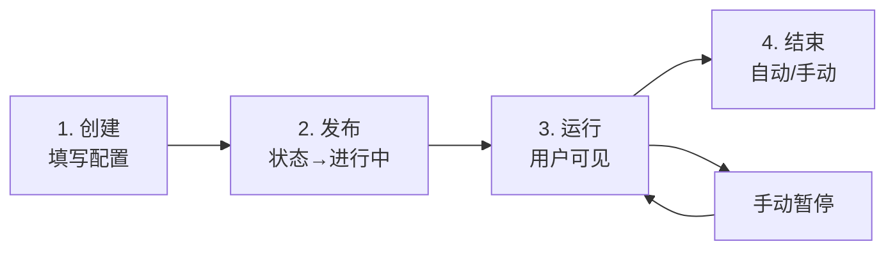
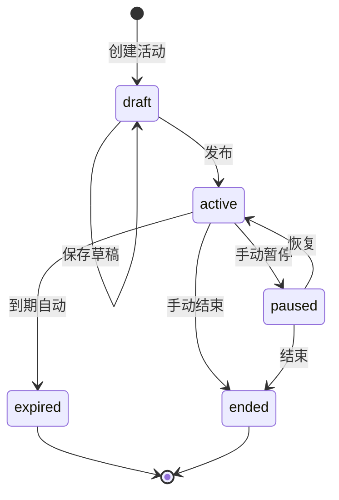
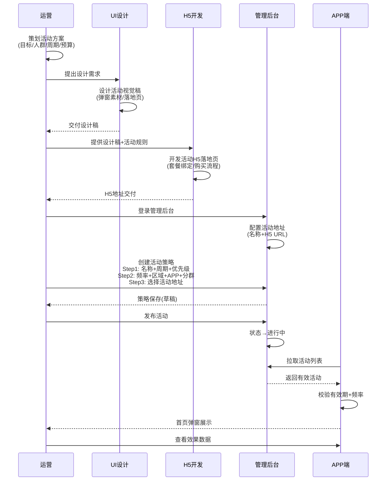
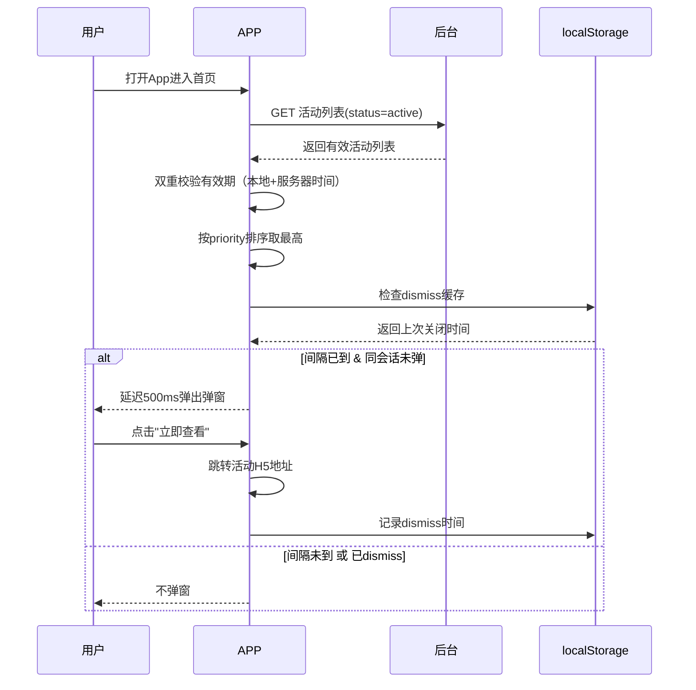

# 活动位运营 — 完整业务 PRD

## 修订记录

| 修订时间 | 修订内容 | 修订人 |
|------|------|------|
| 2026-05-22 | 初稿 | Kiro |
| 2026-05-22 | 去除审核流程，状态流更新为 draft→active→paused/ended/expired | Kiro |

---

## 一、业务背景

平台运营在"商城位运营"和"推荐位运营"基础上，需要一个独立的"活动位运营"模块来管理 App 内的营销活动展示。

**与商城位、推荐位的本质区别**：
- **商城位**：长期套餐售卖，无时效限制，重在套餐内容
- **推荐位**：内容/设备推荐，重在个性化匹配
- **活动位**：营销活动推广，有明确的活动周期、首页弹窗展示、活动落地地址

**要解决的痛点**：
- 活动投放散乱，缺乏统一的策略配置管理
- 活动到期后仍展示，引发用户投诉和合规风险
- 无法按区域、APP、用户分群精准投放活动
- 活动效果缺少数据追踪

**产品目标**：
- 提供统一的活动位策略配置后台，支持按区域、APP、用户分群精准投放
- 首页弹窗活动，配置弹窗频率（每N小时1次）
- 活动周期管控，超期自动下线
- 活动状态流转：草稿 → 进行中 → 已暂停/已结束/已过期
- APP 端展示效果与后台配置无缝衔接

---

## 二、名词解释

| 术语 | 说明 |
|------|------|
| 活动位 | App 首页用于展示营销活动的弹窗位置 |
| 活动策略 | 一套完整的活动投放规则：什么时间、向哪些用户、展示什么内容 |
| 活动周期 | 活动生效的时间范围 [startTime, endTime]，超期自动下线 |
| 活动地址 | 用户点击活动后跳转的目标 H5 地址 |
| 活动状态 | 草稿 → 进行中 / 已暂停 / 已结束 / 已过期 |
| 弹窗频率 | 弹窗展示频率，每N小时弹1次（1-720小时） |
| 用户分群 | 投放的目标用户群体：高价值用户、新注册用户、活跃用户、沉默用户、付费用户 |

---

## 三、业务实体说明

### 3.1 核心实体

**活动策略（ActivityStrategy）**
- 属性：名称、状态（draft/active/paused/ended/expired）、开始/结束时间、投放区域、投放APP、用户分群、活动地址、弹窗频率、优先级、备注
- 生命周期：草稿 → 进行中 ⇄ 已暂停 → 已结束/已过期
- 唯一标识：AS_XXXX 格式策略ID

**活动地址（ActivityAddress）**
- 属性：地址名称、H5 URL
- 独立管理，策略通过下拉选择关联

### 3.2 实体关系

```
活动策略 1──1 活动地址（选1）
活动策略 1──N 投放区域（国内/海外，至少选1）
活动策略 1──N 投放APP（牵心PRO/鹤梦之家，至少选1）
活动策略 1──N 用户分群（5个分群，至少选1）
```

---

## 四、核心业务流程

### 4.1 活动策略全生命周期



### 4.2 3步创建流程

```
Step 1: 基础信息
  → 活动名称（必填，最长50字）
  → 活动周期（必填，结束>开始）
  → 活动优先级（默认50，1-100）
  → 备注（选填）

Step 2: 投放配置
  → 弹窗频率（必填，1-720小时）
  → 投放区域（多选，至少选1）
  → 投放APP（多选，至少选1）
  → 投放用户分群（多选，至少选1）

Step 3: 活动内容
  → 活动地址（必填，下拉选择已配置地址）
  → 提交 → 状态为"草稿"；发布 → 状态变为"进行中"
```

### 4.3 活动状态流转



### 4.4 全局协作时序图

活动从策划到上线的全链路，涉及运营、UI设计、H5开发、后台配置、APP 展示五个角色：



### 4.5 APP 端展示流程（时序图）



---

## 五、业务规则

### 5.1 策略管理

| 编号 | 规则 | 说明 |
|------|------|------|
| R01 | 名称必填 | 活动名称不能为空，最长50字 |
| R02 | 周期合法 | 活动结束时间必须晚于开始时间 |
| R03 | 频率必填 | 弹窗频率必须设置（1-720小时） |
| R04 | 区域必选 | 每个策略至少选择一个投放区域 |
| R05 | APP必选 | 每个策略至少选择一个投放APP |
| R06 | 分群必选 | 每个策略至少选择一个用户分群 |
| R07 | 地址必选 | 活动地址不能为空 |
| R08 | 冲突排序 | 同一APP+区域冲突时按优先级和创建时间排序 |
| R09 | 终态不可编辑 | 已结束/已过期的活动不可编辑，只能复制新建 |
| R10 | 进行中不可删除 | 进行中活动需先暂停或结束后才能删除 |
| R11 | 软删除 | 删除活动为软删除，保留记录 |

### 5.2 APP 端展示

| 编号 | 规则 | 说明 |
|------|------|------|
| R12 | 仅拉取有效 | 仅拉取 status=active 且在 [startTime, endTime] 范围内的活动 |
| R13 | 双重校验 | 客户端本地时间与服务器时间双重校验，防止时区偏差 |
| R14 | 关闭缓存 | 弹窗关闭记录存储在 localStorage，key: `carecam_activity_dismiss` |
| R15 | 频率控制 | 距上次弹窗超过 popupInterval 小时才再次弹窗 |
| R16 | 优先级排序 | 多个活动按 priority 降序，取最高优先级 |
| R17 | API降级 | API 不可用时使用前端内置 Mock 数据 |

---

## 六、功能架构

```
活动位运营系统
├── 管理后台（iot-platform）
│   ├── 活动策略列表
│   │   ├── 筛选栏（状态/区域/APP + 搜索）
│   │   ├── 策略表格（名称/周期/状态/频率/操作）
│   │   └── 状态批量筛选
│   ├── 添加/编辑策略（3步抽屉）
│   │   ├── Step1: 基础信息
│   │   ├── Step2: 投放配置
│   │   └── Step3: 选择活动地址
│   ├── 查看活动详情（抽屉·只读）
│   ├── 活动地址配置（二级页面）
│   │   └── 地址CRUD列表
│   └── 活动操作（按状态动态显示）
│       ├── 发布 / 编辑 / 删除
│       ├── 暂停 / 恢复 / 结束
│       └── 复制新建
│
└── APP 端（carecam_pro）
    ├── ActivityPopup — 首页弹窗（含频率控制）
    └── ActivityDemoPanel — 演示控制面板
```

---

## 七、详细功能描述

### 7.1 活动策略列表

#### 功能应用场景
运营管理员查看所有活动策略，了解当前投放状态，进行筛选和管理操作。

#### 列表展示
- 每行显示：活动名称+ID、活动周期、状态标签、弹窗频率、备注摘要、操作按钮
- 支持按状态/区域/APP筛选
- 支持按活动名称搜索
- 列表按创建时间倒序排列

#### 操作按钮（按状态动态变化）

| 状态 | 可用操作 |
|------|----------|
| 草稿 | 编辑 + 删除 + 发布 |
| 进行中 | 查看 + 暂停 |
| 已暂停 | 查看 + 恢复 + 结束 |
| 已结束 | 查看 + 复制新建 |
| 已过期 | 查看 + 复制新建 |

---

### 7.2 创建/编辑活动策略

#### 功能应用场景
运营管理员创建新的活动投放策略，或编辑已有的草稿策略。

#### Step 1: 基础信息
- 活动名称：文本输入，最长50字符，必填
- 活动周期：日期时间范围选择器，必填，结束时间必须晚于开始时间
- 活动优先级：数字输入，范围 1-100，默认50，越高越优先展示
- 备注：文本域，选填

#### Step 2: 投放配置
- 弹窗频率：数字输入，范围 1-720 小时，默认24
- 投放区域：复选框（国内/海外），至少选1
- 投放APP：复选框（牵心PRO/鹤梦之家），至少选1
- 投放用户分群：复选框（5个分群），至少选1

#### Step 3: 选择活动地址
- 活动地址：下拉选择已配置的地址，显示名称+URL，必填
- 保存草稿：校验通过后保存，状态为"草稿"
- 发布：校验通过后状态变为"进行中"

#### 编辑限制
- 已结束/已过期的策略不可编辑，只能复制新建
- 进行中的策略不可编辑

---

### 7.3 查看活动详情

#### 功能应用场景
运营管理员查看进行中/已结束/已过期活动策略的完整信息。

#### 详情抽屉
- 只读展示策略全部信息（名称、周期、区域、APP、分群、频率、地址）
- 包含操作按钮（按状态动态显示）

---

### 7.4 活动地址配置

#### 功能应用场景
运营管理员管理活动H5地址列表，供策略创建时选择。

#### 功能要点
- 独立页面：地址列表表格（名称 + H5地址 + 操作）
- 添加/编辑弹窗：地址名称 + URL
- 删除前确认提示
- 已关联到策略的地址删除时提示"已被N个策略引用"

---

### 7.5 APP 端 — 首页弹窗

#### 功能应用场景
用户打开 App 时看到活动弹窗，引导参与限时活动。

#### 功能要点
- 仅展示 status=active 且在有效期内的活动
- 取 priority 最高的一条
- 延迟 500ms 弹出（避免与页面加载动画冲突）
- 弹窗内容：活动名称 + "立即查看"按钮 + "暂不参与"
- 频率控制：距上次弹窗超过 popupInterval 小时才弹
- 关闭记录存储在 localStorage
- 同一会话只弹一次

---

## 八、页面信息架构

### 8.1 页面层级（管理后台）

```
iot-platform
└── 运营管理
    └── 活动位运营（策略列表页）
        ├── 添加活动抽屉（3步）
        ├── 编辑活动抽屉（3步）
        ├── 查看详情抽屉（只读）
        └── 活动地址配置页
            └── 地址CRUD列表
```

### 8.2 页面层级（APP 端）

```
carecam_pro
└── 首页（home/index.vue）
    ├── ActivityPopup（弹窗）
    └── ActivityDemoPanel（演示控制）
```

### 8.3 页面跳转关系

| 起点 | 触发 | 终点 |
|------|------|------|
| 左侧导航「活动位运营」 | 点击 | 策略列表页 |
| 策略列表「添加活动」 | 点击 | 添加抽屉（当前页） |
| 列表行「编辑」 | 点击 | 编辑抽屉（当前页） |
| 列表行「查看」 | 点击 | 详情抽屉（当前页） |
| 活动地址配置 tab | 点击 | 地址配置页 |
| APP 弹窗「立即查看」 | 点击 | 外部 H5 |
| APP 弹窗「暂不参与」 | 点击 | 关闭弹窗 |

---

## 九、异常说明

| 分类 | 场景 | 处理方式 |
|------|------|------|
| 数据异常 | 活动周期重叠 | 前端提示冲突列表，确认后仍可提交 |
| 数据异常 | 活动已过期仍展示 | 后端定时任务 + 客户端本地时间双校验 |
| 数据异常 | 发布时必填项缺失 | 前端校验，阻止发布并定位到对应步骤 |
| 数据异常 | 活动地址被删除 | 已关联策略仍保留地址信息，新策略不可选 |
| 网络异常 | API 不可用 | APP 降级使用前端内置 Mock 数据 |
| 操作异常 | 已结束活动被编辑 | 前端置灰编辑按钮，后端校验拦截 |
| 操作异常 | 进行中活动被删除 | 前端置灰删除按钮，后端校验拦截 |
| 极限场景 | 多活动冲突 | 按 priority 降序 + 创建时间排序，前端提示 |
| 边界条件 | 活动周期跨年 | 正常支持，时间范围无年份限制 |
| 边界条件 | 弹窗 dismiss 缓存在 localStorage | 清理 APP 缓存后重置，属于预期行为 |

---

> **本文档为纯业务PRD，面向产品和开发团队。不包含API路由路径、数据库建表语句等技术实现细节。**
