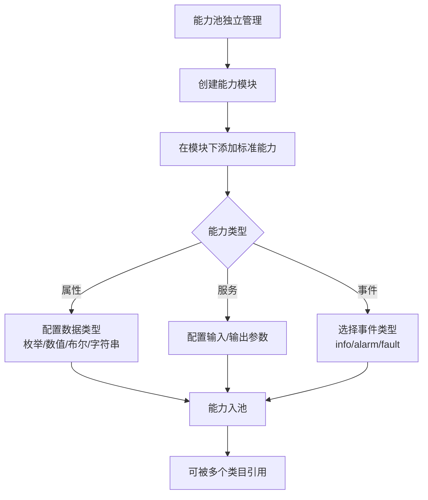
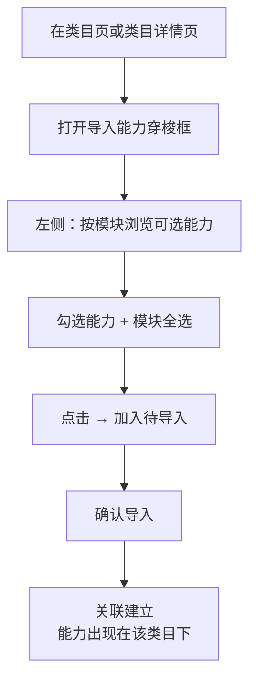
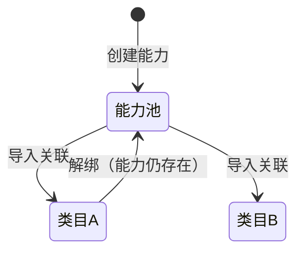

# 物模型管理 — 需求分析

## 修订记录

| 修订时间 | 修订内容 | 修订人 |
|------|------|------|
| 2026-05-25 | 初稿 | Kiro |
| 2026-05-28 | 数据模型重构：能力独立池+多对多关联；标识符改为 PascalCase | Kiro |
| 2026-05-28 | 能力库改为纯能力池（去类目选择器）；新增类目能力二级页；导入能力移至类目页 | Kiro |
| 2026-05-29 | 新增「自定义能力」标签页：企业私有能力池，模块/能力标识符全局唯一 | Kiro |

---

## 1. 业务背景与目标

### 1.1 背景
随着 IoT 设备品类不断扩展，平台需要建立一套标准化的**物模型体系**，以支持不同类型设备的快速接入和功能配置。物模型是设备功能的数字化定义，包括**属性（Property）**、**服务（Service）**、**事件（Event）**三类，按**能力模块**分组管理。

标准能力标识符全类目唯一（类似阿里云 ICA），因此能力应为独立资源池，类目通过多对多关联引用能力。

### 1.2 目标
- 平台管理员可按设备**类目**（IPC摄像机、智能门铃等）管理标准物模型
- 能力模块独立管理，与类目解耦
- **标准能力**作为独立资源池，支持跨类目引用
- 类目通过「导入能力」穿梭框按模块批量关联已有能力
- 支持定义**属性**（枚举/数值/布尔/字符串）、**服务**（含输入输出参数）、**事件**（info/alarm/fault）
- 支持**企业自定义能力**，企业在私有池中自行维护能力模块和能力，与标准能力池数据隔离
- 统一的 CRUD 交互，编辑实时生效

## 2. 角色与职责

| 角色 | 职责 |
|------|------|
| 平台管理员 | 创建/编辑/删除设备类目 |
| 平台管理员 | 管理能力模块（新增/编辑/删除） |
| 平台管理员 | 定义标准能力（属性/服务/事件），配置数据类型和参数 |
| 平台管理员 | 通过穿梭框将能力按模块批量导入到类目 |
| 企业管理员 | 在「自定义能力」tab 下创建/编辑/删除私有模块和能力 |
| 厂商/开发者 | 在产品开发时引用平台定义的标准能力或企业自定义能力 |

## 3. 名词解释

| 术语 | 说明 |
|------|------|
| **物模型** | 设备功能的数字化定义，包括属性、服务、事件，按模块分组 |
| **类目** | 设备分类（如 IPC摄像机、智能门铃），通过关联表引用标准能力 |
| **能力模块** | 对能力进行逻辑分组的独立容器，与类目解耦 |
| **标准能力** | 独立资源池中的能力定义，可被多个类目引用 |
| **自定义能力** | 企业私有池中的能力定义，由企业自行创建和维护，结构同标准能力 |
| **属性（Property）** | 设备的状态参数，可读取和设置，如工作模式、录制清晰度 |
| **服务（Service）** | 设备可执行的指令，可被调用，如格式化存储、远程开门 |
| **事件（Event）** | 设备主动上报的消息，可被订阅，如移动侦测告警、电量不足 |
| **枚举型** | 数据类型，表示有限的离散值集合 |
| **数值型** | 数据类型，表示有范围的连续数值 |
| **布尔型** | 数据类型，表示 true/false 二值状态 |
| **字符串型** | 数据类型，表示文本内容 |
| **标识符** | PascalCase 命名的唯一标识，如 `WorkMode`、`MotionDetect`，全局唯一 |
| **导入能力** | 将标准能力池中的能力通过穿梭框批量关联到指定类目 |

## 4. 核心业务流程

### 4.1 能力池管理



### 4.2 类目关联能力



### 4.3 状态流转



## 5. 功能架构

### 5.1 页面结构

**Page 1 — 能力库（capability）**
- 纯能力池页面，展示全量能力和模块
- 标签页「标准能力」
- 左栏（260px）：能力模块列表 + 全部 + 新增/编辑/删除模块
- 右栏：全量能力表格，按模块筛选
- 添加/编辑标准能力弹窗
- 无类目上下文，无导入按钮

**Page 2 — IOT类目（category）**
- 表格展示所有类目：名称、标识符、标准能力数、描述
- 每行操作：导入能力 / 编辑 / 删除
- 标准能力数可点击，跳转至类目能力详情页
- 添加/编辑/删除类目

**Page 3 — 类目能力详情（category-capability）**
- 顶部返回栏：返回按钮 + 类目名称 + 能力计数 + 导入能力按钮
- 左栏（260px）：该分类已关联能力涉及的模块列表
- 右栏：该类目已关联的能力表格
- 每行操作：编辑参数 / 移除关联
- 编辑弹窗：类型/名称/标识符只读，描述、数据定义、默认值可编辑

### 5.2 数据模型

类目、模块、能力三者解耦，采用关联表模式：

```
categories ──┐
             ├── categoryCaps（多对多关联表）
capabilities ─┘
             │
modules ─────┘（capability.moduleId → module.id）
```

- 类目：纯类目定义，不嵌套模块和能力
- 模块：独立池，与类目解耦
- 能力：独立池，属于某个模块，可被多个类目引用
- 关联表：categoryId ↔ capabilityId

### 5.3 能力类型

| 类型 | 编码 | 说明 |
|------|------|------|
| 属性 | prop | 设备状态参数，可读写/只读 |
| 服务 | svc | 设备可执行指令，含输入/输出参数 |
| 事件 | evt | 设备主动上报，含事件类型 |

### 5.4 数据类型（属性专用）

| 类型 | key | 配置项 |
|------|------|------|
| 枚举型 | enum | 枚举值列表（Name + Value）、默认值 |
| 数值型 | int | 最小值、最大值、步长、单位、默认值 |
| 布尔型 | boolean | true标签、false标签、默认值 |
| 字符串型 | string | 最大长度（字节）、默认值 |

### 5.5 读写模式

| 模式 | 编码 | 说明 |
|------|------|------|
| 读写 | rw | 允许读取和设置 |
| 只读 | ro | 仅允许读取，不可设置 |

## 6. 详细场景分析

### 6.1 正常场景

#### S01: 创建类目
1. 管理员进入「IOT类目」页，点击"添加类目"
2. 输入类目名称（如"IPC摄像机"）和标识符（如 `IpcCamera`）
3. 输入描述
4. 保存 → 类目列表刷新

#### S02: 创建能力模块
1. 管理员进入「能力库」页
2. 左侧模块列表点击"+ 添加"
3. 输入模块名称和标识符（如 `WorkModeModule`）
4. 保存 → 模块列表刷新

#### S03: 添加标准能力
1. 点击"添加标准能力"
2. 选择能力类型（属性/服务/事件）
3. 填写名称、标识符（如 `WorkMode`）、描述
4. 根据类型配置数据定义（枚举值/数值范围/参数等）
5. 提交 → 能力入池，模块自动取侧栏当前选中

#### S04: 导入能力到类目（从类目页）
1. 进入「IOT类目」页，点击某类目行的"导入能力"
2. 左侧按模块浏览可选能力，勾选或模块全选
3. 搜索过滤特定能力
4. 点击 → 加入右侧待导入列表
5. 确认导入 → 关联建立

#### S05: 查看类目已绑定能力
1. 点击类目行"标准能力"列的链接（如"13 个"）
2. 跳转至类目能力详情页，按模块分类展示已关联能力
3. 可在此页导入更多能力、编辑能力参数、移除关联

#### S06: 编辑标准能力
1. 在能力表格中点击某能力的"编辑"
2. 修改能力名称、标识符、数据定义
3. 所属模块自动保持（编辑时不可更改）
4. 提交更新

#### S07: 编辑类目绑定能力的参数
1. 在类目能力详情页点击某能力的"编辑"
2. 类型、名称、标识符不可编辑
3. 可修改数据定义参数、默认值、描述
4. 提交更新 → 能力池中该能力同步更新（因为是同一能力）

### 6.2 异常场景

| 异常 | 处理方式 |
|------|----------|
| 标识符重复 | 前端校验 + 提示"标识符已存在，请更换" |
| 标识符格式不合法 | 实时校验正则 `[a-zA-Z][a-zA-Z0-9_]*` |
| 枚举值为空 | 提交时校验，至少一个枚举值 |
| 数值范围不合法 | 最大值必须 > 最小值，否则提示 |
| 删除非空模块 | 二次确认弹窗，提示模块下有 N 个能力将被同步删除 |
| 删除类目 | 自动解绑关联的能力（能力本身不删除） |
| 能力无归属模块 | 穿梭框中归入"其他"分组 |
| 刷新类目能力详情页 | 类目 ID 固定，刷新后数据正常加载 |

## 7. 业务规则

| 编号 | 规则 |
|------|------|
| R01 | 类目名称不能为空，最长 40 字符 |
| R02 | 标识符全局唯一（类目+模块+能力独立校验），格式 `[a-zA-Z][a-zA-Z0-9_]*`，PascalCase 首字母大写 |
| R03 | 能力类型创建后可修改，修改后数据定义重置 |
| R04 | 模块删除前校验其下能力数，二次确认，能力同步删除 |
| R05 | 枚举型至少需要 1 个枚举值 |
| R06 | 数值型最大值必须 > 最小值 |
| R07 | 删除类目时自动解绑所有能力关联，能力本身不删除 |
| R08 | 能力类型为属性时必须选择数据类型 |
| R09 | 添加/编辑能力时不需手动选择所属模块，自动取侧栏当前模块 |
| R10 | 能力类型为服务时，输入参数和输出参数为可选 |
| R11 | 能力类型为事件时，事件类型必选 |
| R12 | 导入能力时，左侧支持按模块全选/取消，支持搜索过滤 |
| R13 | 已关联到当前类目的能力不在左侧可选列表中显示 |
| R14 | 穿梭框右侧待导入按模块分组展示，支持折叠/展开和逐个移除 |
| R15 | 类目能力详情页编辑能力时，类型/名称/标识符不可修改，参数、默认值、描述可修改 |
| R16 | 类目 ID 使用固定数值（不从 Date.now 生成），确保刷新页面后 URL 匹配 |

---

*文档版本: v2.1 | 更新日期: 2026-05-28*