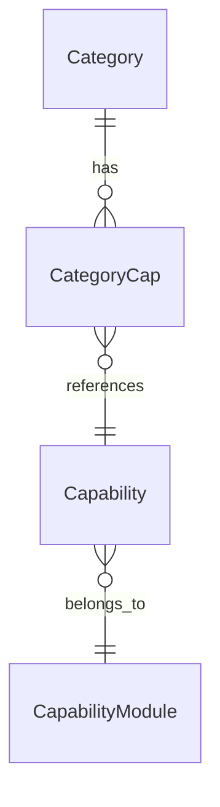
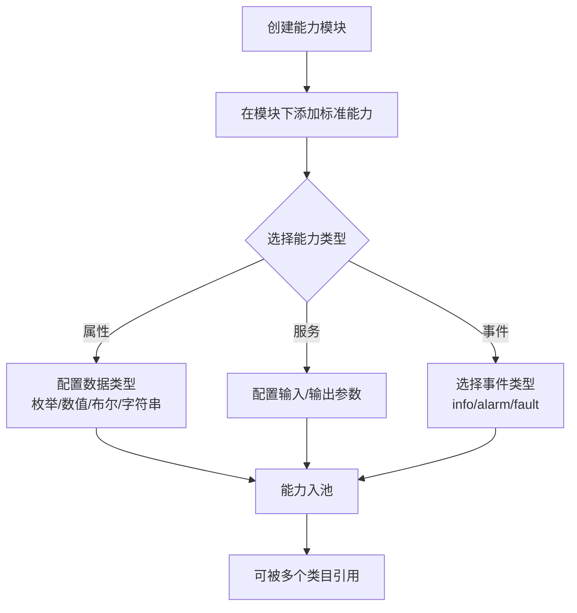
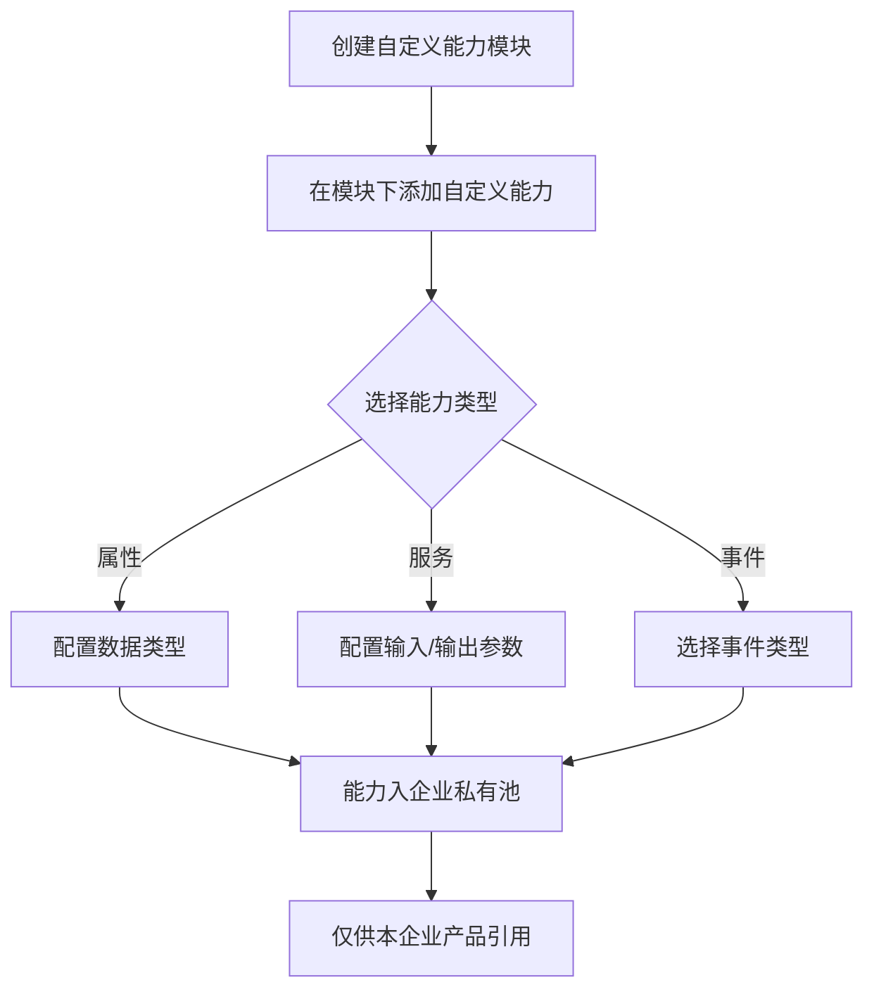
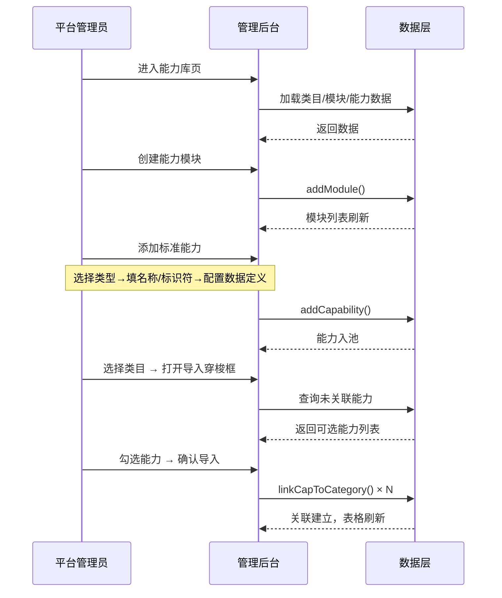
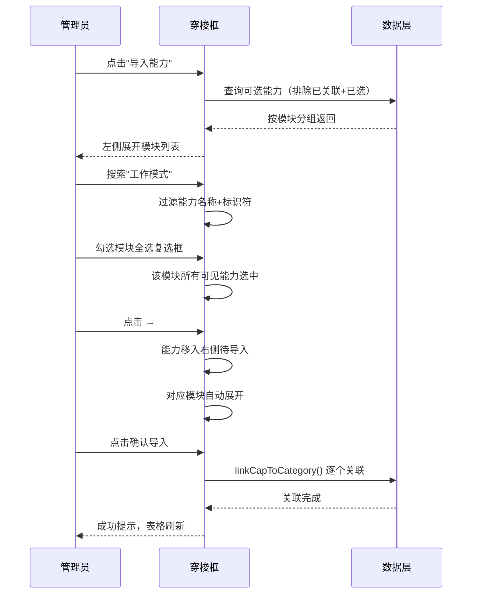

# 物模型管理 — 完整业务 PRD

## 修订记录

| 修订时间 | 修订内容 | 修订人 |
|------|------|------|
| 2026-05-28 | 初稿 | Kiro |
| 2026-05-28 | 能力库改为纯能力池（去类目选择器）；新增类目能力详情二级页；导入移至类目页行操作 | Kiro |
| 2026-05-29 | 新增「自定义能力」标签页：企业私有池，模块/能力标识符全局唯一；新增业务规则 R23-R28 | Kiro |

---

## 一、业务背景

随着 IoT 设备品类不断扩展，平台需要建立一套标准化的**物模型体系**，以支持不同类型设备的快速接入和功能配置。

**物模型**是设备功能的数字化定义，包括属性（Property）、服务（Service）、事件（Event）三类，按能力模块分组管理。核心设计思想是"能力独立池 + 类目关联"：标准能力全类目唯一，属于独立资源池，类目通过多对多关联引用能力。

**要解决的痛点**：
- 设备品类繁多，功能定义散乱，缺乏统一的标准能力库
- 同一能力（如移动侦测）被多个类目使用时需重复定义
- 新类目接入时需从零配置物模型，无法复用已有能力定义

**产品目标**：
- 建立独立的标准能力池，支持跨类目复用
- 类目通过穿梭框批量导入能力，快速完成物模型配置
- 提供完整的能力类型支持：属性（枚举/数值/布尔/字符串）、服务、事件

---

## 二、名词解释

| 术语 | 说明 |
|------|------|
| 物模型 | 设备功能的数字化定义，包括属性、服务、事件，按模块分组 |
| 类目 | 设备分类（如 IPC摄像机、智能门铃），通过关联表引用标准能力 |
| 能力模块 | 对能力进行逻辑分组的独立容器（如工作模式模块、录制模式模块） |
| 标准能力 | 独立资源池中的能力定义，标识符全局唯一，可被多个类目引用 |
| 属性（Property） | 设备的状态参数，可读取和设置 |
| 服务（Service） | 设备可执行的指令，含输入/输出参数 |
| 事件（Event） | 设备主动上报的消息，含事件类型（info/alarm/fault） |
| 标识符 | PascalCase 全局唯一标识，如 `WorkMode`，格式 `[a-zA-Z][a-zA-Z0-9_]*` |
| 导入能力 | 将标准能力池中的能力批量关联到指定类目 |

---

## 三、业务实体说明

### 3.1 核心实体

**类目（Category）**
- 属性：名称、标识符、描述
- 纯类目定义，不嵌套模块或能力
- 通过关联表与能力建立多对多关系

**能力模块（CapabilityModule）**
- 属性：名称、标识符
- 独立池，与类目解耦
- 一个模块包含多个标准能力

**标准能力（Capability）**
- 属性：名称、标识符、能力类型（prop/svc/evt）、描述、数据定义
- 属于某个模块（moduleId 外键）
- 可被多个类目引用

**自定义能力（CustomCapability）**
- 结构同标准能力，由企业自行创建和维护
- 独立数据池，与标准能力池隔离
- 模块标识符和能力标识符跨池全局唯一（不与标准能力重复）

### 3.2 实体关系



- 类目与能力：多对多（通过 CategoryCap 关联表）
- 模块与能力：一对多（一个模块包含多个能力）
- 模块与类目：无直接关系（通过能力间接关联）

---

## 四、核心业务流程

### 4.1 能力池管理流程

**标准能力**


**自定义能力**


### 4.2 类目关联能力流程


### 4.3 全局时序图



### 4.4 导入能力时序图



---

## 五、业务规则

### 5.1 类目管理

| 编号 | 规则 | 说明 |
|------|------|------|
| R01 | 名称必填 | 类目名称不能为空，最长 40 字符 |
| R02 | 标识符唯一 | 类目标识符全局唯一，PascalCase 首字母大写 |
| R03 | 删除解绑 | 删除类目时自动解绑所有能力关联，能力本身不删除 |

### 5.2 模块管理

| 编号 | 规则 | 说明 |
|------|------|------|
| R04 | 名称必填 | 模块名称不能为空 |
| R05 | 标识符唯一 | 模块标识符全局唯一，PascalCase |
| R06 | 级联删除 | 删除模块时同步删除其下所有能力及关联 |

### 5.3 能力管理

| 编号 | 规则 | 说明 |
|------|------|------|
| R07 | 标识符全局唯一 | 能力标识符跨所有类目唯一，PascalCase |
| R08 | 类型可修改 | 能力类型创建后可修改，修改后数据定义重置 |
| R09 | 模块自动归属 | 新增能力自动取侧栏当前选中模块；编辑时不可更改 |
| R10 | 枚举至少一项 | 枚举型至少需要 1 个有效枚举值 |
| R11 | 数值范围合法 | 最大值必须 > 最小值 |
| R12 | 属性需数据类型 | 能力类型为属性时必须选择数据类型 |
| R13 | 事件类型必选 | 能力类型为事件时事件类型必选 |
| R14 | 删除级联 | 删除能力时同步删除所有类目关联 |

### 5.4 导入能力

| 编号 | 规则 | 说明 |
|------|------|------|
| R15 | 已关联不可见 | 已关联到当前类目的能力不在左侧可选列表中 |
| R16 | 待导入排重 | 已在右侧待导入列表的能力不在左侧显示 |
| R17 | 模块全选 | 模块全选仅作用于可见（搜索过滤后）的能力 |
| R18 | 无模块归"其他" | 无归属模块的能力在穿梭框中归入"其他"分组 |

---

## 六、功能架构

```
物模型管理系统
├── 能力库页（capability）
│   ├── 「标准能力」标签页
│   │   ├── 左栏：能力模块列表（全部 + 模块项 + CRUD）
│   │   ├── 右栏：全量能力表格（按模块筛选）
│   │   ├── 添加/编辑能力弹窗（类型切换联动数据定义）
│   │   └── 参数编辑弹窗（Int/String/Boolean/Enum）
│   ├── 「自定义能力」标签页
│   │   ├── 左栏：自定义模块列表（全部 + 模块项 + CRUD）
│   │   ├── 右栏：自定义能力表格（按模块筛选）
│   │   ├── 添加/编辑能力弹窗
│   │   └── 参数编辑弹窗
│   └── 模块添加/编辑弹窗（标准/自定义共用）
│
├── IOT类目页（category）
│   ├── 类目表格（名称/标识符/标准能力数/描述）
│   ├── 行操作：导入能力 / 编辑 / 删除
│   ├── 导入能力穿梭框（模块分组 + 全选 + 搜索）
│   └── 添加/编辑类目弹窗
│
└── 类目能力详情页（category-capability）
    ├── 顶部返回栏（返回 + 类目名 + 能力计数 + 导入能力按钮）
    ├── 左栏：该类目关联能力涉及的模块列表
    ├── 右栏：已关联能力表格（含编辑参数/移除操作）
    ├── 导入能力穿梭框
    └── 编辑能力参数弹窗（类型/名称/标识符只读）
```

---

## 七、详细功能描述

### 7.1 IOT类目页

#### 功能应用场景
平台管理员维护设备类目，查看每个类目关联的能力概况，快速导入能力。

#### 功能详述
- 表格展示所有类目：名称、标识符、标准能力数、描述
- 标准能力数：关联的能力总数，点击跳转至类目能力详情页
- 每行操作：导入能力（打开穿梭框）/ 编辑 / 删除
- 支持添加/编辑类目（弹窗表单）
- 支持删除类目（二次确认，提示将解绑 N 个能力）

### 7.2 能力库页

#### 功能应用场景
平台管理员管理标准能力池（公共）和自定义能力池（企业私有），能力池独立于类目，展示全量能力。

#### 标签页
- 「标准能力」标签页：平台级公共能力池，能力可被多个类目通过穿梭框引用
- 「自定义能力」标签页：企业私有能力池，由企业自行创建和维护，初始为空
- 两个标签页 UI 完全一致（左栏模块列表 + 右栏能力表格 + CRUD）
- 模块标识符和能力标识符全局唯一（标准池+自定义池不冲突）
- 切换标签页自动重置模块选中为「全部」

#### 左栏模块侧栏
- 显示能力模块列表，首项"全部"默认选中
- 每个模块项显示名称 + 标识符
- 选中模块 → 右栏能力表格按模块筛选
- 选中"全部" → 显示全量能力
- 支持添加/编辑/删除模块

#### 右栏能力表格
- 列：类型标签、能力名称、能力标识、数据类型、数据定义、描述、所属模块、操作
- 按选中模块筛选（纯模块维度，无类目上下文）
- 操作：编辑 / 删除
- 「添加标准能力」：创建新能力，模块自动取侧栏当前选中

### 7.3 类目能力详情页

#### 功能应用场景
查看某个类目已关联的所有能力，按模块分类浏览，支持编辑能力参数和移除关联。

#### 顶部返回栏
- 返回按钮 → 回到类目列表页
- 显示类目名称和能力数量
- 「导入能力」按钮 → 打开穿梭框，追加关联

#### 左栏模块侧栏
- 仅显示该类目已关联能力所涉及的模块（去重）
- 无 CRUD 操作（模块管理在能力库页）

#### 右栏能力表格
- 列定义同能力库页
- 操作：编辑（仅参数）/ 移除（解绑）
- 编辑弹窗：类型、名称、标识符只读；数据定义、默认值、描述可编辑

### 7.4 导入能力穿梭框

#### 功能应用场景
将一个或多个标准能力批量关联到指定类目（从类目页或类目详情页触发）。

#### 左侧面板（可选能力）
- 按模块分组，每组可折叠/展开（默认全部展开）
- 搜索栏位于面板内部，支持按名称和标识符实时过滤
- 模块标题行包含：展开箭头 + 全选复选框（含半选态） + 模块名(标识符) + 能力计数
- 每个能力条目：复选框 + 类型标签 + 能力名称 + 标识符
- 模块全选仅作用于搜索过滤后的可见能力
- 已关联到当前类目的能力和已加入待导入的能力不显示

#### 中间操作
- `→` 将左侧勾选移入右侧待导入
- `←` 清空右侧待导入

#### 右侧面板（待导入）
- 按模块分组，可折叠/展开
- 每个能力以标签形式展示：类型标签 + 名称 + 标识符（灰色小字） + ×
- 新增时对应模块自动展开
- 无归属模块的能力归入"其他"分组
- 点击 × 移除单个能力

### 7.5 添加/编辑能力

#### 功能应用场景
创建新的标准能力或编辑已有能力。

#### 能力类型选择
- 卡片式三选一：属性 / 服务 / 事件
- 编辑时切换类型，数据定义区重置（弹窗确认）

#### 基础信息
- 能力名称（必填，2-50字符）
- 标识符（必填，PascalCase 全局唯一）
- 描述（选填）
- 无「所属模块」字段：新增时自动取侧栏当前模块；编辑时保持原模块

#### 数据定义区
- 属性-枚举型：枚举值列表编辑器 + 默认值
- 属性-数值型：取值范围 + 步长 + 单位 + 默认值
- 属性-布尔型：true/false 标签 + 默认值
- 属性-字符串型：最大长度 + 默认值
- 服务：输入参数列表 + 输出参数列表
- 事件：事件类型（信息/告警/故障） + 输出参数列表

### 7.6 参数编辑弹窗

#### 功能应用场景
为服务或事件的参数定义详细的数据类型。

#### 功能要点
- 参数名称 + 参数标识 + 数据类型（Int/String/Boolean/Enum）
- 选中数据类型后展开对应的类型定义区
- 支持添加/编辑/删除参数

---

## 八、页面信息架构

### 8.1 页面层级

```
iot-platform
└── 物模型管理
    ├── 能力库（/thing-model/capability）
    │   ├── 「标准能力」标签页
    │   │   ├── 模块侧栏 + 能力表格
    │   │   ├── 能力弹窗
    │   │   └── 模块弹窗
    │   └── 参数弹窗
    │
    ├── IOT类目（/thing-model/category）
    │   ├── 类目表格 + 行内导入能力
    │   └── CRUD 弹窗
    │
    └── 类目能力详情（/thing-model/category/:id/capabilities）
        ├── 顶部返回栏
        ├── 模块侧栏 + 能力表格
        ├── 导入能力穿梭框
        └── 编辑参数弹窗
```

### 8.2 页面跳转关系

| 起点 | 触发 | 终点 |
|------|------|------|
| 侧栏「能力库」 | 点击 | 能力库页 |
| 侧栏「IOT类目」 | 点击 | IOT类目页 |
| 类目行「标准能力」数 | 点击 | 类目能力详情页 |
| 类目行「导入能力」 | 点击 | 导入穿梭框（当前页弹窗） |
| 类目详情「导入能力」 | 点击 | 导入穿梭框（当前页弹窗） |
| 能力库「添加标准能力」 | 点击 | 能力弹窗（当前页弹窗） |
| 能力表格「编辑」 | 点击 | 编辑能力弹窗（当前页弹窗） |
| 类目详情「编辑」 | 点击 | 参数编辑弹窗（类型/名称/标识符只读） |
| IOT类目「添加类目」 | 点击 | 类目弹窗（当前页弹窗） |
| 类目详情「返回」 | 点击 | IOT类目页 |

---

## 九、异常说明

| 分类 | 场景 | 处理方式 |
|------|------|------|
| 校验 | 标识符重复 | 前端校验，提示"标识符已存在，请更换" |
| 校验 | 标识符格式不合法 | 实时校验，非法字符提示 |
| 校验 | 枚举值为空 | 提交时校验，至少一个枚举值 |
| 校验 | 数值范围不合法 | 最大值必须 > 最小值 |
| 操作 | 删除非空模块 | 二次确认弹窗，提示能力数 |
| 操作 | 删除类目 | 提示解绑能力数，确认后删除 |
| 操作 | 编辑时切换能力类型 | 弹窗确认"将清空数据定义" |
| 极限 | 无类目时进入能力库 | 类目选择器显示"全部类目"，提示创建类目 |
| 极限 | 类目无关联能力 | 能力表格为空，可导入或添加 |
| 极限 | 能力无归属模块 | 穿梭框中归入"其他"分组 |

---

> **本文档为纯业务PRD，面向产品和开发团队。不包含API路由路径、数据库建表语句等技术实现细节。**

---

*文档版本: v1.0 | 创建日期: 2026-05-28*
