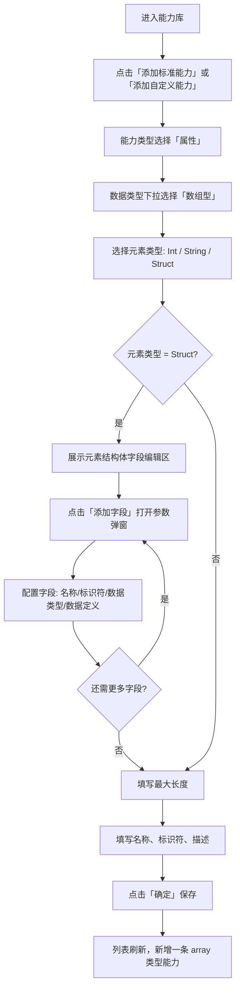
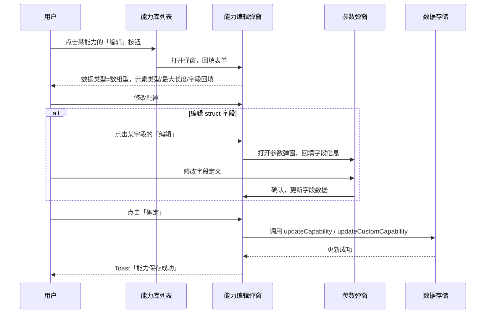
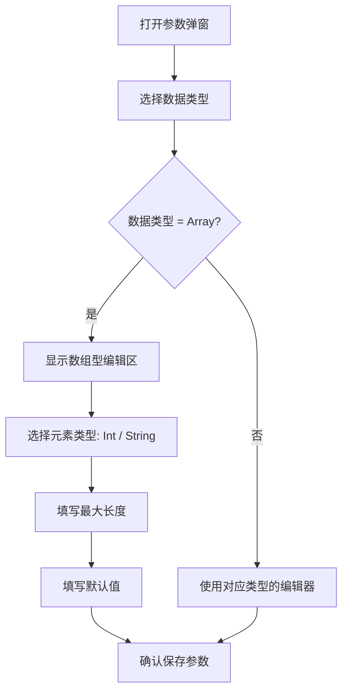

# 物模型能力定义增加 array 数组类型 — 完整业务 PRD

## 修订记录

| 修订时间 | 修订内容 | 修订人 |
|------|------|------|
| 2026-06-18 | v1.0 初稿 | Kiro |

---

## 一、业务背景

IoT 平台物模型能力库当前支持 enum、int、boolean、string 四种属性数据类型。在实际设备协议设计中，存在定时侦测（多时段）、区域侦测（多区域+顶点坐标）、循环周期（星期集合）等数组场景，需要在能力库中新增 `array` 数据类型以支持这些场景的标准化建模。

**产品目标**：属性型能力新增 array 数据类型，支持 elementType=int/string/struct，struct 和 array\<struct\> 支持字段编辑与嵌套。

---

## 二、名词解释

| 术语 | 说明 |
|------|------|
| 物模型能力库 | IoT 管理后台中管理设备能力定义的模块，包含标准能力和自定义能力 |
| array 数据类型 | 新增的属性数据类型，表示同类型元素的列表，每个元素类型由 elementType 指定 |
| elementType | 数组元素的类型，可选 int / string / struct |
| array\<int\> | 元素为整数的数组，如循环周期 [1,3,5]（周一、周三、周五） |
| array\<string\> | 元素为字符串的数组，如标签列表 ["安防","看护"] |
| array\<struct\> | 元素为结构体的数组，如侦测时段 [{开始,结束,周期}, ...] |
| 参数弹窗 | 编辑服务入参/出参、事件出参、struct 字段时的次级弹窗 |

---

## 三、核心业务流程

### 3.1 添加 array 类型能力流程



### 3.2 编辑 array 类型能力时序



### 3.3 参数弹窗中使用 array 类型



---

## 四、业务规则

| 编号 | 规则 | 说明 |
|------|------|------|
| R01 | 数据类型扩展 | 属性型能力的数据类型从 enum/int/boolean/string 扩展为 enum/int/boolean/string/array/struct |
| R02 | array 元素类型 | elementType 支持 int / string / struct（参数弹窗中仅支持 int / string） |
| R03 | 默认值 | newCapability 时默认 elementType='int', arrayMaxLength=100 |
| R04 | 字段列表 | elementType='struct' 时必须至少 1 个字段，字段本身可为任意数据类型（含 array） |
| R05 | 最大长度范围 | 1-1000，步长 1 |
| R06 | 列表展示 | 数据类型列显示「数组型」，数据定义列显示「元素{Int/String/Struct}, 最大{N}项」 |
| R07 | 保存校验 | 元素类型和最大长度为必填；elementType=struct 时字段列表不能为空 |
| R08 | 编辑回填 | 编辑已有 array 能力时，完整还原 elementType、maxLength、fields |
| R09 | 自定义能力复用 | 自定义能力添加/编辑弹窗复用标准能力的 array 编辑逻辑 |

---

## 五、功能架构

```
能力弹窗（属性型）
├── 基本信息: 能力类型 / 名称 / 标识符 / 描述
└── 数据定义
    ├── enum 编辑器      ← 已有
    ├── int 编辑器       ← 已有
    ├── boolean 编辑器   ← 已有
    ├── string 编辑器    ← 已有
    ├── struct 编辑器    ← 已有
    └── array 编辑器     ← 本需求新增
        ├── elementType: Select (Int / String / Struct)
        ├── maxLength: InputNumber (1-1000)
        └── fields[]: struct 字段列表 ← elementType=Struct 时显示
            ├── 字段 item: 名称 / 标识符 / 数据类型摘要 / 编辑 / 删除
            └── 添加字段 → 参数弹窗
                └── array 定义: elementType (Int / String) + maxLength + defaultVal
```

---

## 六、详细功能描述

### 6.1 能力弹窗 — array 类型编辑器

**触发条件**：添加/编辑属性型能力，数据类型下拉选择「数组型」

**控件规格**：
- 元素类型下拉：`el-select` 100% 宽度，选项「Int (数字)」「String (字符串)」「Struct (结构体)」
- 最大长度：`el-input-number` min=1 max=1000 step=1，默认 100，width 150px
- 默认值：`el-input` placeholder「请输入默认值」

**元素类型切换行为**：从 Struct 切换到 Int/String 时，已填的字段列表数据保留在内存中（切换回来时恢复）；保存时仅提交当前 elementType 对应的数据。

**保存校验**：
- elementType 必选
- maxLength 必填且 >= 1
- elementType=struct 时 fields 数组不能为空

### 6.2 struct 字段列表编辑器

**位置**：array 编辑器中，elementType=Struct 时显示在最大长度下方

**字段 item 展示**：
- 左侧：字段名称（`param-name`，无值时显示「未命名」） + 标识符·数据类型摘要（`param-meta`）
- 右侧：编辑按钮（text icon）+ 删除按钮（text danger icon）

**添加/编辑字段**：打开参数弹窗，支持配置字段的数据类型（含 array 嵌套）

**空态**：「暂无字段」

### 6.3 参数弹窗 — array 类型

**触发条件**：在参数弹窗中数据类型选择「Array」

**与能力弹窗 array 的区别**：
- elementType 仅 Int / String（不支持 Struct，参数弹窗用于简单数据）
- 默认值输入框 placeholder 为「请输入默认值（逗号分隔）」

### 6.4 数据存储格式

```json
// array<int>
{
  "dataType": "array",
  "elementType": "int",
  "maxLength": 10,
  "accessMode": "rw",
  "defaultVal": ""
}

// array<struct>
{
  "dataType": "array",
  "elementType": "struct",
  "maxLength": 10,
  "accessMode": "rw",
  "fields": [
    { "name": "启用", "identifier": "Switch", "dataType": "boolean", "trueLabel": "开启", "falseLabel": "关闭" },
    { "name": "开始时间", "identifier": "StartTime", "dataType": "string", "maxLength": 8 },
    { "name": "循环周期", "identifier": "WeekDays", "dataType": "array", "elementType": "int", "maxLength": 7 }
  ]
}
```

---

## 七、异常说明

| 异常类型 | 页面表现 | 处理方式 |
|------|------|------|
| 元素类型未选择 | 保存时校验不通过 | Toast「请选择元素类型」 |
| 最大长度未填写 | 保存时校验不通过 | Toast「请填写最大长度」 |
| struct 字段为空 | 保存时校验不通过 | Toast「请至少添加一个结构体字段」 |
| 字段编辑中名称/标识符为空 | 参数弹窗确定时校验 | Toast「请填写参数名称和标识符」 |
| 输入越界值 | 最大长度输入 <1 或 >1000 | 控件自动限制 |

---

## 八、状态说明

| 状态 | 触发条件 | 展示内容 |
|------|------|------|
| 默认态 | 新建能力，数据类型选择数组型 | elementType=Int, maxLength=100, 字段列表为空 |
| 已配置态 — Int/String | elementType 已选 Int 或 String | 最大长度和默认值显示当前值 |
| 已配置态 — Struct | elementType=Struct, 已添加字段 | 字段列表显示已添加项 |
| 最小值边界 | maxLength = 1 | 减号按钮置灰 |
| 最大值边界 | maxLength = 1000 | 加号按钮置灰 |

---

## 九、省略章节说明

- **业务实体说明**：本需求不引入新的业务实体，array 是属性 dataDef 的新 dataType 值
- **APP 端影响**：无，物模型配置变更通过协议层下发，不涉及 APP UI 改动
- **运营埋点**：纯后台配置功能，不涉及用户行为埋点

---

*文档版本: v1.0 | 创建日期: 2026-06-18*
