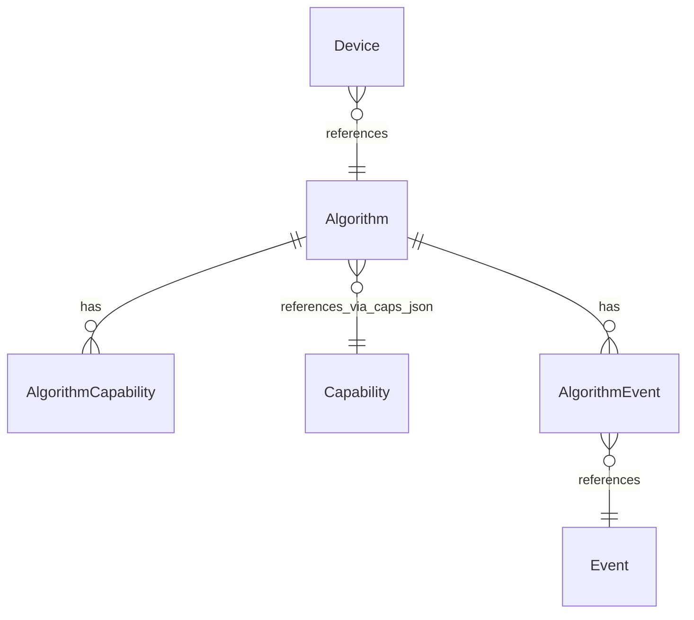
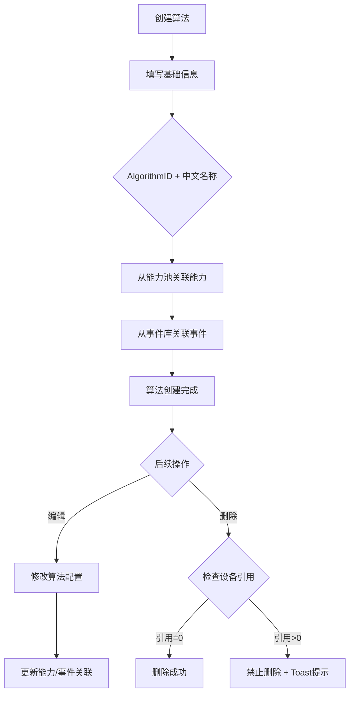
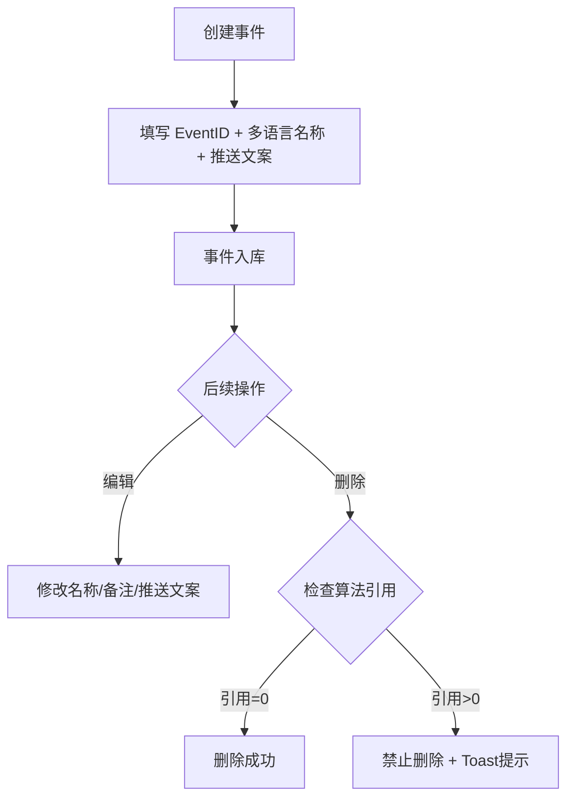
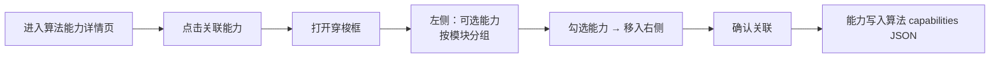
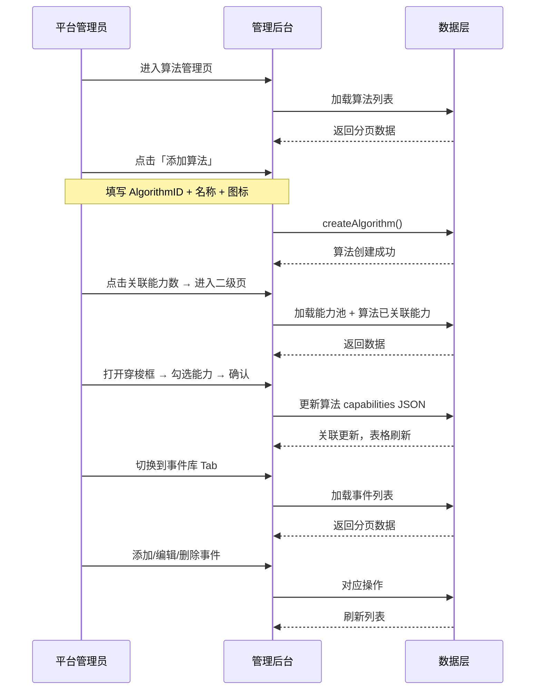

# 算法管理 — 完整业务 PRD

## 修订记录

| 修订时间 | 修订内容 | 修订人 |
|------|------|------|
| 2026-06-04 | 初稿，基于需求分析和UI设计生成 | Kiro |

---

## 一、业务背景

IoT 平台支持 15+ 种侦测算法（运动、人形、车辆、声音、哭声、烟火等），当前定义分散在物模型定义、协议设计和前端常量中。新增一个算法需要同时改动物模型 + 协议 + 前端代码，运营/产品人员无法自主配置。

**产品目标**：建设平台级「算法管理」模块，作为物模型上层元数据组织层，实现算法和事件的配置化管理。

**核心设计思想**：三层解耦 —— 能力池（原子定义）→ 算法（组合 + 展示）→ 事件（触发上报）

---

## 二、名词解释

| 术语 | 说明 |
|------|------|
| 算法 Algorithm | 设备端运行的侦测能力，如运动侦测、人形侦测。每个算法有独立 AlgorithmID、多语言名称、图标、能力配置。 |
| 事件 Event | 算法触发后上报给平台的事件，如「检测到移动物体」。APP 收到事件后展示对应的多语言推送文案。 |
| 能力项 Capability | 算法可配置的功能单元，如开关、灵敏度、侦测区域。从能力池导入，算法不自行定义。 |
| AlgorithmID | 算法在平台内的唯一标识符，snake_case 格式（如 `motion_detection`），对应协议层 AlgorithmType。可修改。 |
| EventID | 事件在平台内的唯一数字标识（如 `100001`），创建后不可修改。 |
| 能力池 | 位于 `/thing-model/capability`，全品类原子能力定义，含「算法能力模块」专用于算法。 |
| 引用关系 | 设备引用算法（N:1），算法引用事件（N:M）。删除时需校验引用是否存在。 |

---

## 三、业务实体说明

### 3.1 核心实体

**算法（Algorithm）**
- 属性：AlgorithmID、多语言名称（JSON）、图标、排序权重
- 关联能力池中的能力（通过 capabilities JSON 字段存储能力标识符映射）
- 关联事件库中的事件（通过 eventIds 数组存储 EventID）
- 被设备引用（referencedCount 记录引用设备数）

**事件（Event）**
- 属性：EventID（不可修改）、多语言名称（JSON）、备注、多语言推送文案（JSON）
- 被算法引用（通过算法表的 eventIds 字段）
- 位于能力库页「标准能力 → 事件库」子 Tab

**能力池能力（Capability）**
- 属性：名称、标识符、能力类型（prop/svc/evt）、数据定义（dataDef）、描述
- 属于某个能力模块，其中「算法能力模块」专门存放算法可用的原子能力
- 与算法通过 capabilities JSON 建立关联（N:M 弱引用）

### 3.2 实体关系



- 算法与能力：多对多（通过 capabilities JSON 字段存储 `{ 能力标识符: true }` 映射）
- 算法与事件：多对多（通过 eventIds 数组）
- 设备与算法：多对一（设备存储 AlgorithmID 引用算法）

---

## 四、核心业务流程

### 4.1 算法管理流程



### 4.2 事件管理流程



### 4.3 算法关联能力流程



### 4.4 全局时序图



---

## 五、业务规则

### 5.1 算法管理

| 编号 | 规则 | 说明 |
|------|------|------|
| R01 | AlgorithmID 必填 | 唯一标识，snake_case 格式 |
| R02 | AlgorithmID 唯一 | 全局唯一，修改时需校验不冲突 |
| R03 | 中文名称必填 | 算法名称多语言 JSON 中 key=1 的值不能为空 |
| R04 | 删除需校验引用 | 有设备引用（referencedCount > 0）时禁止删除，Toast 提示引用数 |
| R05 | 能力关联可选 | 算法可零能力关联，关联能力通过二级页管理 |
| R06 | 事件关联可选 | 算法可零事件关联，通过算法编辑弹窗穿梭框配置 |
| R07 | 排序权重 | 0-9999，默认 0，列表按升序排列 |

### 5.2 事件管理

| 编号 | 规则 | 说明 |
|------|------|------|
| R08 | EventID 必填 | 唯一数字标识，1-99999999 |
| R09 | EventID 不可修改 | 创建后 disabled，避免关联断裂 |
| R10 | EventID 唯一 | 全局唯一 |
| R11 | 中文名称必填 | 多语言名称 key=1 不能为空 |
| R12 | 中文推送文案必填 | pushCopy 多语言 key=1 不能为空 |
| R13 | 删除需校验引用 | 有算法引用时禁止删除，Toast 提示引用算法数 |

### 5.3 能力关联

| 编号 | 规则 | 说明 |
|------|------|------|
| R14 | 能力从池导入 | 算法不自建能力定义，所有能力从能力池关联 |
| R15 | 关联去重 | 已关联的能力不在穿梭框左侧显示 |
| R16 | 能力元数据 | JSON 中 `__` 前缀的 key 为元数据（如 `__detectTypes`），不计入能力计数 |
| R17 | 解除关联 | 移除能力关联不删除能力本身 |
| R18 | 能力编辑 | 在二级页可编辑已关联能力的 dataDef（不影响池中原始定义） |

---

## 六、功能架构

```
算法管理
├── 算法库页（/thing-model/algorithm）
│   ├── 搜索栏（keyword 搜索 AlgorithmID + 名称）
│   ├── 算法表格（ID / 图标 / 名称 / 关联能力 / 关联事件 / 引用设备 / 操作）
│   ├── 分页组件
│   ├── 添加/编辑算法弹窗（基础信息 + 事件穿梭框）
│   └── 删除确认
│
├── 算法能力详情页（/thing-model/algorithm/:id/capabilities）
│   ├── 顶部返回栏（返回 + 算法名 + 能力数 + 关联能力按钮）
│   ├── 左栏：已关联能力涉及的模块列表
│   ├── 右栏：已关联能力表格（类型 / 名称 / 标识符 / 数据类型 / 数据定义 / 描述 / 模块 / 操作）
│   ├── 关联能力穿梭框（从能力池导入）
│   ├── 编辑能力参数弹窗（类型/名称/标识符只读）
│   └── 参数编辑弹窗（Int/String/Boolean/Enum/Array）
│
└── 事件库（能力库页「标准能力 → 事件库」子 Tab）
    ├── 搜索栏（keyword 搜索 EventID + 名称）
    ├── 事件表格（ID / 名称 / 备注 / 推送文案 / 引用算法数 / 操作）
    ├── 分页组件
    ├── 添加/编辑事件弹窗
    └── 删除确认
```

---

## 七、详细功能描述

### 7.1 算法库页

#### 功能应用场景
平台管理员查看和管理所有算法，配置算法的能力关联和事件关联。

#### 搜索栏
- `el-input`（240px，placeholder「搜索 AlgorithmID / 名称」）+ 「查询」+ 「重置」
- 搜索匹配 AlgorithmID 和中文名称
- 回车触发查询；重置清空搜索框并刷新列表

#### 算法表格

| 列 | 说明 |
|------|------|
| AlgorithmID | `<code>` 样式展示，180px |
| 图标 | 算法图标 emoji/icon，居中 |
| 算法名称 | 展示中文名称，`font-weight: 500` |
| 关联能力 | `el-tag size="small"` pill 排列，展示能力名称（不限个数）；无时 `—` |
| 关联事件 | `el-tag size="small"` 显示事件数量，点击跳转？？保留为计数展示 |
| 引用设备 | 数字，`el-tag` 展示 |
| 操作 | 「编辑」「删除」，fixed-right |

- 关联能力数为算法 capabilities JSON 中非 `__` 前缀的 key 数量
- 关联能力数可点击，跳转至算法能力详情二级页

#### 分页
- pageSize: 10 / 20 / 50，默认 20
- 左侧「共 N 条记录」+ 右侧 el-pagination

### 7.2 添加/编辑算法弹窗

#### 触发
- 算法表格「添加算法」按钮
- 行操作「编辑」按钮

#### 弹窗规格
- `el-dialog`，宽度 720px，`close-on-click-modal={false}`，`destroy-on-close`

#### 表单字段

**区域 1：基础信息**

| 字段 | 组件 | 说明 |
|------|------|------|
| AlgorithmID | `el-input` | 占位「snake_case，如 motion_detection」 |
| 算法名称 | 中文 `el-input` + 「多语言」按钮 | LangDialog，16 语言 |
| 排序 | `el-input-number` | `:min="0"` |
| 图标 | `el-input` | 占位「icon name 或 emoji」 |

**区域 2：关联事件**
- 穿梭框（transfer 模式），左侧展示事件库全部事件，右侧展示已关联事件
- 每行显示 EventID + 中文名称
- 支持搜索过滤

**区域 3：扩展属性**
- `el-input type="textarea" :rows="3"`，选填，JSON 格式

**Footer**
- 「取消」+ 「确认创建/确认保存」
- 提交时 loading 防重复

#### 校验规则
- AlgorithmID 必填，唯一性校验
- 中文名称必填（多语言 key=1）

### 7.3 算法能力详情页

#### 功能应用场景
查看和管理某个算法已关联的所有能力，按模块分类浏览，支持从能力池导入新能力和编辑已关联能力参数。

#### 页面结构
- 顶部返回栏：返回按钮 + 算法名称 + 能力计数 + 「关联能力」按钮
- 左栏模块侧栏：仅显示已关联能力涉及的模块（去重）
- 右栏能力表格：已关联能力的完整信息 + 编辑/移除操作

#### 关联能力穿梭框
- 左侧面板：能力池可选能力，按模块分组（已关联的不显示），支持搜索
- 右侧面板：本次待导入能力列表
- 确认后写入算法 capabilities JSON

#### 编辑能力参数弹窗
- 类型、名称、标识符只读
- 数据定义（dataDef）、描述可编辑
- 支持全部数据类型：enum / int / boolean / string / array / struct
- array 类型支持 elementType: int / string / struct
- struct 类型和 array<struct> 支持字段编辑（参数弹窗）

### 7.4 事件库

#### 功能应用场景
平台管理员维护事件定义，为算法提供可关联的事件池。

#### 位置
能力库页（`/thing-model/capability`）→ 「标准能力」标签页 → 「事件库」子 Tab

#### 事件表格

| 列 | 说明 |
|------|------|
| EventID | `<code>` 样式，110px |
| 事件名称 | 中文名称，`font-weight: 500` |
| 备注 | `color: var(--text-secondary)`，无时 `—` |
| 推送文案 | 中文文案，无时 `—` |
| 引用算法数 | `el-tag size="small" type="success"`，0 时灰色 |
| 操作 | 「编辑」「删除」 |

#### 添加/编辑事件弹窗
- `el-dialog`，宽度 560px
- 表单：EventID（`el-input-number`，编辑时 disabled）+ 多语言名称 + 备注 + 多语言推送文案
- 中文名称和中文推送文案必填

### 7.5 多语言弹窗（LangDialog）

- `el-dialog`，宽度 640px，`top: 5vh`
- 顶部预览区展示中文内容
- 2 列网格布局，15 种非中文语言（英文、繁体中文、日文、韩文、法文等）
- 数据格式：`{ "1": "zh", "2": "en", ... "16": "id" }`
- 打开时深拷贝，确认回写，取消丢弃

### 7.6 删除确认

- 算法删除：`ElMessageBox.confirm`「确定删除算法「XX」？」
- 事件删除：`ElMessageBox.confirm`「确定删除事件「XX」？」
- 引用拦截：后端返回引用数时 Toast 提示并阻止删除

---

## 八、页面信息架构

### 8.1 页面层级

```
iot-platform
└── 物模型管理
    ├── 能力库（/thing-model/capability）
    │   ├── 「标准能力」标签页
    │   │   ├── 「能力池」子 Tab（现有：模块侧栏 + 能力表格）
    │   │   └── 「事件库」子 Tab（新增：事件表格 + 事件弹窗）
    │   └── 「自定义能力」标签页（现有）
    │
    ├── 算法库（/thing-model/algorithm）
    │   ├── 搜索栏 + 表格 + 分页
    │   ├── 添加/编辑算法弹窗（基础信息 + 事件穿梭框）
    │   └── 删除确认
    │
    └── 算法能力详情（/thing-model/algorithm/:id/capabilities）
        ├── 顶部返回栏
        ├── 模块侧栏 + 已关联能力表格
        ├── 关联能力穿梭框
        ├── 编辑能力参数弹窗
        └── 参数编辑弹窗
```

### 8.2 页面跳转关系

| 起点 | 触发 | 终点 |
|------|------|------|
| 侧栏「算法库」 | 点击 | 算法列表页 |
| 算法行「关联能力」数 | 点击 | 算法能力详情页 |
| 算法能力详情「返回」 | 点击 | 算法列表页 |
| 算法能力详情「关联能力」 | 点击 | 关联能力穿梭框（当前页弹窗） |
| 算法能力详情「编辑」 | 点击 | 编辑参数弹窗（类型/名称/标识符只读） |
| 能力库「事件库」Tab | 点击 | 事件列表 |
| 事件行「编辑」 | 点击 | 事件弹窗 |

---

## 九、异常说明

| 分类 | 场景 | 处理方式 |
|------|------|------|
| 校验 | AlgorithmID 重复 | 后端返回冲突，Toast「AlgorithmID 已存在」 |
| 校验 | AlgorithmID 为空 | 表单校验拦截，红色提示 |
| 校验 | 中文名称为空 | Toast「请至少填写中文名称」 |
| 校验 | EventID 重复 | 后端返回冲突，Toast「EventID 已存在」 |
| 校验 | 推送文案为空 | Toast「请至少填写中文推送文案」 |
| 操作 | 删除有引用的算法 | Toast「有 N 台设备使用该算法，不可删除」 |
| 操作 | 删除有引用的事件 | Toast「有 N 个算法引用该事件，不可删除」 |
| 操作 | 编辑时原数据被删 | 保存时后端返回不存在，Toast 提示，弹窗关闭 |
| 操作 | 多语言弹窗取消 | 修改内容丢弃，保留原值 |
| 网络 | 接口超时/无网络 | ElMessage 自动提示错误（request 拦截器统一处理） |
| 网络 | 重复提交 | 按钮 loading + disabled 防抖 |
| 极限 | 列表无数据 | `el-empty` + 「暂无算法/事件」+ 快捷添加按钮 |
| 极限 | 搜索无结果 | 空态展示 |
| 极限 | 能力池无可用能力 | 穿梭框左侧空态「能力池暂无能力」 |

---

> **本文档为纯业务PRD，面向产品和开发团队。不包含API路由路径、数据库建表语句等技术实现细节。**

---

*文档版本: v1.0 | 创建日期: 2026-06-04*
