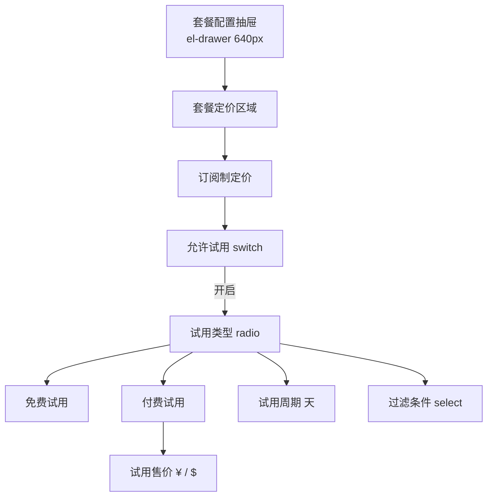
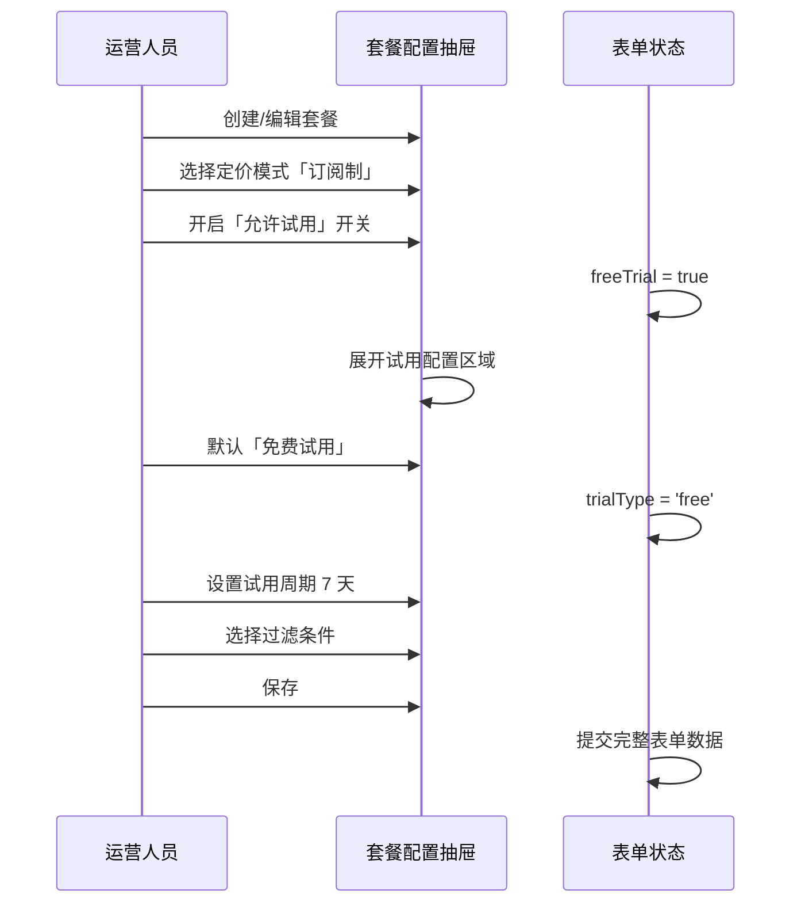
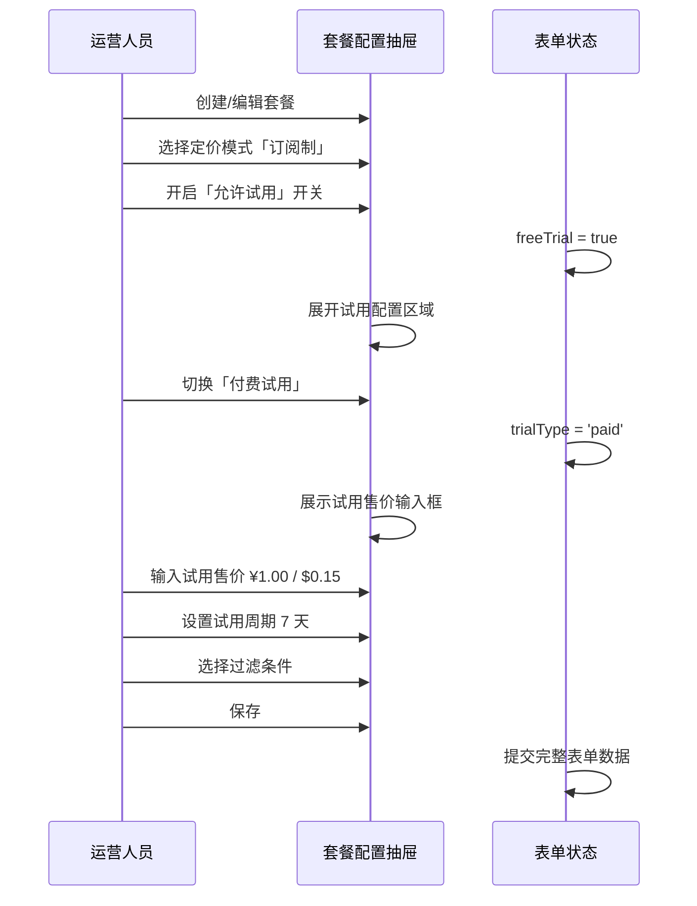

# 订阅制新增付费试用 — 完整业务 PRD

## 修订记录

| 修订时间 | 修订内容 | 修订人 |
|------|------|------|
| 2026-06-29 | 初稿 | Kiro |

---

## 一、业务背景

IoT 平台套餐配置目前仅支持「免费试用」能力，运营人员在配置订阅制套餐时无法设置付费试用（如 1 元体验价）。存在以下问题：

1. 所有试用均为免费，平台无法回收试用期间的任何成本
2. 部分高价值套餐免费试用吸引大量「羊毛党」，转化率低
3. 运营缺少灵活的试用定价手段，无法通过低门槛付费筛选高意向用户

**产品目标**：在套餐配置的订阅制定价区域，将「免费试用」升级为「允许试用」开关，新增试用类型选择（免费/付费），支持付费试用价格配置。

---

## 二、名词解释

| 术语 | 说明 |
|------|------|
| 允许试用 | 订阅制套餐是否开启试用能力的总开关 |
| 免费试用 | 用户 0 元体验套餐，试用周期结束后自动转正式订阅 |
| 付费试用 | 用户支付低价体验套餐，试用周期结束后自动转正式订阅 |
| 试用周期 | 试用有效天数，如 7 天、14 天 |
| 过滤条件 | 限制用户可参与试用的条件，如「从未试用过此套餐」 |
| 试用售价 | 付费试用时的价格，支持人民币（¥）和美元（$）双币种 |

---

## 三、功能架构



---

## 四、核心流程

### 4.1 配置免费试用



### 4.2 配置付费试用



---

## 五、业务规则

| 编号 | 规则 | 说明 |
|------|------|------|
| R01 | 试用总开关 | `freeTrial = false` 时，试用类型、售价、周期、过滤条件全部隐藏 |
| R02 | 默认试用类型 | 开启试用后默认选择「免费试用」（`trialType = 'free'`） |
| R03 | 付费展示价格 | 仅当 `trialType = 'paid'` 时展示试用售价（¥ / $）输入框 |
| R04 | 价格格式 | 试用售价使用 `type="number"` 限制输入，与订阅售价展示格式一致 |
| R05 | 周期默认值 | 试用周期默认 7 天，最小值 1 |
| R06 | 过滤条件选项 | 从未试用过此套餐 / 从未试用过该服务类型 / 不限制 |

---

## 六、详细功能描述

### 6.1 允许试用开关

**功能应用场景**：运营人员在创建/编辑订阅制套餐时，决定是否为此套餐开启试用能力。

**组件规格**：

| 属性 | 值 |
|------|------|
| 组件 | `el-switch` |
| 绑定字段 | `form.freeTrial` |
| 默认值 | `false` |
| 布局 | label「允许试用」+ switch 同行展示（flex，space-between） |
| 交互 | 开启后展开试用配置区域（v-if），关闭后收起 |

### 6.2 试用类型选择

**功能应用场景**：开启试用后选择免费或付费模式。

**组件规格**：

| 属性 | 值 |
|------|------|
| 组件 | `el-radio-group` + `el-radio`，`size="small"` |
| 绑定字段 | `form.trialType` |
| 选项 | `free` → 免费试用 / `paid` → 付费试用 |
| 默认值 | `'free'` |
| 显示条件 | `form.freeTrial === true` |

### 6.3 试用售价

**功能应用场景**：付费试用模式下设置试用的双币种价格。

**组件规格**：

| 属性 | 值 |
|------|------|
| 组件 | `el-input`，`type="number"`，带货币前缀 |
| 绑定字段 | `form.trialPriceYuan` / `form.trialPriceDollar` |
| 前缀 | 固定标签 ¥ 和 $（`.price-prefix` + `.prefix-label`） |
| 默认值 | 空字符串 |
| 显示条件 | `form.freeTrial === true && form.trialType === 'paid'` |
| 布局 | 双列并排（`.price-row`），与订阅售价展示格式一致 |

### 6.4 试用周期

**功能应用场景**：设置试用有效天数。

**组件规格**：

| 属性 | 值 |
|------|------|
| 组件 | `el-input-number`，`:min="1"` |
| 绑定字段 | `form.trialDays` |
| 默认值 | `7` |
| 显示条件 | `form.freeTrial === true` |

### 6.5 过滤条件

**功能应用场景**：限制用户参与试用的条件，防止重复薅羊毛。

**组件规格**：

| 属性 | 值 |
|------|------|
| 组件 | `el-select` |
| 绑定字段 | `form.trialFilter` |
| 选项 | `never_this` → 从未试用过此套餐 / `never_any` → 从未试用过该服务类型 / `none` → 不限制 |
| 默认值 | `''` |
| 显示条件 | `form.freeTrial === true` |

---

## 七、页面信息架构

### 7.1 字段层级

```
订阅制定价
├── 划线价（¥）
├── 划线价（$）
├── 允许试用 [switch]               ← form.freeTrial
│   └── （开启后展开）
│       ├── 试用类型 [radio]         ← form.trialType: 'free' | 'paid'
│       ├── 试用售价（¥）[$] [input]  ← form.trialPriceYuan / trialPriceDollar（仅付费）
│       ├── 试用周期（天）[number]    ← form.trialDays
│       └── 过滤条件 [select]         ← form.trialFilter
├── 订阅售价（¥）
├── 订阅售价（$）
└── IAP 价格...
```

### 7.2 表单默认值

| 字段 | 默认值 |
|------|------|
| `freeTrial` | `false` |
| `trialType` | `'free'` |
| `trialPriceYuan` | `''` |
| `trialPriceDollar` | `''` |
| `trialDays` | `7` |
| `trialFilter` | `''` |

---

## 八、异常说明

| 分类 | 场景 | 处理方式 |
|------|------|------|
| 输入 | 付费试用价格为空 | 由后端校验，前端通过 `type="number"` 限制格式 |
| 输入 | 试用周期输入 0 或负数 | `:min="1"` 限制最小值为 1 |
| 交互 | 免费切换为付费后价格区域展示 | v-if 响应式，无闪烁 |
| 交互 | 关闭试用后重新开启 | 恢复默认值（免费试用，周期 7 天，过滤条件清空） |
| 兼容 | `freeTrial` 字段名保留 | 历史字段名不变，仅 UI 文案改为「允许试用」 |

---

## 九、文件清单

| 文件 | 类型 | 说明 |
|------|------|------|
| `src/views/pkg/config.vue` | 页面（改） | 套餐配置抽屉，修改试用区域模板 + 表单默认值 + CSS |

---

> **本文档为纯业务PRD，面向产品和开发团队。不包含API路由路径、数据库建表语句等技术实现细节。**

---

*文档版本: v1.0 | 创建日期: 2026-06-29*
