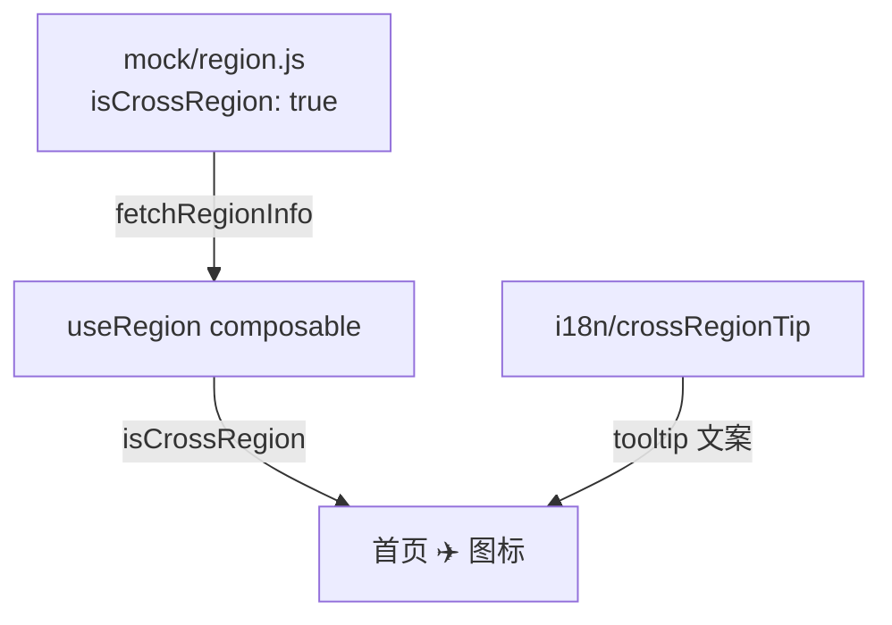
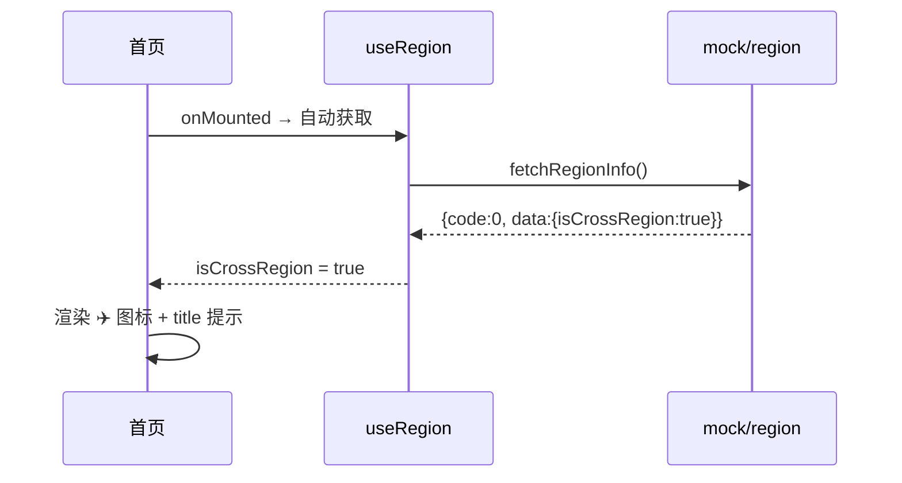

# 跨域访问提示 — 完整业务 PRD

## 修订记录

| 修订时间 | 修订内容 | 修订人 |
|------|------|------|
| 2026-06-04 | 初稿 | Kiro |
| 2026-06-04 | 精简范围：去掉质量监测相关，仅保留跨域提示 | Kiro |

---

## 一、业务背景

CareCam Pro 是全球类 PWA APP。用户注册时由大云端按 IP 分配所属域。当用户跨域访问时，APP 仍访问原属域服务器，体验下降。

**一期方案**：检测到跨域时，首页左上角轻量提示，不阻断用户操作。

---

## 二、名词解释

| 术语 | 说明 |
|------|------|
| 所属域 (Region) | 用户注册时分配的服务区域 |
| isCrossRegion | 后端返回的布尔值，标识当前用户是否跨域访问 |

---

## 三、功能架构

---

## 四、核心流程

---

## 五、文件清单

| 文件 | 类型 | 说明 |
|------|------|------|
| `src/composables/useRegion.js` | Composable | 封装 fetchRegionInfo，暴露 isCrossRegion |
| `src/mock/region.js` | Mock | fetchRegionInfo()，300ms 延迟，isCrossRegion: true |
| `src/utils/i18n.js` | 工具 | crossRegionTip 中/英 |
| `src/views/home/index.vue` | 页面（改） | 左上角 ✈️ 跨域图标 |

---

## 六、关键决策

| # | 决策 | 原因 |
|------|------|------|
| D1 | 一期仅做跨域提示，不做网络质量监测 | 先解决最明确的问题 |
| D2 | 跨域判断依赖后端 isCrossRegion 字段 | 服务端有准确数据，前端不做 IP 定位 |
| D3 | 首页 ✈️ 图标 + hover tooltip，无文字 | 轻量提示，不干扰用户 |
| D4 | 接口失败降级为不显示 | 宁可漏提示也不误报 |
