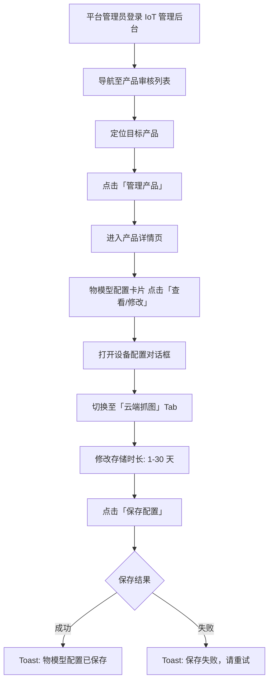
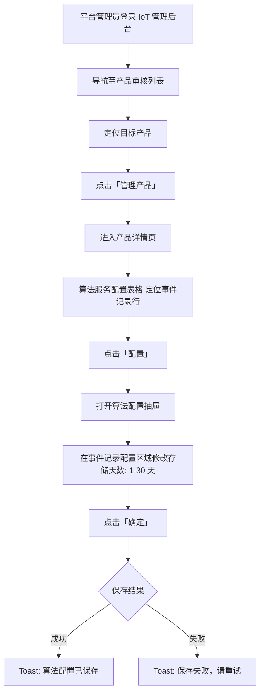
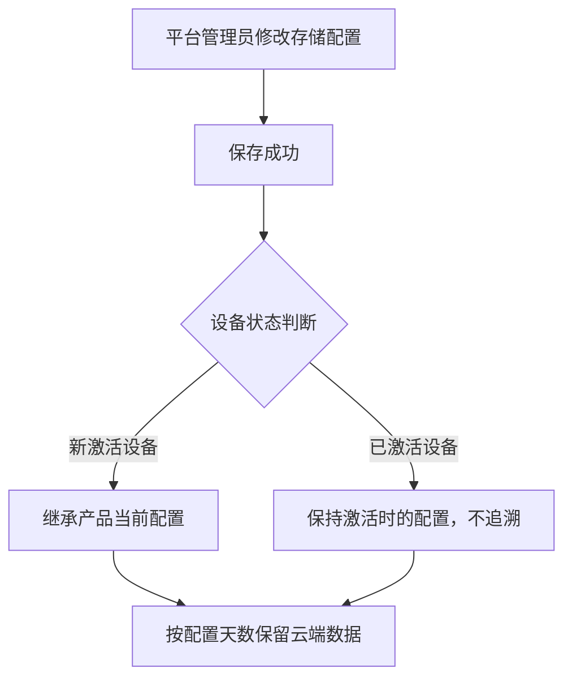
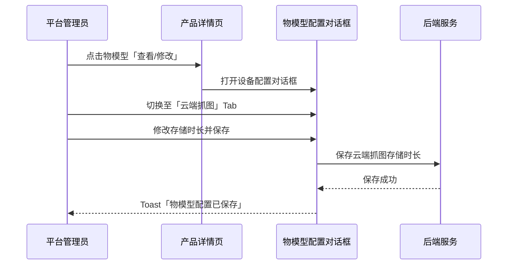
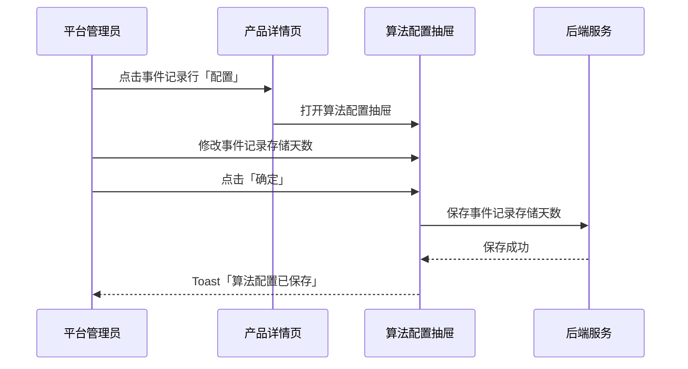

# 默认消息存储天数配置 — 完整业务 PRD

## 修订记录

| 修订时间 | 修订内容 | 修订人 |
|------|------|------|
| 2026-06-18 | v1.0 初稿（旧方案：App配置页单一配置） | Kiro |
| 2026-06-18 | v3.0：方案变更 — 存储配置拆分为云端抓图(物模型对话框)和事件记录(算法抽屉)两处 | Kiro |

---

## 一、业务背景

IoT 平台下存在两类需要云端存储的设备数据：

1. **设备抓图（云端抓图）**：设备定时或事件触发抓拍的图片，存储在云端供用户查看。抓图文件体积大（单张 100KB-500KB），存储成本显著。
2. **事件消息（告警/事件记录）**：设备检测到事件（人形检测、声音告警等）后上报的消息记录，存储在云端供用户回溯。消息体积小但数量大。

当前两类数据的存储时长均硬编码为 1 天，无法按产品类型差异化配置。不同产品类型需求差异显著：

- 安防类产品：抓图需保留 7-30 天用于取证，事件告警需 7-30 天用于安全回溯
- 看护类产品：AI 事件需 7-14 天供家人回顾
- 普通 IPC 产品：1 天即可满足需求

**产品目标**：平台管理员可在审核产品时为产品配置云端抓图存储时长和事件记录存储天数（1-30 天），新设备激活时继承产品级配置。配置仅平台管理员可见（产品审核端），企业客户不可见、不可修改。

---

## 二、名词解释

| 术语 | 说明 |
|------|------|
| 云端抓图 | 设备定时或事件触发抓拍的图片，上传至云端存储，用户可通过 App 查看 |
| 云端抓图存储时长 | 产品级配置，决定该产品下设备抓图在云端保留的天数。取值范围 1-30 天，默认 1 天 |
| 事件记录 | 设备检测到算法事件（人形检测、声音告警等）后上报的消息记录 |
| 事件记录存储天数 | 产品级配置，决定该产品下设备事件消息在云端保留的天数。取值范围 1-30 天，默认 1 天 |
| 云存储成本 | 抓图和消息数据在云端占用的存储空间产生的费用，与存储天数和数据量正相关 |
| 平台管理员 | IoT 管理后台的最高权限角色，可审核和管理所有产品，可访问成本敏感配置 |
| 企业客户 | 在平台上注册的企业账号，可创建和管理自有产品，不可见成本敏感配置 |
| 产品审核端 | IoT 管理后台中平台管理员使用的审核/管理界面，区别于企业端的产品开发界面 |
| 物模型配置 | 产品审核流程中，平台管理员在对话框中配置产品设备能力的界面，含多个配置 Tab |
| 算法服务配置 | 产品审核流程中，平台管理员在抽屉中为算法配置参数和绑定能力的界面 |

---

## 三、核心业务流程

### 3.1 云端抓图存储时长配置流程



### 3.2 事件记录存储天数配置流程



### 3.3 配置生效流程



### 3.4 云端抓图存储时长配置时序



### 3.5 事件记录存储天数配置时序



---

## 四、业务规则

| 编号 | 规则 | 说明 |
|------|------|------|
| R01 | 平台独占 | 配置仅平台管理员可见和可操作，企业客户端不可见 |
| R02 | 默认值 | 新创建产品的云端抓图存储时长和事件记录存储天数均默认为 1 天 |
| R03 | 取值范围 | 1-30 天，整数，步长 1 天。输入控件自动限制范围，不可越界 |
| R04 | 成本提示 | 输入框下方始终显示辅助说明文案，含信息图标和成本提示 |
| R05 | 产品级作用域 | 按产品维度配置，同一产品下所有新激活设备共享该默认值 |
| R06 | 新建设备继承 | 新激活设备使用当前产品的配置值。已激活设备不追溯 |
| R07 | 配置路径 A | 产品审核列表 → 管理产品 → 物模型配置「查看/修改」→ 设备配置对话框 → 云端抓图 Tab |
| R08 | 配置路径 B | 产品审核列表 → 管理产品 → 算法服务表格 → 事件记录行「配置」→ 算法配置抽屉 → 事件记录配置 |
| R09 | 保存机制 | 物模型配置通过对话框底部「保存配置」统一提交；算法配置通过抽屉底部「确定」提交 |

---

## 五、功能架构

```
产品审核模块
├── 产品审核列表页
│   └── 操作列：「管理产品」→ 跳转至产品详情页
├── 产品详情页
│   ├── 基本信息展示
│   ├── 物模型配置卡片 →「查看/修改」→ 设备配置对话框
│   │   └── Tabs: 设备能力 / 镜头配置 / 麦克风配置 / 屏显配置 / 喇叭配置 / 云端抓图
│   │       └── 云端抓图 Tab: 存储时长（1-30天，默认1）  ← 核心配置 A
│   ├── 算法服务配置表格
│   │   ├── 事件记录(ID 1013) →「配置」→ 算法配置抽屉（含事件记录配置区域） ← 核心配置 B
│   │   ├── 云端抓图(ID 1011) →「配置」→ 算法配置抽屉（能力绑定）
│   │   ├── 人形/运动检测(ID 1000) →「配置」→ 算法配置抽屉（能力绑定）
│   │   └── …其他算法行
│   ├── 平台服务配置（云存 + 时光相册）
│   ├── App配置卡片 →「前往查看/修改」→ App功能配置页
│   ├── 语音助手配置
│   └── 固件版本历史
└── App功能配置页
    ├── 安装指引 Tab
    ├── App使用范围 Tab
    └── 默认配置 Tab（已移除消息存储天数配置项）
```

---

## 六、详细功能描述

### 6.1 云端抓图存储时长

**功能应用场景**：平台管理员在审核产品时，根据产品类型设置合理的抓图存储时长。该值直接影响该产品下新激活设备的云端抓图保留时长和云存储成本。

**配置入口**：产品详情页 → 物模型配置卡片 →「查看/修改」→ 设备配置对话框 → 云端抓图 Tab

**输入控件**：数字输入框，支持加号/减号步进和键盘输入。范围 1-30 天，步长 1，默认 1。

**成本提示**：输入框下方始终显示：
"设置云端抓图在服务器的存储时长（1-30天）。仅平台可见，涉及云存储成本，请谨慎配置。"

**保存方式**：点击对话框底部「保存配置」按钮提交。成功 Toast"物模型配置已保存"，失败 Toast"保存失败，请重试"且值回退。

### 6.2 事件记录存储天数

**功能应用场景**：平台管理员为产品下的事件记录算法配置消息存储天数。该值直接影响事件消息的云端保留时长和云存储成本。

**配置入口**：产品详情页 → 算法服务配置表格 → 事件记录(ID 1013)行 →「配置」→ 算法配置抽屉 → 事件记录配置区域

**输入控件**：数字输入框，范围 1-30 天，步长 1，默认 1。

**成本提示**：输入框下方始终显示：
"设置该算法事件记录的云端存储天数（1-30天）。仅平台可见，涉及云存储成本，请谨慎配置。"

**保存方式**：点击抽屉底部「确定」按钮提交。成功 Toast"算法配置已保存"，失败 Toast"保存失败，请重试"且值回退。

### 6.3 App功能配置页改造

移除默认配置 Tab 中原有的「默认消息存储天数」配置项。其余 7 个配置项（默认分辨率、图片插值、视频插值、全彩模式时段、一键报警配置、假三目设置、灯控开关显示）保持不变。

---

## 七、异常说明

| 异常类型 | 页面表现 | 处理方式 |
|------|------|------|
| 网络异常（保存时） | 对话框/抽屉保持打开 | Toast"保存失败，请重试"，配置值回退 |
| 输入越界值 | 输入 0 自动修正为 1，输入 > 30 自动修正为 30 | 控件自动约束 |
| 输入非整数 | 小数自动截断为整数 | 控件步长 1 自动限制 |
| 产品 ID 缺失 | 页面正常渲染，产品信息显示空值 | 保存时提示"产品信息缺失" |
| 非平台管理员访问 | 页面可查看，保存时权限校验失败 | Toast"无操作权限" |
| 保存按钮重复点击 | 前次请求未完成时忽略后续点击 | 防抖处理 |
| 算法服务表格空态 | 无算法服务配置 | 表格显示"暂无算法服务配置" |
| 能力绑定空态 | 算法无绑定能力 | 表格显示"暂无数据" |

---

## 八、状态说明

| 状态 | 触发条件 | 展示内容 |
|------|------|------|
| 默认态 | 新产品从未配置 | 云端抓图存储时长显示 1，事件记录存储天数显示 1 |
| 已配置态 | 管理员已修改并保存 | 显示已保存的天数值 |
| 最小值边界 | 输入值 1 | 减号按钮置灰 |
| 最大值边界 | 输入值 30 | 加号按钮置灰 |
| 保存中 | 点击保存后请求完成前 | 保存按钮显示加载态 |
| 保存失败 | 网络或服务端错误 | Toast"保存失败，请重试"，值回退 |

---

## 九、省略章节说明

- **业务实体说明**：本需求不引入新的业务实体，存储时长为产品配置的新增字段
- **APP埋点与运营数据看板**：纯后台配置功能，无 APP 端交互，不涉及用户行为埋点
- **产品审核列表等已有页面**：非本次改动范围，不做赘述

---

*文档版本: v3.0 | 创建日期: 2026-06-18*
